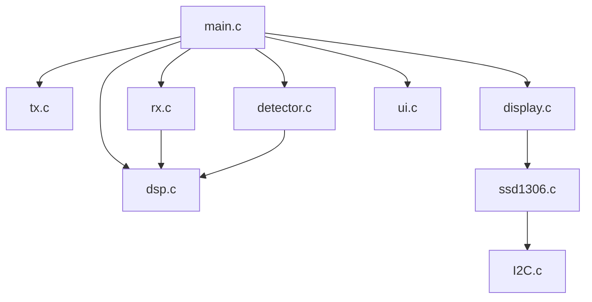
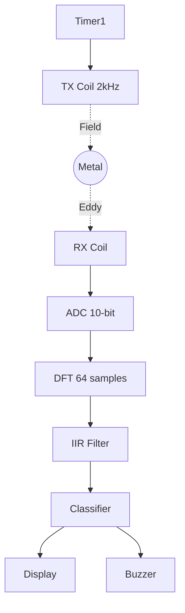
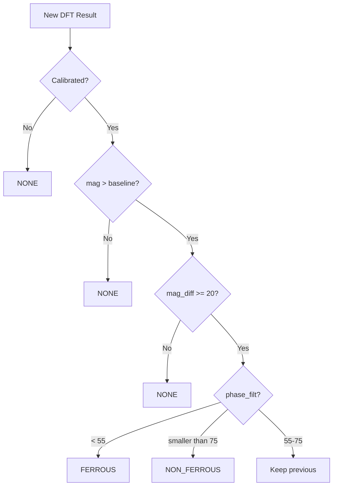
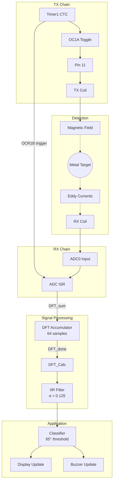
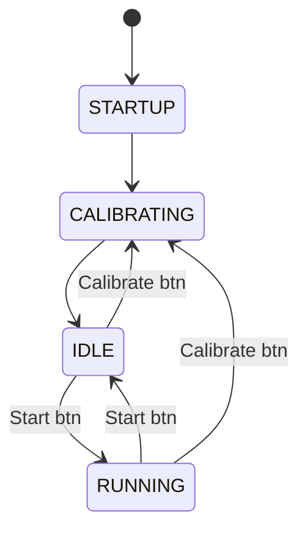
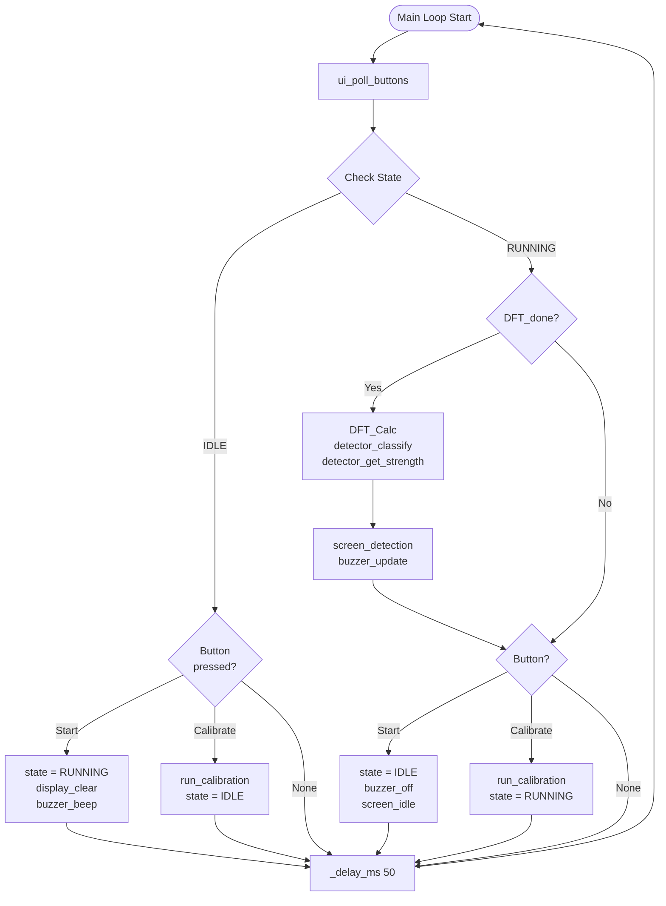

# Metal Detector Firmware Code Review

> [!abstract] Document Purpose
> This document provides a comprehensive technical review of the VLF metal detector firmware.
> It serves as both a **learning guide** for newcomers and a **reference** for experienced team members.
>
> **Target:** ATmega2560 (Arduino Mega 2560)
> **Course:** DTU 34621 - Embedded Systems

---

## Table of Contents

1. [[#1. System Overview]]
2. [[#2. File-by-File Breakdown]]
3. [[#3. Hardware Abstraction]]
4. [[#4. Signal Processing Pipeline]]
5. [[#5. Application Logic]]
6. [[#6. Timing & Synchronization]]
7. [[#7. Power Management]]
8. [[#8. Configuration & Constants]]

---

## 1. System Overview

### 1.1 High-Level Architecture

The metal detector firmware is organized into three logical layers:



| Layer | Modules | Purpose |
|-------|---------|---------|
| **Application** | main.c, detector.c, display.c, ui.c | State machine, classification, UI |
| **Signal** | tx.c, rx.c, dsp.c | TX generation, ADC sampling, DFT |
| **Drivers** | I2C.c, ssd1306.c, data.h | Hardware abstraction |

### 1.2 Signal Flow



**Signal chain:** Timer1 → TX Coil → Metal Target → RX Coil → ADC → DFT → Filter → Classifier → Output

### 1.3 Key Specifications

| Parameter | Value | Notes |
|-----------|-------|-------|
| TX Frequency | 2 kHz | VLF range for general purpose |
| Sample Rate | 8 kHz | 4 samples per TX cycle |
| DFT Window | 64 samples | 8 ms of data |
| TX Cycles per Window | 16 | 64 / 4 = 16 |
| Phase Threshold | 65 | Ferrous < 65, Non-ferrous > 65 |
| Display Refresh | ~20 Hz | 50ms main loop delay |
| I2C Clock | ~400 kHz | Fast mode |
| ADC Resolution | 10 bits | 0-1023 range |

> [!IMPORTANT] Power Design Decision
> The system is designed for **7.5V supply voltage**, not 9V fresh battery.
> This ensures consistent detection performance throughout battery life.
> See: [[Power Budget Analysis#11.0.1 Design for 7.5V Supply Voltage]]

---

## 2. File-by-File Breakdown

### 2.1 Directory Structure

```
Code/src/
├── main.c                 # Application entry point, state machine
├── config.h               # Pin definitions and constants
│
├── signal/                # Signal generation and processing
│   ├── tx.c, tx.h         # TX signal generation (Timer1)
│   ├── rx.c, rx.h         # ADC sampling (Timer1 triggered)
│   └── dsp.c, dsp.h       # DFT analysis and filtering
│
├── app/                   # Application logic
│   ├── detector.c, .h     # Metal classification
│   ├── display.c, .h      # High-level display API
│   └── ui.c, ui.h         # Buttons and buzzer
│
└── drivers/               # Hardware drivers
    ├── I2C.c, I2C.h       # TWI master driver
    ├── ssd1306.c, .h      # OLED display driver
    └── data.h             # Font data (PROGMEM)
```

---

### 2.2 config.h - Pin Definitions

**Location:** `Code/src/config.h`

**Purpose:** Central location for all hardware pin assignments.

```c
/*
 * Pin assignments for ATmega2560 (Arduino Mega 2560):
 *
 *   9  (PH6) - PWM to TX coil (alternate - not currently used)
 *   10 (PB4) - MCP3208 CS (external ADC - not currently used)
 *   11 (PB5) - TX signal output (OC1A)
 *   51 (PB2) - MOSI (SPI)
 *   50 (PB3) - MISO (SPI)
 *   52 (PB1) - SCK (SPI)
 *   8  (PH5) - Buzzer PWM output (OC4C)
 *   2  (PE4) - Start/Stop button (INT4)
 *   3  (PE5) - Calibrate button (INT5)
 *   20 (PD1) - I2C SDA
 *   21 (PD0) - I2C SCL
 *   A0 (PF0) - RX signal input (ADC0)
 */
```

> [!NOTE]
> The config.h file is currently a stub with comments only.
> Pin assignments are hardcoded in each module for now.

---

### 2.3 tx.c - TX Signal Generation

**Location:** `Code/src/signal/tx.c`

**Purpose:** Generate the 2kHz transmit signal using Timer1 hardware.

**Dependencies:** `<avr/io.h>`

**Hardware Used:** Timer1, Pin 11 (OC1A/PB5)

#### Function Reference

```c
void timer1_init(void);
```

| Parameter | Description |
|-----------|-------------|
| (none) | Initializes Timer1 for 2kHz square wave output |

#### Implementation Details

```c
void timer1_init(void) {
    DDRB |= (1 << PB5);   /* Pin 11 = OC1A output */

    /* CTC mode, toggle OC1A on compare match */
    TCCR1A = (1 << COM1A0);              /* Toggle OC1A */
    TCCR1B = (1 << WGM12) | (1 << CS10); /* CTC, no prescaler */

    OCR1A = 3999;  /* 16 MHz / 4000 = 4 kHz toggle = 2 kHz wave */
}
```

#### Register Configuration

##### TCCR1A (Timer/Counter1 Control Register A)

| Bit | Name | Value | Purpose |
|-----|------|-------|---------|
| 7 | COM1A1 | 0 | \|
| 6 | COM1A0 | 1 | Toggle OC1A on compare match |
| 5 | COM1B1 | 0 | \|
| 4 | COM1B0 | 0 | OC1B disconnected |
| 3:2 | - | 0 | Reserved |
| 1:0 | WGM11:10 | 00 | Part of CTC mode selection |

##### TCCR1B (Timer/Counter1 Control Register B)

| Bit | Name | Value | Purpose |
|-----|------|-------|---------|
| 7 | ICNC1 | 0 | Input capture noise canceler off |
| 6 | ICES1 | 0 | Input capture edge select |
| 5 | - | 0 | Reserved |
| 4:3 | WGM13:12 | 01 | CTC mode (TOP = OCR1A) |
| 2:0 | CS12:10 | 001 | No prescaler (clk/1) |

> [!TIP] Verification
> Connect oscilloscope to Pin 11. You should see a clean 2kHz square wave with 250s high and 250s low periods.

---

### 2.4 rx.c - ADC Sampling

**Location:** `Code/src/signal/rx.c`

**Purpose:** Sample the RX signal at precisely 8kHz, phase-locked to the TX signal.

**Dependencies:** `<avr/io.h>`, `<avr/interrupt.h>`, `dsp.h`

**Hardware Used:** ADC, Timer1 Compare Match B

#### Key Concept: Phase-Locked Sampling

> [!WARNING] Critical Design Decision
> The ADC **must** be triggered by Timer1 Compare Match B, not an independent timer.
> Using Timer3 or any other source will cause samples to drift relative to the TX signal,
> making phase measurements **completely meaningless**.

The sampling points are set within the Timer1 cycle:

```c
#define SAMPLE_POINT_A  999   /* 1/4 through the cycle */
#define SAMPLE_POINT_B  2999  /* 3/4 through the cycle */
```

Timer1 counts from 0 to 3999 (OCR1A), giving a 250s half-period.
By alternating OCR1B between 999 and 2999, we get exactly 2 evenly-spaced samples per TX toggle, yielding 4 samples per full TX cycle (8kHz rate).

#### Function Reference

```c
void adc_init(void);        /* Configure ADC with Timer1 trigger */
void sampling_start(void);  /* Start ADC sampling loop */
void sampling_stop(void);   /* Stop ADC sampling */
```

#### ADC Configuration

```c
void adc_init(void) {
    /* Reference = AVCC (5V), channel 0 (A0) */
    ADMUX = (1 << REFS0);

    /* ADC Control:
     * ADEN  = Enable ADC
     * ADIE  = Enable ADC interrupt
     * ADATE = Enable auto-trigger
     * ADPS  = Prescaler 128 (125kHz ADC clock)
     */
    ADCSRA = (1 << ADEN) | (1 << ADIE) | (1 << ADATE)
           | (1 << ADPS2) | (1 << ADPS1) | (1 << ADPS0);

    /* Auto-trigger source = Timer1 Compare Match B */
    ADCSRB = (1 << ADTS2) | (1 << ADTS0);

    /* Set first compare point */
    OCR1B = SAMPLE_POINT_A;
}
```

#### Register Configuration

##### ADMUX (ADC Multiplexer Selection Register)

| Bit | Name | Value | Purpose |
|-----|------|-------|---------|
| 7:6 | REFS1:0 | 01 | AVCC with external capacitor at AREF |
| 5 | ADLAR | 0 | Right-adjusted result |
| 4:0 | MUX4:0 | 00000 | ADC0 (Pin A0) |

##### ADCSRA (ADC Control and Status Register A)

| Bit | Name | Value | Purpose |
|-----|------|-------|---------|
| 7 | ADEN | 1 | ADC Enable |
| 6 | ADSC | - | Start Conversion (set in ISR) |
| 5 | ADATE | 1 | Auto Trigger Enable |
| 4 | ADIF | - | Interrupt Flag (cleared by hardware) |
| 3 | ADIE | 1 | Interrupt Enable |
| 2:0 | ADPS2:0 | 111 | Prescaler = 128 (125kHz ADC clock) |

##### ADCSRB (ADC Control and Status Register B)

| Bit | Name | Value | Purpose |
|-----|------|-------|---------|
| 7 | - | 0 | Reserved |
| 6 | ACME | 0 | Analog Comparator Multiplexer |
| 5:3 | - | 0 | Reserved |
| 2:0 | ADTS2:0 | 101 | Timer1 Compare Match B trigger |

#### ADC Interrupt Service Routine

```c
ISR(ADC_vect) {
    uint16_t sample = ADC;

    /* Clear Timer1 Compare B flag */
    TIFR1 = (1 << OCF1B);

    /* Store in buffer (for debugging) */
    adc_buffer[sample_index] = sample;
    sample_index++;
    if (sample_index >= ADC_BUFFER_SIZE) {
        sample_index = 0;
        buffer_ready = 1;
    }

    /* Send directly to DFT accumulator */
    DFT_sum(sample);

    /* Alternate trigger point for next sample */
    if (OCR1B == SAMPLE_POINT_A) {
        OCR1B = SAMPLE_POINT_B;
    } else {
        OCR1B = SAMPLE_POINT_A;
    }
}
```

> [!NOTE]
> Samples are sent directly to `DFT_sum()` in the ISR for real-time processing.
> The `adc_buffer[]` is maintained for debugging purposes only.

---

### 2.5 dsp.c - DFT Signal Processing

**Location:** `Code/src/signal/dsp.c`

**Purpose:** Extract magnitude and phase from the sampled RX signal using optimized single-bin DFT.

**Dependencies:** `<avr/io.h>`, `<stdlib.h>`, `<stdint.h>`

#### The 4 Oversampling Trick

> [!TIP] Key Optimization
> Since we sample at **exactly 4 the signal frequency** (8kHz sampling, 2kHz signal),
> the DFT coefficients become trivial: `{1, 0, -1, 0}` for cosine and `{0, -1, 0, 1}` for sine.
> **No trigonometric calculations needed!**

Standard DFT formula:
$$X[k] = \sum_{n=0}^{N-1} x[n] \cdot e^{-j2\pi kn/N}$$

At 4 oversampling (k=N/4), the complex exponential values cycle through:
$$e^{-j2\pi n/4} = \{1, -j, -1, j\}$$

This means:
- Real (cosine) coefficients: `{+1, 0, -1, 0}`
- Imaginary (sine) coefficients: `{0, -1, 0, +1}`

#### DFT Coefficient Pattern (ASCII Diagram)

```
Sample Index:     0    1    2    3    4    5    6    7   ...
                  |    |    |    |    |    |    |    |
cos coefficient: +1    0   -1    0   +1    0   -1    0   ...
sin coefficient:  0   -1    0   +1    0   -1    0   +1   ...

Operation:       Re+  Im-  Re-  Im+  Re+  Im-  Re-  Im+  ...
                 ~~~~ ~~~~ ~~~~ ~~~~ (one TX cycle repeats)
```

#### Function Reference

```c
void DFT_sum(uint16_t ADC_Raw);  /* Called from ADC ISR for each sample */
void DFT_Calc(void);             /* Called after DFT_done==1 */
```

#### DFT Accumulator Implementation

```c
#define N  64                    /* Samples per DFT window */
#define ADC_middelvaerdi 512     /* DC offset to remove */

static uint8_t i = 0;            /* Sample counter */
static int32_t Re = 0;           /* Real accumulator */
static int32_t Im = 0;           /* Imaginary accumulator */

void DFT_sum(uint16_t ADC_Raw) {
    /* Remove DC offset */
    int16_t xn = (int16_t)ADC_Raw - ADC_middelvaerdi;

    /* Apply coefficient based on sample index mod 4 */
    switch(i & 3) {
        case 0: Re += xn;  break;  /* cos(0) = +1 */
        case 1: Im -= xn;  break;  /* -sin(90) = -1 */
        case 2: Re -= xn;  break;  /* cos(180) = -1 */
        case 3: Im += xn;  break;  /* -sin(270) = +1 */
    }

    i++;
    if (i >= N) {
        /* DFT window complete */
        i = 0;
        DFT_done = 1;
        Re_buff = Re;
        Im_buff = Im;
        Re = 0;
        Im = 0;
    }
}
```

> [!WARNING] Integer Overflow Prevention
> With 64 samples at 10-bit resolution (max 1023, centered at 512):
> - Max sample deviation: 512
> - Worst case sum: 64  512 = 32,768
> - Fits in 16-bit signed, but 32-bit used for safety margin

#### Magnitude and Phase Calculation

```c
void DFT_Calc(void) {
    int32_t re = Re_buff;
    int32_t im = Im_buff;

    /* Scale down to prevent overflow in squaring */
    int32_t re_scaled = re / 16;
    int32_t im_scaled = im / 16;

    /* Magnitude = sqrt(Re + Im) */
    uint32_t mag_squared = re_scaled * re_scaled + im_scaled * im_scaled;
    magnitude = (uint16_t)isqrt(mag_squared);

    /* Phase = atan2(Im, Re) in degrees */
    phase_deg = iatan2(im, re);

    /* Apply IIR low-pass filter */
    magnitude_filt = (IIR_ALPHA * magnitude +
                      (256 - IIR_ALPHA) * magnitude_filt) / 256;
    phase_filt = (IIR_ALPHA * phase_deg +
                  (256 - IIR_ALPHA) * phase_filt) / 256;
}
```

#### Integer Square Root (Newton's Method)

```c
static uint32_t isqrt(uint32_t n) {
    if (n == 0) return 0;

    uint32_t x = n;
    uint32_t y = (x + 1) / 2;

    /* Newton iteration: x_new = (x + n/x) / 2 */
    while (y < x) {
        x = y;
        y = (x + n / x) / 2;
    }
    return x;
}
```

#### Integer atan2 Approximation

```c
static int16_t iatan2(int32_t y, int32_t x) {
    /* Handle special cases */
    if (x == 0 && y == 0) return 0;
    if (x == 0) return (y > 0) ? 90 : -90;
    if (y == 0) return (x > 0) ? 0 : 180;

    int16_t angle;
    int32_t abs_y = (y < 0) ? -y : y;
    int32_t abs_x = (x < 0) ? -x : x;

    /* Approximation: atan(y/x)  45 * y/x for small angles */
    if (abs_x >= abs_y) {
        int32_t z = (abs_y * 64) / abs_x;
        angle = (z * 45) / 64;
    } else {
        int32_t z = (abs_x * 64) / abs_y;
        angle = 90 - (z * 45) / 64;
    }

    /* Adjust for quadrant */
    if (x < 0) angle = 180 - angle;
    if (y < 0) angle = -angle;

    return angle;
}
```

#### IIR Low-Pass Filter

The filter smooths magnitude and phase readings to reduce noise:

$$y[n] = \alpha \cdot x[n] + (1-\alpha) \cdot y[n-1]$$

With `IIR_ALPHA = 32` and denominator 256:
$$\alpha = \frac{32}{256} = 0.125$$

This gives a slow response (good stability) with approximately 8-sample time constant.

#### Exported Variables

| Variable | Type | Description |
|----------|------|-------------|
| `Re_buff` | `volatile int32_t` | Raw real DFT component |
| `Im_buff` | `volatile int32_t` | Raw imaginary DFT component |
| `DFT_done` | `volatile uint8_t` | Flag: 1 when new DFT ready |
| `magnitude` | `volatile uint16_t` | Raw magnitude |
| `phase_deg` | `volatile int16_t` | Raw phase in degrees |
| `magnitude_filt` | `volatile uint16_t` | Filtered magnitude |
| `phase_filt` | `volatile int16_t` | Filtered phase |

---

### 2.6 I2C.c & ssd1306.c - External Drivers

> [!NOTE] External Code
> These drivers were **provided to us** and not written by the team.
> They are documented here only for reference - see source files for full implementation.

#### I2C.c - TWI Master Driver

**Attribution:** Adapted from AVR freaks (author: osch)

| Function | Purpose |
|----------|---------|
| `I2C_Init()` | Initialize TWI at ~400kHz |
| `I2C_Start(addr)` | Send START + address |
| `I2C_Write(data)` | Write one byte |
| `I2C_Stop()` | Send STOP condition |

**Hardware:** Pin 20 (SDA), Pin 21 (SCL)

#### ssd1306.c - OLED Display Driver

**Attribution:** Based on Adafruit_SSD1306 library

| Function | Purpose |
|----------|---------|
| `InitializeDisplay()` | Initialize 128x64 OLED |
| `clear_display()` | Clear screen |
| `setXY(row, col)` | Set cursor (page 0-7, col 0-15) |
| `SendChar(data)` | Send pixel data byte |
| `sendStrXY(str, X, Y)` | Print string at position |

**Hardware:** I2C address 0x78, 128x64 pixels (8 pages × 128 columns)

#### data.h - Font Data

**Location:** `Code/src/drivers/data.h`

**Purpose:** Store font bitmaps in program memory (PROGMEM).

**Contents:**
- **myFont[][]** - 8x8 pixel ASCII font (characters 32-126)
- **bigNumbers[][]** - Large digit font (96 bytes per digit)
- **minus[]** - Large minus symbol
- **myDegree[]** - Degree symbol ()

#### Font Format

The 8x8 font stores each character as 8 bytes, where each byte represents one column:

```
Character 'A' (0x41):

Byte index:  0    1    2    3    4    5    6    7
            0x00 0x7E 0x09 0x09 0x09 0x7E 0x00 0x00

Column 1 (0x7E = 0111 1110):
  Bit 7: 0  .
  Bit 6: 1  #
  Bit 5: 1  #
  Bit 4: 1  #
  Bit 3: 1  #
  Bit 2: 1  #
  Bit 1: 1  #
  Bit 0: 0  .

Visual result (rotated):
  .######.
  ....#..#
  ....#..#
  ....#..#
  .######.
  ........
  ........
  ........
```

---

### 2.9 display.c - High-Level Display API

**Location:** `Code/src/app/display.c`

**Purpose:** Provide simplified display functions for the application.

**Dependencies:** `I2C.h`, `ssd1306.h`

#### Function Reference

| Function | Purpose |
|----------|---------|
| `display_init()` | Initialize I2C and OLED |
| `display_clear()` | Clear screen |
| `display_text(row, col, text)` | Print text at position |
| `display_number(row, col, value)` | Print unsigned integer |
| `display_bar(row, col, width, value)` | Draw progress bar |

#### Screen Templates

| Function | Purpose |
|----------|---------|
| `screen_splash()` | Startup splash screen |
| `screen_idle()` | Idle state display |
| `screen_calibrating()` | Calibration progress |
| `screen_detection(strength, phase, type)` | Main detection display |

#### Progress Bar Implementation

```c
void display_bar(uint8_t row, uint8_t col, uint8_t width, uint8_t value) {
    if (width > 16) width = 16;
    if (value > 100) value = 100;

    uint8_t filled = (value * width) / 100;

    for (uint8_t i = 0; i < width; i++) {
        if (i < filled) {
            display_solid_block(row, col + i);  /* 0xFF */
        } else {
            display_empty_block(row, col + i);  /* 0x00 */
        }
    }
}
```

---

### 2.10 detector.c - Metal Classification

**Location:** `Code/src/app/detector.c`

**Purpose:** Classify detected metal as ferrous or non-ferrous based on phase angle.

**Dependencies:** `dsp.h`

#### Classification Algorithm



#### Key Constants

| Constant | Value | Purpose |
|----------|-------|---------|
| `PHASE_THRESHOLD` | 65 | Ferrous/non-ferrous boundary |
| `PHASE_HYSTERESIS` | 10 | Band around threshold |
| `MIN_DETECTION_MAG` | 20 | Minimum signal for detection |

#### Phase-Based Classification

```c
/* Classification with hysteresis:
 * - Switch to FERRO only if phase < (65 - 10) = 55
 * - Switch to NON_FE only if phase > (65 + 10) = 75
 * - Otherwise keep previous classification
 */
if (phase_filt <= (PHASE_THRESHOLD - PHASE_HYSTERESIS)) {
    last_type = METAL_FERROUS;
} else if (phase_filt >= (PHASE_THRESHOLD + PHASE_HYSTERESIS)) {
    last_type = METAL_NON_FERROUS;
}
```

> [!NOTE] Phase Interpretation
> | Phase Range | Metal Type | Physical Reason |
> |-------------|------------|-----------------|
> | < 55 | **Ferrous** | High magnetic permeability (r >> 1) |
> | 55-75 | (hysteresis) | Classification held |
> | > 75 | **Non-ferrous** | Eddy currents dominate |

---

### 2.11 ui.c - User Interface

**Location:** `Code/src/app/ui.c`

**Purpose:** Handle button input and buzzer output.

**Hardware Used:** Timer4 (buzzer PWM), PE4/PE5 (buttons)

#### Button Configuration

| Pin | Port | Function | Connection |
|-----|------|----------|------------|
| 2 | PE4 | Start/Stop | Pull-up, active low |
| 3 | PE5 | Calibrate | Pull-up, active low |

#### Button Polling with Debounce

```c
void ui_poll_buttons(void) {
    uint8_t start_now = (PINE & (1 << PE4)) ? 1 : 0;
    uint8_t calibrate_now = (PINE & (1 << PE5)) ? 1 : 0;

    /* Detect falling edge (button pressed) */
    if (last_start == 1 && start_now == 0) {
        _delay_ms(DEBOUNCE_MS);  /* 50ms debounce */
        if (!(PINE & (1 << PE4))) {
            btn_start_pressed = 1;
        }
    }
    /* Similar for calibrate button... */

    last_start = start_now;
    last_calibrate = calibrate_now;
}
```

#### Buzzer PWM (Timer4)

The buzzer uses Timer4 in Fast PWM mode with variable frequency:

```c
/* Timer4: Fast PWM, TOP = ICR4 */
TCCR4A = (1 << WGM41);
TCCR4B = (1 << WGM43) | (1 << WGM42) | (1 << CS41);  /* Prescaler 8 */
ICR4 = BUZZER_TOP;  /* 3999 = ~500 Hz base */
```

#### Variable Pitch Buzzer

```c
void buzzer_update(uint8_t strength) {
    if (strength == 0) {
        buzzer_off();
        return;
    }

    /* Frequency based on strength:
     * strength 1   = low tone  (~200 Hz, TOP = 10000)
     * strength 100 = high tone (~2000 Hz, TOP = 1000)
     *
     * TOP = 10000 - (strength * 90)
     */
    uint16_t top = 10000 - ((uint16_t)strength * 90);
    ICR4 = top;
    OCR4C = top / 2;  /* 50\% duty */
    TCCR4A |= (1 << COM4C1);  /* Enable output */
}
```

---

### 2.12 main.c - Application Entry Point

**Location:** `Code/src/main.c`

**Purpose:** System initialization and main state machine.

**Dependencies:** All modules

#### System States

```c
typedef enum {
    STATE_STARTUP,      /* Initial boot */
    STATE_CALIBRATING,  /* Running calibration */
    STATE_IDLE,         /* Waiting for start */
    STATE_RUNNING       /* Active detection */
} system_state_t;
```

#### Initialization Sequence

```c
static void system_init(void) {
    timer1_init();      /* 2kHz TX on Pin 11 */
    display_init();     /* I2C + OLED */
    adc_init();         /* ADC with Timer1 trigger */
    detector_init();    /* Reset calibration */
    ui_init();          /* Buttons + buzzer */
}
```

#### Main Loop

```c
while (1) {
    ui_poll_buttons();

    switch (state) {
        case STATE_IDLE:
            /* Wait for Start button */
            if (btn_start_pressed) {
                btn_start_pressed = 0;
                state = STATE_RUNNING;
                display_clear();
                buzzer_beep(50);
            }
            /* Handle Calibrate button */
            if (btn_calibrate_pressed) {
                btn_calibrate_pressed = 0;
                state = STATE_CALIBRATING;
                run_calibration();
                state = STATE_IDLE;
                screen_idle();
            }
            break;

        case STATE_RUNNING:
            /* Process DFT and update display */
            if (DFT_done) {
                DFT_done = 0;
                DFT_Calc();

                metal_type_t metal = detector_classify();
                uint8_t strength = detector_get_strength();

                screen_detection(strength, phase_filt, (uint8_t)metal);
                buzzer_update(strength);
            }
            /* Handle Stop/Calibrate buttons... */
            break;
        /* ... */
    }

    _delay_ms(50);  /* ~20Hz loop rate */
}
```

---

## 3. Hardware Abstraction

### 3.1 Timer1 - TX Generation & ADC Synchronization

Timer1 serves dual purposes:
1. Generate the 2kHz TX signal via OC1A
2. Trigger ADC sampling via Compare Match B

#### Timer1 Block Diagram

```
                    16 MHz Clock
                         │
                         ▼
              ┌──────────────────────┐
              │       Timer1         │
              │   (16-bit counter)   │
              │                      │
              │  TCNT1: 0 → 3999 → 0 │
              │         (CTC mode)   │
              └──────────┬───────────┘
                         │
           ┌─────────────┼─────────────┐
           │             │             │
           ▼             ▼             ▼
     ┌──────────┐  ┌──────────┐  ┌──────────┐
     │  OCR1A   │  │  OCR1B   │  │  OCR1C   │
     │  = 3999  │  │ 999/2999 │  │  (unused)│
     └────┬─────┘  └────┬─────┘  └──────────┘
          │             │
          ▼             ▼
    ┌──────────┐  ┌──────────┐
    │ Toggle   │  │ ADC      │
    │ OC1A pin │  │ Trigger  │
    │ (Pin 11) │  │          │
    └──────────┘  └──────────┘
```

#### Timing Relationship

```
Timer1 Count:
0         999       1999      2999      3999    0
├──────────┼──────────┼──────────┼──────────┤
│          │          │          │          │
│    ▲     │    ▲     │    ▲     │    ▲     │
│    │     │    │     │    │     │    │     │
│   ADC    │  Toggle  │   ADC    │  Toggle  │
│ Sample A │  OC1A    │ Sample B │  OC1A    │
│(OCR1B=999)│(OCR1A=3999)│(OCR1B=2999)│(wraps) │

TX Output (Pin 11):
         ┌──────────────────────┐
    LOW  │         HIGH         │  LOW
─────────┘                      └──────────

Time:   0       125µs    250µs    375µs    500µs
         ├────────┼────────┼────────┼────────┤
                    One TX cycle (2kHz = 500µs)
```

### 3.2 ADC Configuration

#### ADC Timing

```
Timer1 Compare B Match (trigger)
         │
         ▼
    ┌────────────────────────────────────────────┐
    │         ADC Conversion (~104µs)            │
    │                                            │
    │  Sample ──► Hold ──► Convert ──► Result    │
    │  (1.5 cyc)          (13 cycles)            │
    └────────────────────────────────────────────┘
                                            │
                                            ▼
                                     ADC Interrupt
                                     (ADC_vect)
                                            │
                                            ▼
                                     DFT_sum() called
```

ADC clock = 16 MHz / 128 = 125 kHz
Conversion time = 13 ADC cycles = 104 s
Sample spacing = 125 s (8 kHz rate)

> [!WARNING]
> The ADC conversion (104s) must complete before the next trigger (125s).
> With prescaler 128, there is only ~21s margin. Do not reduce the prescaler!

### 3.3 I2C/TWI Communication

#### I2C Write Transaction

```
     START      ADDRESS       ACK       DATA        ACK       STOP
       │           │          │          │          │          │
       ▼           ▼          ▼          ▼          ▼          ▼
SDA: ─┐   ┌─────────────┐   ┌────────────────┐   ┌─
      └───┤ 0x78 (W)    ├───┤ Command/Data   ├───┤
          └─────────────┘   └────────────────┘   └─

SCL: ─┐ ┌─┐ ┌─┐ ┌─┐ ┌─┐ ┌─┐ ┌─┐ ┌─┐ ┌─┐ ┌─┐ ┌─┐ ┌─┐   ┌─
      └─┘ └─┘ └─┘ └─┘ └─┘ └─┘ └─┘ └─┘ └─┘ └─┘ └─┘ └─┘───┘
        1   2   3   4   5   6   7   8   9   ...
```

#### SSD1306 Command vs Data

| Control Byte | Type | Description |
|--------------|------|-------------|
| 0x00 | Command | Following bytes are commands |
| 0x40 | Data | Following bytes are pixel data |

### 3.4 GPIO Pin Summary

| Pin | Port | Direction | Function |
|-----|------|-----------|----------|
| 11 | PB5/OC1A | Output | TX signal (2kHz) |
| A0 | PF0/ADC0 | Input | RX signal |
| 20 | PD1/SDA | Bidirectional | I2C data |
| 21 | PD0/SCL | Output | I2C clock |
| 8 | PH5/OC4C | Output | Buzzer PWM |
| 2 | PE4/INT4 | Input | Start/Stop button |
| 3 | PE5/INT5 | Input | Calibrate button |

---

## 4. Signal Processing Pipeline

### 4.1 Complete Signal Flow



### 4.2 DFT Processing Detail

#### Why Single-Bin DFT?

We only care about the 2kHz component (the TX frequency). A full FFT would waste computation on frequencies we don't need.

#### The 4× Oversampling Advantage

| Traditional DFT | Our Optimized DFT |
|-----------------|-------------------|
| `Re += x[n] * cos(2*PI*n/N)` | `Re += x[n]` (for n mod 4 = 0) |
| `Im += x[n] * sin(2*PI*n/N)` | `Re -= x[n]` (for n mod 4 = 2) |
| Requires floating-point | Pure integer arithmetic |
| ~100 multiplications | 0 multiplications |
| Slow | Fast |

#### DFT Accumulation Over One TX Cycle

```
TX Signal:     ┌────────────┐            ┌────────────┐
               │            │            │            │
          ─────┘            └────────────┘            └─────

Sample:        S0     S1     S2     S3     (4 samples per cycle)
               │      │      │      │
Phase:         0°    90°   180°   270°
               │      │      │      │
cos coeff:    +1      0     -1      0
sin coeff:     0     -1      0     +1
               │      │      │      │
               ▼      ▼      ▼      ▼
          ┌────────────────────────────┐
          │  Re += S0                  │
          │  Im -= S1                  │
          │  Re -= S2                  │
          │  Im += S3                  │
          └────────────────────────────┘
```

### 4.3 Phase Interpretation

```
Phase Angle (degrees)
        │
  180° ─┤
        │
   90° ─┤    ────────────────────────
        │   │                        │
   65° ─┤───│── THRESHOLD ───────────│────
        │   │      │                 │
    0° ─┼───┼──────┼─────────────────┼────►
        │   │      │                 │    Metal Type
  -90° ─┤   │      │                 │
        │   Ferrous│                 Non-ferrous
 -180° ─┤  (Iron,  │                 (Copper, Gold,
        │   Steel) │                  Aluminum)
        │          │
        │    Hysteresis Zone
        │    (55° - 75°)
```

---

## 5. Application Logic

### 5.1 State Machine



| State | Description |
|-------|-------------|
| **STARTUP** | Initialize hardware, show splash, play beep |
| **CALIBRATING** | Display "KALIBRERING", collect samples 2s, store baseline |
| **IDLE** | Display idle screen, wait for button input |
| **RUNNING** | Process DFT, classify metal, update display/buzzer |

### 5.2 Calibration Procedure

```c
static void run_calibration(void) {
    screen_calibrating();

    /* Collect data for 2 seconds */
    for (uint16_t i = 0; i < 200; i++) {
        if (DFT_done) {
            DFT_done = 0;
            DFT_Calc();
        }
        _delay_ms(10);
    }

    /* Store baseline from filtered values */
    detector_calibrate();

    /* Confirmation beep */
    buzzer_beep(50);
    _delay_ms(50);
    buzzer_beep(50);
}
```

> [!TIP] Calibration Best Practice
> During calibration, keep the search coil **away from any metal objects**.
> The baseline represents the "no metal" signal that all detections are measured against.

### 5.3 Main Loop Flowchart



---

## 6. Timing & Synchronization

### 6.1 Why Phase-Locked Sampling is Critical

> [!DANGER] Critical Timing Requirement
> The ADC **must** be triggered by Timer1 Compare Match B.
> Any other trigger source will cause the samples to drift relative to the TX signal.

#### What Happens with Independent Timers

```
Scenario: Using Timer3 for ADC trigger (WRONG!)

TX (Timer1):  ┌────────┐        ┌────────┐        ┌────────┐
              │        │        │        │        │        │
           ───┘        └────────┘        └────────┘        └───

Timer3:    ↓    ↓    ↓    ↓    ↓    ↓    ↓    ↓    ↓    ↓
           (samples drift relative to TX due to clock difference)

           At t=0:     samples at 0°, 90°, 180°, 270°
           At t=1s:    samples at 5°, 95°, 185°, 275° (5° drift!)
           At t=10s:   samples at 50°, 140°, 230°, 320° (useless!)

Result: Phase measurement becomes random noise!
```

#### Correct: Timer1-Triggered ADC

```
TX (Timer1):  ┌────────┐        ┌────────┐        ┌────────┐
              │        │        │        │        │        │
           ───┘        └────────┘        └────────┘        └───

ADC (OCR1B):  ↓         ↓       ↓         ↓       ↓         ↓
              │  Same   │       │  Same   │       │  Same   │
              │  phase  │       │  phase  │       │  phase  │

              Always samples at exact 1/4 and 3/4 points of TX cycle
              Phase relationship is LOCKED forever!
```

### 6.2 Complete Timing Diagram

```
Time (µs):     0    125   250   375   500   625   750   875  1000
               │     │     │     │     │     │     │     │     │

Timer1 TCNT1:  0   999  1999  2999  3999   0   999  1999  2999  ...
                    │           │           │     │           │
                   OCR1B      OCR1B       OCR1A  OCR1B      OCR1B
                  (=999)     (=2999)     (=3999) (=999)    (=2999)
                    │           │           │     │           │
                    ▼           ▼           ▼     ▼           ▼
                   ADC        ADC       Toggle   ADC        ADC
                   S0          S1       OC1A     S2          S3

TX Output:   LOW   LOW   LOW   LOW   HIGH  HIGH  HIGH  HIGH  LOW
             ─────────────────────────┌──────────────────────┐────
                                      │                      │
                                      └──────────────────────┘

Sample Index: n=0         n=1              n=2         n=3
cos coeff:    +1           0               -1           0
sin coeff:     0          -1                0          +1
```

### 6.3 ADC Conversion Timing Detail

```
OCR1B Match
     │
     ▼
┌────┬─────────────────────────────────────────────────────────────┐
│ADC │ Sample │    Hold     │        Conversion (13 cycles)        │
│    │ 1.5cyc │             │  Bit11 Bit10 Bit9  ...  Bit1  Bit0  │
└────┴────────┴─────────────┴──────────────────────────────────────┘
     │        │                                                    │
     │<─ 8µs ─│<────────────── ~104µs ────────────────────────────>│
     │                                                             │
     │                                                             ▼
     │                                                        ADC_vect ISR
     │                                                             │
     │<──────────────────────── < 125µs ──────────────────────────>│
                                                                   │
                                                          Next OCR1B trigger
```

### 6.4 Race Condition Prevention

The code avoids race conditions through careful ordering:

```c
ISR(ADC_vect) {
    uint16_t sample = ADC;           /* 1. Read ADC result immediately */

    TIFR1 = (1 << OCF1B);            /* 2. Clear compare flag */

    adc_buffer[sample_index] = sample;
    sample_index++;
    /* ... */

    DFT_sum(sample);                 /* 3. Process sample */

    /* 4. Set up next trigger point LAST */
    if (OCR1B == SAMPLE_POINT_A) {
        OCR1B = SAMPLE_POINT_B;
    } else {
        OCR1B = SAMPLE_POINT_A;
    }
}
```

> [!WARNING] Order Matters
> The `OCR1B` update must happen **after** all sample processing.
> Updating it early could cause the next trigger to fire before the ISR completes.

---

## 7. Power Management

### 7.1 Current Design Status

> [!NOTE]
> The current firmware does **not** implement power management features.
> This section documents the planned implementation based on the power budget analysis.

### 7.2 Design Voltage

> [!IMPORTANT] Power Design Decision
> The system targets **7.5V operating voltage**, not the 9V fresh battery voltage.
> This ensures consistent detection performance from full charge (9V) to cutoff (6V).
> See: [[Power Budget Analysis#11.0.1 Design for 7.5V Supply Voltage]]

### 7.3 Current Budget Allocation

| Component | Current | Notes |
|-----------|---------|-------|
| ATmega2560 | ~40 mA | Active mode, all peripherals |
| Arduino regulator/LED | ~22 mA | Includes power LED |
| SSD1306 OLED | ~18 mA | Depends on pixels lit |
| TX Coil | 40 mA | Target at 7.5V |
| **Total** | **~120 mA** | Maximum budget |

> [!IMPORTANT] Power Budget Reference
> The 120 mA maximum ensures 100+ minutes runtime on a 9V battery.
> See: [[Power Budget Analysis#10 Complete System Power Budget]]

### 7.4 Planned: Duty Cycling Implementation

The power redistribution strategy trades sleep time for higher peak TX current:

```c
/* PLANNED - Not yet implemented */
void measurement_cycle(void) {
    /* 80\% active: Higher TX current for better detection */
    enable_tx_driver();
    for (int i = 0; i < 8; i++) {
        /* Process 8 DFT windows (~64ms) */
        while (!DFT_done);
        DFT_done = 0;
        DFT_Calc();
    }

    /* 20\% sleep: Save power */
    disable_tx_driver();
    enter_idle_sleep(16);  /* ~16ms sleep */
}
```

> [!NOTE] Power Budget Reference
> The 80\% duty cycle enables 67 mA peak TX current while staying within budget.
> See: [[Power Budget Analysis#11.0.2 Power Redistribution Strategy]]

### 7.5 Planned: Sleep Mode Selection

| Mode | Wake Source | Current | Use Case |
|------|-------------|---------|----------|
| Idle | Any interrupt | ~15 mA | Between measurements |
| ADC Noise Reduction | ADC complete | ~10 mA | During ADC conversion |
| Power-save | Timer2, TWI | ~1 mA | Long idle periods |

> [!IMPORTANT] Power Budget Reference
> Sleep modes can reduce idle current significantly.
> See: [[Power Budget Analysis#11.7 Implementation: Power Redistribution Mode]]

### 7.6 Planned: TX Driver Control

```c
/* PLANNED - TX driver enable/disable */
#define TX_DRIVER_PORT PORTD
#define TX_DRIVER_PIN  PD7

void enable_tx_driver(void) {
    TX_DRIVER_PORT |= (1 << TX_DRIVER_PIN);
}

void disable_tx_driver(void) {
    TX_DRIVER_PORT &= ~(1 << TX_DRIVER_PIN);
}
```

---

## 8. Configuration & Constants

### 8.1 Tunable Parameters

#### Signal Processing (dsp.c)

| Constant | Value | Effect of Change |
|----------|-------|------------------|
| `N` | 64 | DFT window size. Larger = better frequency resolution, slower response |
| `ADC_middelvaerdi` | 512 | DC offset. Adjust if signal is not centered |
| `IIR_ALPHA` | 32 | Filter coefficient (32/256 = 0.125). Higher = faster, noisier |

#### Detection (detector.c)

| Constant | Value | Effect of Change |
|----------|-------|------------------|
| `PHASE_THRESHOLD` | 65 | Classification boundary. Adjust based on testing |
| `PHASE_HYSTERESIS` | 10 | Dead zone. Larger = more stable, less responsive |
| `MIN_DETECTION_MAG` | 20 | Sensitivity. Lower = more sensitive, more false positives |

#### User Interface (ui.c)

| Constant | Value | Effect of Change |
|----------|-------|------------------|
| `DEBOUNCE_MS` | 50 | Button debounce time. Lower = more responsive, may miss-trigger |
| `BUZZER_TOP` | 3999 | Base buzzer frequency (~500 Hz at prescaler 8) |

#### Timing (rx.c)

| Constant | Value | Notes |
|----------|-------|-------|
| `ADC_BUFFER_SIZE` | 64 | Must match DFT window `N` |
| `SAMPLE_POINT_A` | 999 | 1/4 of Timer1 period (0-3999) |
| `SAMPLE_POINT_B` | 2999 | 3/4 of Timer1 period |

### 8.2 Hardware Constants

#### Timer1 Configuration (tx.c)

| Parameter | Calculation | Value |
|-----------|-------------|-------|
| Clock | System clock | 16 MHz |
| Prescaler | None | 1 |
| Mode | CTC | TOP = OCR1A |
| OCR1A | (16MHz / 2kHz / 2) - 1 | 3999 |
| Output frequency | 16MHz / (2  4000) | 2 kHz |

#### ADC Configuration (rx.c)

| Parameter | Value | Notes |
|-----------|-------|-------|
| Reference | AVCC (5V) | External capacitor on AREF |
| Channel | ADC0 (A0) | Single-ended input |
| Prescaler | 128 | 125 kHz ADC clock |
| Conversion time | 13 ADC cycles | ~104 s |
| Resolution | 10 bits | 0-1023 |
| Trigger | Timer1 Compare B | Phase-locked to TX |

### 8.3 Display Constants (ssd1306.h)

| Constant | Value | Description |
|----------|-------|-------------|
| `SSD1306_LCDWIDTH` | 128 | Pixels wide |
| `SSD1306_LCDHEIGHT` | 64 | Pixels tall |
| `_i2c_address` | 0x78 | I2C write address |

### 8.4 Calibration Values

The detector stores runtime calibration data:

```c
typedef struct {
    uint16_t baseline_mag;    /* Magnitude with no metal */
    int16_t baseline_phase;   /* Phase with no metal */
    uint8_t calibrated;       /* Calibration valid flag */
} detector_state_t;
```

> [!TIP]
> If detection seems unreliable, recalibrate by pressing the Calibrate button
> while the search coil is held away from any metal objects.

---

## Appendix A: Register Quick Reference

### Timer1 Registers

| Register | Address | Purpose |
|----------|---------|---------|
| TCCR1A | 0x80 | Control Register A (COM, WGM bits) |
| TCCR1B | 0x81 | Control Register B (WGM, CS bits) |
| TCNT1 | 0x84-85 | Counter Value (16-bit) |
| OCR1A | 0x88-89 | Output Compare A (TX frequency) |
| OCR1B | 0x8A-8B | Output Compare B (ADC trigger) |
| TIFR1 | 0x36 | Interrupt Flag Register |
| TIMSK1 | 0x6F | Interrupt Mask Register |

### ADC Registers

| Register | Address | Purpose |
|----------|---------|---------|
| ADMUX | 0x7C | Multiplexer Selection |
| ADCSRA | 0x7A | Control and Status A |
| ADCSRB | 0x7B | Control and Status B |
| ADCH:ADCL | 0x78-79 | Data Register (10-bit result) |

### TWI Registers

| Register | Address | Purpose |
|----------|---------|---------|
| TWBR | 0xB8 | Bit Rate Register |
| TWSR | 0xB9 | Status Register |
| TWDR | 0xBB | Data Register |
| TWCR | 0xBC | Control Register |

---

## Appendix B: Building and Flashing

### PlatformIO Configuration

```ini
[env:megaatmega2560]
platform = atmelavr
board = megaatmega2560
framework = arduino
```

### Build Commands

```bash
# Build
pio run

# Upload
pio run -t upload

# Monitor serial (if enabled)
pio device monitor -b 115200
```

---

## Appendix C: Troubleshooting

### No TX Signal on Pin 11

1. Check Timer1 initialization is called
2. Verify DDRB bit 5 is set (output)
3. Measure with oscilloscope (should be 2kHz, 50\% duty)

### ADC Not Sampling

1. Verify `sei()` is called (global interrupts enabled)
2. Check ADCSRA has ADEN, ADIE, ADATE set
3. Verify ADCSRB trigger source (should be Timer1 Compare B)
4. Ensure `sampling_start()` is called after `adc_init()`

### Display Not Working

1. Check I2C connections (SDA=Pin 20, SCL=Pin 21)
2. Verify 1 second delay in `I2C_Init()` for display startup
3. Try different I2C address (some modules use 0x7A)

### No Metal Detection

1. Verify calibration was performed (double beep confirmation)
2. Check phase/magnitude values on display
3. Ensure DFT is completing (DFT_done flag)
4. Lower MIN_DETECTION_MAG for testing

### Buzzer Always On or Off

1. Check Timer4 initialization
2. Verify DDRH bit 5 is set (output)
3. Test with `buzzer_beep(100)` to verify hardware

---

## Document Revision History

| Version | Date | Changes |
|---------|------|---------|
| 1.0 | 2025-01 | Initial comprehensive review |

---

## References

- [[Power Budget Analysis]] - Detailed power consumption analysis
- [[DFT Algorithm]] - Mathematical background for signal processing
- [[Development Roadmap]] - Project phases and status
- [[Search Coil Design]] - TX/RX coil specifications
- [[TX Driver and Tank Circuit Design]] - Driver circuit options
- ATmega2560 Datasheet - Microchip/Atmel
- SSD1306 Datasheet - Solomon Systech

---

*Document generated for DTU 34621 Metal Detector Project*
*Team: Mads Rudolph, Andreas Skaaning, Jonas Beck & Sigurd Hestbech*
