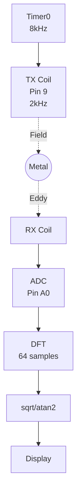
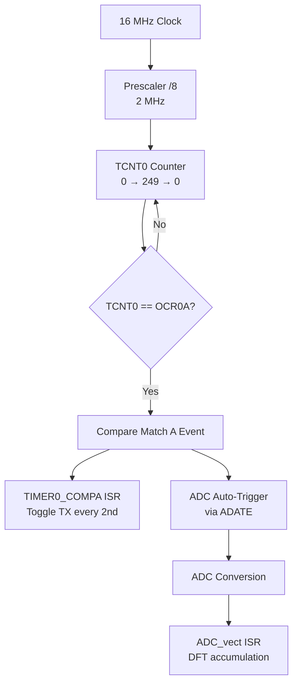

# Metal Detector Firmware Code Review

> [!abstract] Document Purpose
> This document provides a technical review of the VLF metal detector firmware.
> **Current State:** Minimal test version focusing on core TX/RX/DSP functionality.
>
> **Target:** ATmega328P (Arduino Nano)
> **Course:** DTU 34621 - Embedded Systems

---

## Table of Contents

1. [[#1. System Overview]]
2. [[#2. Code Structure]]
3. [[#3. Hardware Configuration]]
4. [[#4. Signal Processing]]
5. [[#5. Building and Flashing]]

---

## 1. System Overview

### 1.1 Current Architecture (Minimal Test Version)

The firmware is currently in a minimal test configuration with all application code consolidated into a single `main.c` file. This simplifies development and testing of the core signal processing chain.

```
Code/src/
├── main.c                 # All application code (TX, RX, DSP, display)
│
└── drivers/               # Hardware drivers (kept separate)
    ├── I2C.c, I2C.h       # TWI master driver
    ├── ssd1306.c, .h      # OLED display driver
    └── data.h             # Font data (PROGMEM)
```

### 1.2 Signal Flow



**Signal chain:** Timer0 (8kHz) → TX Toggle (2kHz) → Metal → RX Coil → ADC (auto-trigger) → DFT → Display

### 1.3 Key Specifications

| Parameter | Value | Notes |
|-----------|-------|-------|
| TX Frequency | 2 kHz | VLF range |
| Sample Rate | 8 kHz | 4 samples per TX cycle |
| ADC Trigger | Auto (ADATE) | Timer0 Compare Match A |
| DFT Window | 64 samples | 8 ms of data |
| TX Cycles per Window | 16 | 64 / 4 = 16 |
| I2C Clock | ~400 kHz | Fast mode |
| ADC Resolution | 10 bits | 0-1023 range |
| ADC Prescaler | 128 | 125 kHz ADC clock |

### 1.4 Pin Configuration

| Pin | AVR Port | Function | Notes |
|-----|----------|----------|-------|
| 9 | PB1 | TX signal | 2 kHz square wave |
| A0 | PC0/ADC0 | RX signal input | 10-bit ADC |
| A4 | PC4 | I2C SDA | OLED display |
| A5 | PC5 | I2C SCL | OLED display |
| D4 | PD4 | Debug button | Press to toggle debug screen |

---

## 2. Code Structure

### 2.1 main.c Overview

**Location:** `Code/src/main.c` (~188 lines)

The minimal test version contains:
- TX signal generation (Timer0)
- ADC sampling (auto-triggered)
- DFT accumulation and calculation
- Basic OLED display output

#### Includes and Constants

```c
#include <avr/io.h>
#include <avr/interrupt.h>
#include <util/delay.h>
#include <stdint.h>
#include <math.h>

#include "drivers/I2C.h"
#include "drivers/ssd1306.h"

#define N 64                      /* DFT window size */
#define ADC_OFFSET 512            /* DC offset (mid-scale) */
#define RAD_TO_DEG 57.2957795131  /* 180/PI */
```

#### Global Variables

```c
/* TX counter */
static volatile uint8_t tx_i = 0;

/* DFT accumulators */
static volatile uint8_t dft_i = 0;
static volatile int32_t Re = 0;
static volatile int32_t Im = 0;
static volatile int32_t Re_buf = 0;
static volatile int32_t Im_buf = 0;
static volatile uint8_t DFT_done = 0;

/* Results */
static volatile uint16_t magnitude = 0;
static volatile int16_t phase = 0;
```

> [!WARNING] Signed Types Required
> `Re` and `Im` MUST be `int32_t` (signed), not `uint32_t`.
> The DFT subtracts values, so negative results are expected.

#### Timer0 Initialization

```c
void tx_init(void)
{
    DDRB |= (1 << PB1);           /* Pin 9 output */
    TCCR0A = (1 << WGM01);        /* CTC mode */
    TCCR0B = (1 << CS01);         /* Prescaler 8 */
    OCR0A = 249;                  /* 8 kHz interrupt */
    TIMSK0 = (1 << OCIE0A);
}
```

**Frequency Calculation:**
- f_interrupt = 16 MHz / (8 × 250) = 8 kHz
- TX toggles every 2nd interrupt = 4 kHz toggle rate = 2 kHz square wave

#### ADC Initialization

```c
void adc_init(void)
{
    ADMUX = (1 << REFS0);         /* AVCC reference */
    ADCSRA = (1 << ADEN) | (1 << ADIE) | (1 << ADATE)
           | (1 << ADPS2) | (1 << ADPS1) | (1 << ADPS0);
    ADCSRB = (1 << ADTS1) | (1 << ADTS0);  /* Timer0 trigger */
    ADCSRA |= (1 << ADSC);        /* Start */
}
```

> [!TIP] Auto-Trigger Mode
> Using `ADATE` with `ADTS1:0 = 011` means the ADC automatically starts a new
> conversion on every Timer0 Compare Match A event. No manual triggering needed.

#### Timer0 ISR (TX Generation)

```c
ISR(TIMER0_COMPA_vect)
{
    /* Toggle TX every 2nd interrupt = 2kHz */
    if (++tx_i >= 2) {
        PORTB ^= (1 << PB1);
        tx_i = 0;
    }
}
```

#### ADC ISR (DFT Accumulation)

```c
ISR(ADC_vect)
{
    int16_t sample = ADC - ADC_OFFSET;

    /* 4x oversampling DFT at 2kHz */
    switch (dft_i & 3) {
        case 0: Re += sample; break;
        case 1: Im -= sample; break;
        case 2: Re -= sample; break;
        case 3: Im += sample; break;
    }

    if (++dft_i >= N) {
        Re_buf = Re;
        Im_buf = Im;
        DFT_done = 1;
        Re = Im = 0;
        dft_i = 0;
    }
}
```

#### Magnitude and Phase Calculation

```c
void calc_mag_phase(void)
{
    double re = (double)Re_buf;
    double im = (double)Im_buf;

    magnitude = (uint16_t)(sqrt(re*re + im*im) / 16.0);
    phase = (int16_t)(atan2(im, re) * RAD_TO_DEG);
}
```

> [!NOTE] Floating-Point Math
> Uses standard library `sqrt()` and `atan2()` from `<math.h>` for accuracy.
> This is slower on AVR but prioritizes correctness for testing.
> Can be optimized with integer approximations later.

#### Main Function

```c
int main(void)
{
    /* Init */
    I2C_Init();
    InitializeDisplay();
    clear_display();
    tx_init();
    adc_init();
    sei();

    sendStrXY("Starting...", 3, 2);
    _delay_ms(1000);
    clear_display();

    /* Main loop */
    while (1) {
        if (DFT_done) {
            DFT_done = 0;
            calc_mag_phase();
            display_results();
        }
        _delay_ms(50);
    }
}
```

> [!DANGER] Don't Forget sei()
> Without `sei()`, no interrupts will fire. The TX signal won't generate and ADC won't sample.

---

## 3. Hardware Configuration

### 3.1 Timer0 - TX Generation & ADC Auto-Trigger

Timer0 serves dual purposes:
1. Generate 8 kHz Compare Match A event for ADC auto-triggering
2. ISR toggles TX pin every 2nd interrupt for 2 kHz signal



### 3.2 ADC Timing

| Parameter | Value | Calculation |
|-----------|-------|-------------|
| ADC clock | 125 kHz | 16 MHz / 128 |
| Conversion time | 104 µs | 13 cycles / 125 kHz |
| Sample interval | 125 µs | 8 kHz rate |
| Margin | 21 µs | 125 - 104 |

### 3.3 Timing Diagram

```
Time (µs):     0    125   250   375   500
               │     │     │     │     │
Timer0 ISR:   [0]   [1]   [2]   [3]   [4]  (8 kHz)
TX Toggle:    Yes   No    Yes   No    Yes
TX Output:    ─────HIGH─────┐     ┌─────HIGH─────
                            └LOW─┘
ADC Sample:   S0    S1    S2    S3         (4 samples per TX cycle)
DFT coeff:   Re+   Im-   Re-   Im+

             ◄───── 500µs (one TX cycle, 2 kHz) ─────►
```

---

## 4. Signal Processing

### 4.1 The 4× Oversampling DFT Trick

Since we sample at exactly 4× the signal frequency (8kHz sampling, 2kHz signal), the DFT coefficients become trivial:

| Sample Index | cos coefficient | sin coefficient | Operation |
|--------------|-----------------|-----------------|-----------|
| 0 | +1 | 0 | Re += sample |
| 1 | 0 | -1 | Im -= sample |
| 2 | -1 | 0 | Re -= sample |
| 3 | 0 | +1 | Im += sample |

**No trigonometric calculations needed in the ISR!**

### 4.2 DFT Accumulation Pattern

```
TX Signal:     ┌────────────┐            ┌────────────┐
               │            │            │            │
          ─────┘            └────────────┘            └─────

Sample:        S0     S1     S2     S3     (4 samples per cycle)
               │      │      │      │
Phase:         0°    90°   180°   270°
               │      │      │      │
               ▼      ▼      ▼      ▼
          Re += S0
                 Im -= S1
                        Re -= S2
                               Im += S3
```

### 4.3 Display Output

Press the **D4 button** to toggle between two screens:

**Screen 1: DFT Results**
```
=== DFT ===

Re:   <value>
Im:   <value>

Mag:  <value>
Phase: <value> deg
```

**Screen 2: Debug Info**
```
=== DEBUG ===

ADC:  <raw 0-1023>
Min:  <minimum seen>
Max:  <maximum seen>
TX:   HIGH/LOW
DFT#: <completion count>
Vpp:  <max - min>
```

| Value | Description |
|-------|-------------|
| **Re/Im** | Raw DFT components (can be negative) |
| **Mag** | sqrt(Re² + Im²) / 16 |
| **Phase** | atan2(Im, Re) × 180/π degrees |
| **ADC** | Current raw ADC reading (0-1023) |
| **Min/Max** | ADC range since power-on |
| **TX** | Current TX pin state |
| **DFT#** | Number of completed DFT windows |
| **Vpp** | Peak-to-peak ADC swing (Max - Min) |

---

## 5. Building and Flashing

### 5.1 PlatformIO Configuration

```ini
[env:nano]
platform = atmelavr
board = nanoatmega328
framework = arduino

board_build.f_cpu = 16000000L

build_flags =
    -std=c99
    -Wall
    -Os
```

### 5.2 Build Commands

```bash
# Build
pio run

# Upload
pio run -t upload

# Monitor serial
pio device monitor
```

### 5.3 Memory Usage (Minimal Version with Debug)

| Memory | Used | Available | Percentage |
|--------|------|-----------|------------|
| RAM | 261 bytes | 2048 bytes | 12.7% |
| Flash | 4874 bytes | 30720 bytes | 15.9% |

---

## Troubleshooting

### No TX Signal on Pin 9

1. Check `tx_init()` is called
2. Verify `DDRB |= (1 << PB1)` executed
3. Check `sei()` is called (enables interrupts)
4. Measure with oscilloscope (should be 2kHz)

### ADC Not Sampling

1. Verify `sei()` is called (enables interrupts)
2. Check `adc_init()` is called (sets up auto-trigger)
3. Verify ADCSRA has ADEN, ADIE, and ADATE set
4. Verify ADCSRB has ADTS1:0 = 011 (Timer0 Compare Match A trigger)

### Display Not Working

1. Check I2C connections (A4=SDA, A5=SCL)
2. Verify I2C_Init() called before InitializeDisplay()
3. Try different I2C address (some modules use 0x7A instead of 0x78)

### Values Always Zero

1. Ensure ADC is connected to RX coil signal
2. Check that ADC_OFFSET (512) is appropriate for your signal
3. Verify DFT_done flag is being set (ISR running)

---

## Future Enhancements

The following features were removed for minimal testing and can be re-added later:

- [ ] IIR filtering for smoothed display
- [ ] Calibration routine
- [ ] Metal classification (ferrous/non-ferrous based on phase)
- [ ] Buzzer output with Timer2 PWM
- [ ] Button input for UI control
- [ ] Debug screens
- [ ] State machine (IDLE/RUNNING/CALIBRATING)

---

## Document Revision History

| Version | Date | Changes |
|---------|------|---------|
| 1.0 | 2025-01 | Initial comprehensive review (ATmega2560) |
| 2.0 | 2025-01 | Migrated to Arduino Nano (ATmega328P) |
| 2.1 | 2025-01 | Updated to reflect ADC auto-trigger mode (ADATE) |
| 2.2 | 2025-01 | Changed to floating-point sqrt()/atan2() |
| 3.0 | 2025-01 | Simplified to minimal test version (single main.c) |

---

*Document generated for DTU 34621 Metal Detector Project*
*Team: Mads Rudolph, Andreas Skaaning, Jonas Beck & Sigurd Hestbech*
