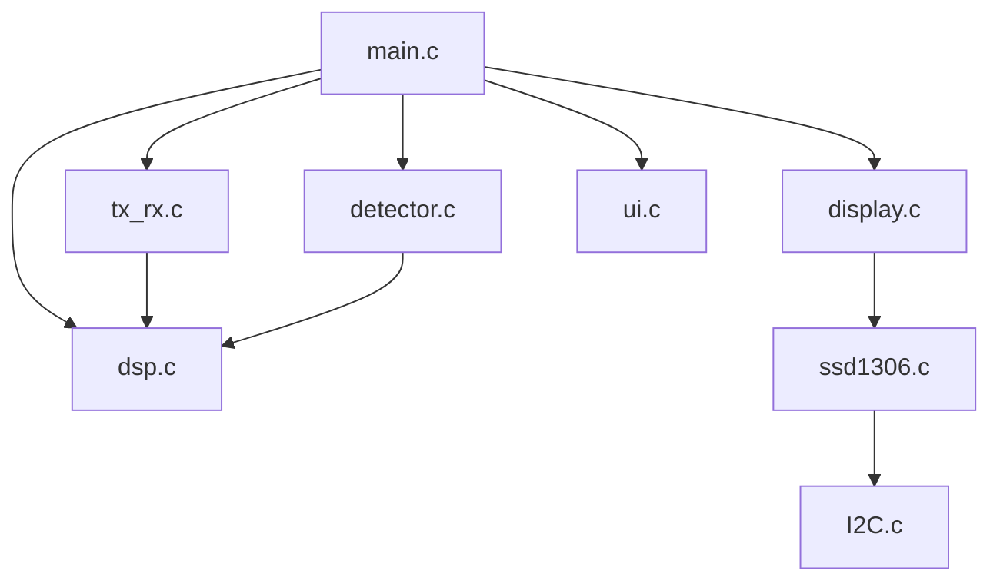
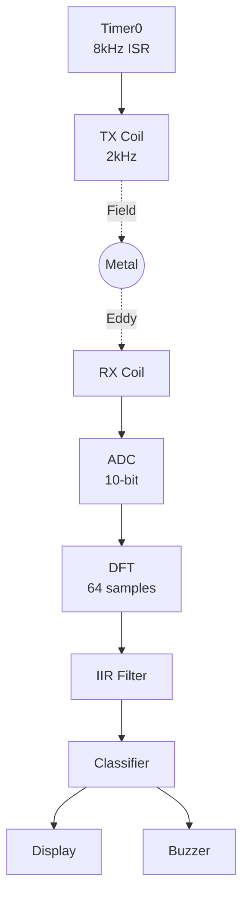
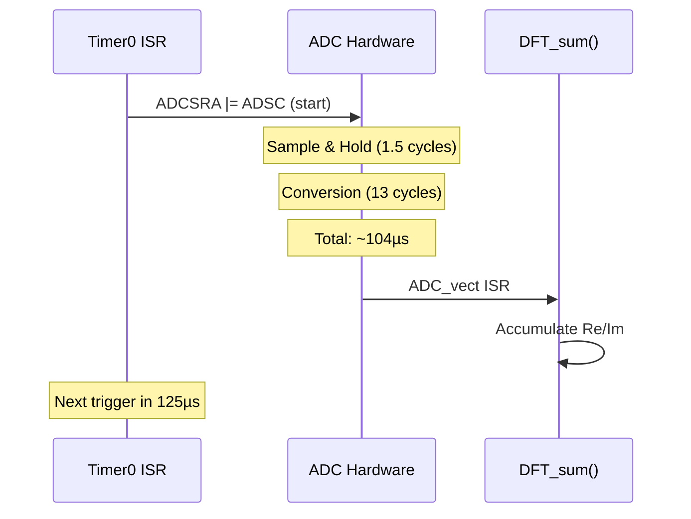
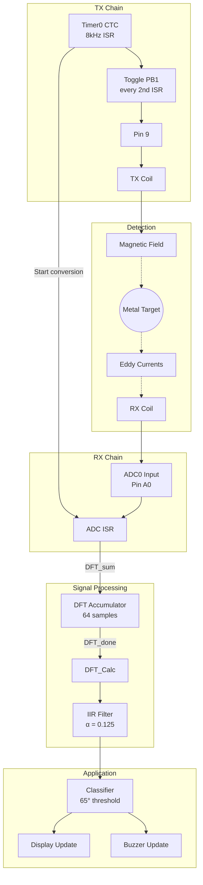
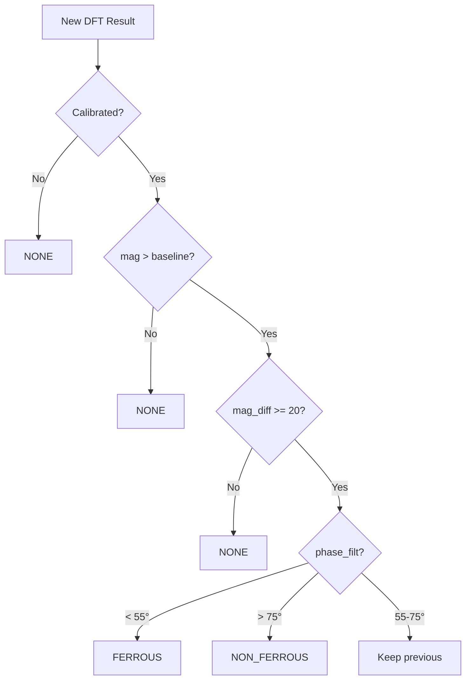
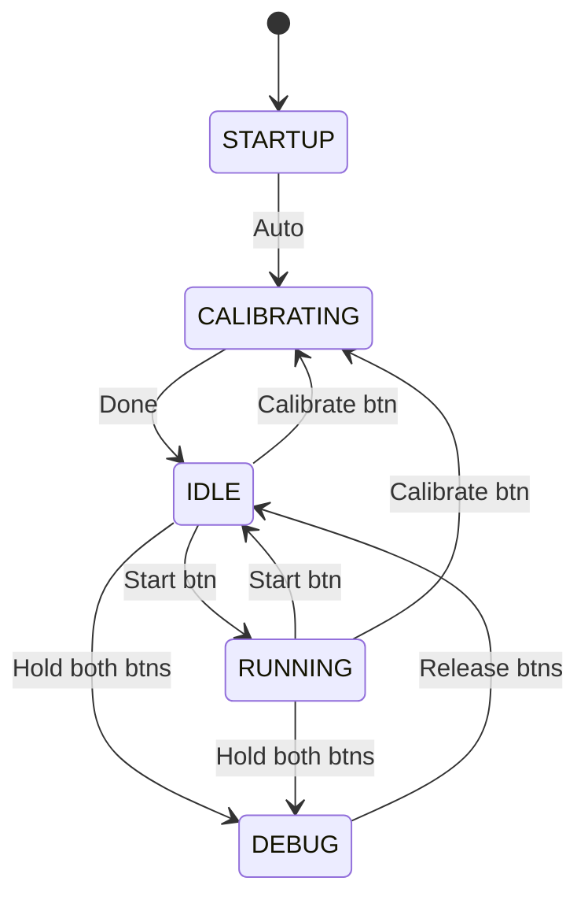
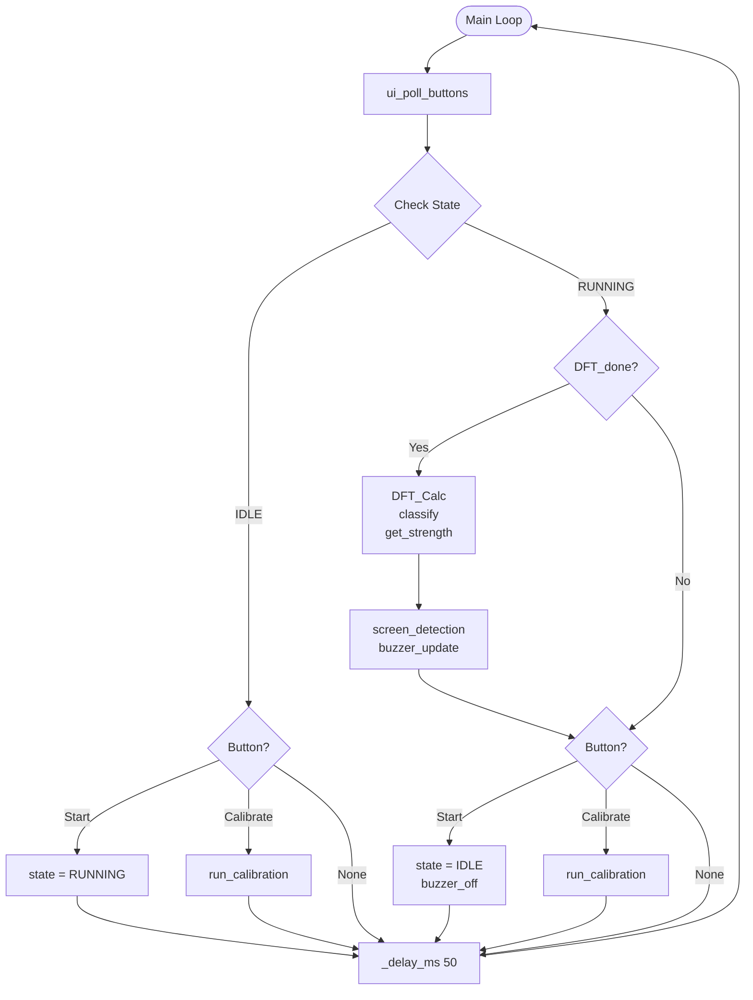

# Metal Detector Firmware Code Review

> [!abstract] Document Purpose
> This document provides a comprehensive technical review of the VLF metal detector firmware.
> It serves as both a **learning guide** for newcomers and a **reference** for experienced team members.
>
> **Target:** ATmega328P (Arduino Nano)
> **Course:** DTU 34621 - Embedded Systems

---

## Table of Contents

1. [[#1. System Overview]]
2. [[#2. File-by-File Breakdown]]
3. [[#3. Hardware Abstraction]]
4. [[#4. Signal Processing Pipeline]]
5. [[#5. Application Logic]]
6. [[#6. Timing & Synchronization]]
7. [[#7. Building and Flashing]]

---

## 1. System Overview

### 1.1 High-Level Architecture

The metal detector firmware is organized into three logical layers:



```
Code/src/
├── main.c                 # Application entry point, state machine
│
├── signal/                # Signal generation and processing
│   ├── tx_rx.c, tx.h      # TX signal generation + ADC sampling (Timer0)
│   └── dsp.c, dsp.h       # DFT analysis and filtering
│
├── app/                   # Application logic
│   ├── detector.c, .h     # Metal classification
│   ├── display.c, .h      # High-level display API
│   ├── ui.c, ui.h         # Buttons and buzzer
│   └── debug.c, debug.h   # Debug screens
│
└── drivers/               # Hardware drivers
    ├── I2C.c, I2C.h       # TWI master driver
    ├── ssd1306.c, .h      # OLED display driver
    └── data.h             # Font data (PROGMEM)
```

| Layer | Modules | Purpose |
|-------|---------|---------|
| **Application** | main.c, detector.c, display.c, ui.c | State machine, classification, UI |
| **Signal** | tx_rx.c, dsp.c | TX generation, ADC sampling, DFT |
| **Drivers** | I2C.c, ssd1306.c, data.h | Hardware abstraction |

### 1.2 Signal Flow



**Signal chain:** Timer0 → TX Coil → Metal Target → RX Coil → ADC → DFT → Filter → Classifier → Output

### 1.3 Key Specifications

| Parameter | Value | Notes |
|-----------|-------|-------|
| TX Frequency | 2 kHz | VLF range for general purpose |
| Sample Rate | 8 kHz | 4 samples per TX cycle |
| DFT Window | 64 samples | 8 ms of data |
| TX Cycles per Window | 16 | 64 / 4 = 16 |
| Phase Threshold | 65° | Ferrous < 65°, Non-ferrous > 65° |
| Display Refresh | ~20 Hz | 50ms main loop delay |
| I2C Clock | ~400 kHz | Fast mode |
| ADC Resolution | 10 bits | 0-1023 range |

### 1.4 Pin Configuration - Arduino Nano (ATmega328P)

| Pin | AVR Port | Function | Notes |
|-----|----------|----------|-------|
| 2 | PD2 | Start/Stop button | Active low, internal pull-up |
| 3 | PD3 | Buzzer | Timer2 PWM (OC2B) |
| 4 | PD4 | Calibrate button | Active low, internal pull-up |
| 8 | PB0 | Debug output | Toggle for oscilloscope |
| 9 | PB1 | TX signal | 2 kHz square wave |
| A0 | PC0/ADC0 | RX signal input | 10-bit ADC |
| A4 | PC4 | I2C SDA | OLED display |
| A5 | PC5 | I2C SCL | OLED display |

> [!NOTE] No config.h
> Pin definitions are **directly in each .c file** where they are used.
> This makes it easier to understand the code without jumping between files.

---

## 2. File-by-File Breakdown

### 2.1 tx_rx.c - TX Signal Generation & ADC Sampling

**Location:** `Code/src/signal/tx_rx.c`

**Purpose:** Generate 2kHz TX signal and sample ADC at 8kHz using Timer0.

**Hardware Used:** Timer0, Pin 9 (PB1), ADC0

#### Pin Definitions (directly in file)

```c
/* TX Signal: Pin 9 = PB1 */
DDRB |= (1 << PB1);      /* Set as output */
PORTB ^= (1 << PB1);     /* Toggle in ISR */
```

#### Timer0 Configuration

```c
void timer0_init(void) {
    DDRB |= (1 << PB1);           /* Pin 9 as output */

    TCCR0A = (1 << WGM01);        /* CTC mode */
    TCCR0B = (1 << CS01);         /* Prescaler 8 */
    OCR0A = 249;                   /* 16MHz / 8 / 250 = 8 kHz interrupt */
    TIMSK0 = (1 << OCIE0A);       /* Compare match interrupt */
}
```

**Frequency Calculation:**
- f_interrupt = 16 MHz / (8 × 250) = 8 kHz
- TX toggles every 2nd interrupt = 4 kHz toggle rate = 2 kHz square wave

#### Timer0 Compare Match ISR

```c
ISR(TIMER0_COMPA_vect) {
    tx_counter++;
    if (tx_counter >= 2) {
        tx_counter = 0;
        PORTB ^= (1 << PB1);      /* Toggle TX pin */
    }

    if (sampling_enabled) {
        ADCSRA |= (1 << ADSC);    /* Start ADC conversion */
    }
}
```

#### ADC Configuration

```c
void adc_init(void) {
    ADMUX = (1 << REFS0);         /* AVCC reference, channel 0 */

    ADCSRA = (1 << ADEN)          /* Enable ADC */
           | (1 << ADIE)          /* Enable interrupt */
           | (1 << ADPS2) | (1 << ADPS1) | (1 << ADPS0);  /* Prescaler 128 */

    ADCSRB = 0;                   /* Free running (triggered manually) */
}
```

#### ADC ISR

```c
ISR(ADC_vect) {
    uint16_t sample = ADC;
    DFT_sum(sample);              /* Send to DFT accumulator */
}
```

---

### 2.2 dsp.c - DFT Signal Processing

**Location:** `Code/src/signal/dsp.c`

**Purpose:** Extract magnitude and phase from RX signal using optimized single-bin DFT.

#### The 4× Oversampling Trick

Since we sample at exactly 4× the signal frequency (8kHz sampling, 2kHz signal), the DFT coefficients become trivial:

| Sample Index | cos coefficient | sin coefficient | Operation |
|--------------|-----------------|-----------------|-----------|
| 0 | +1 | 0 | Re += xn |
| 1 | 0 | -1 | Im -= xn |
| 2 | -1 | 0 | Re -= xn |
| 3 | 0 | +1 | Im += xn |

**No trigonometric calculations needed!**

#### DFT Accumulator

```c
#define N 64                      /* Samples per DFT window */

volatile int32_t Re = 0;          /* Real accumulator (signed!) */
volatile int32_t Im = 0;          /* Imaginary accumulator (signed!) */

void DFT_sum(uint16_t ADC_Raw) {
    int16_t xn = (int16_t)ADC_Raw - 512;  /* Remove DC offset */

    switch(i & 3) {
        case 0: Re += xn; break;  /* cos(0°) = +1 */
        case 1: Im -= xn; break;  /* -sin(90°) = -1 */
        case 2: Re -= xn; break;  /* cos(180°) = -1 */
        case 3: Im += xn; break;  /* -sin(270°) = +1 */
    }

    i++;
    if (i >= N) {
        i = 0;
        DFT_done = 1;
        Re_buff = Re;
        Im_buff = Im;
        Re = 0;
        Im = 0;
    }
}
```

> [!WARNING] Signed Types Required
> `Re` and `Im` MUST be `int32_t` (signed), not `uint32_t`.
> The DFT subtracts values, so negative results are expected.

#### Magnitude and Phase Calculation

```c
void DFT_Calc(void) {
    /* Scale down to prevent overflow */
    int32_t re_scaled = Re_buff / 16;
    int32_t im_scaled = Im_buff / 16;

    /* Magnitude = sqrt(Re² + Im²) using integer sqrt */
    uint32_t mag_squared = re_scaled * re_scaled + im_scaled * im_scaled;
    magnitude = isqrt(mag_squared);

    /* Phase = atan2(Im, Re) using integer approximation */
    phase_deg = fast_atan2_deg(Im_buff, Re_buff);

    /* IIR low-pass filter for stability */
    magnitude_filt = (32 * magnitude + 224 * magnitude_filt) / 256;
    phase_filt = (32 * phase_deg + 224 * phase_filt) / 256;
}
```

> [!NOTE] Integer Math Only
> We use `isqrt()` and `fast_atan2_deg()` instead of `sqrt()` and `atan2()`.
> Floating-point operations are ~50× slower on AVR with no FPU.

#### Exported Variables (in dsp.h)

| Variable | Type | Description |
|----------|------|-------------|
| `Re_buff` | `volatile int32_t` | Raw real DFT component |
| `Im_buff` | `volatile int32_t` | Raw imaginary DFT component |
| `DFT_done` | `volatile uint8_t` | Flag: 1 when new DFT ready |
| `magnitude` | `volatile uint16_t` | Raw magnitude |
| `phase_deg` | `volatile int16_t` | Raw phase in degrees |
| `magnitude_filt` | `volatile uint16_t` | Filtered magnitude |
| `phase_filt` | `volatile int16_t` | Filtered phase |

---

### 2.3 ui.c - User Interface

**Location:** `Code/src/app/ui.c`

**Purpose:** Handle button input and buzzer output.

**Hardware Used:** Timer2 (buzzer PWM), Port D (buttons)

#### Pin Usage (directly in file)

```c
/* Buttons - Port D, active low with pull-up */
DDRD &= ~((1 << PD2) | (1 << PD4));   /* Input */
PORTD |= (1 << PD2) | (1 << PD4);     /* Pull-up */

/* Buzzer - Pin 3 (PD3) */
DDRD |= (1 << PD3);                    /* Output */
```

#### Button Polling

```c
void ui_poll_buttons(void) {
    uint8_t start_now = (PIND & (1 << PD2)) ? 1 : 0;
    uint8_t calibrate_now = (PIND & (1 << PD4)) ? 1 : 0;

    /* Detect falling edge with 50ms debounce */
    if (last_start == 1 && start_now == 0) {
        _delay_ms(50);
        if (!(PIND & (1 << PD2))) {
            btn_start_pressed = 1;
        }
    }
    /* Similar for calibrate... */
}
```

#### Buzzer PWM (Timer2)

```c
/* Timer2 Fast PWM mode */
TCCR2A = (1 << WGM21) | (1 << WGM20);
TCCR2B = (1 << CS22);                  /* Prescaler 64 */

/* Enable buzzer */
TCCR2A |= (1 << COM2B1);               /* Connect OC2B (Pin 3) */
OCR2B = 127;                           /* 50% duty cycle */

/* Disable buzzer */
TCCR2A &= ~(1 << COM2B1);
OCR2B = 0;
```

---

### 2.4 main.c - Application Entry Point

**Location:** `Code/src/main.c`

**Purpose:** System initialization and main state machine.

#### Pin Definitions (directly in file)

```c
/* Buttons for debug mode check */
#define PIND & (1 << PD2)   /* Start button */
#define PIND & (1 << PD4)   /* Calibrate button */
```

#### Initialization Sequence

```c
static void system_init(void) {
    timer1_init();      /* Actually calls timer0_init() for 2kHz TX */
    display_init();     /* I2C + OLED */
    adc_init();         /* ADC configuration */
    detector_init();    /* Reset calibration */
    ui_init();          /* Buttons + buzzer */
}

int main(void) {
    system_init();
    sei();              /* Enable global interrupts - CRITICAL! */
    /* ... */
}
```

> [!DANGER] Don't Forget sei()
> Without `sei()`, no interrupts will fire. The TX signal won't generate and ADC won't sample.

#### State Machine

| State | Description |
|-------|-------------|
| **STARTUP** | Initialize hardware, show splash, play beep |
| **CALIBRATING** | Display "KALIBRERING", collect samples 2s, store baseline |
| **IDLE** | Display idle screen, wait for button input |
| **RUNNING** | Process DFT, classify metal, update display/buzzer |
| **DEBUG** | Show debug screens (hold both buttons) |

---

### 2.5 debug.c / debug.h - Debug System

**Location:** `Code/src/app/debug.c`

**Purpose:** Four debug screens for troubleshooting.

#### Debug Pin (directly in file)

```c
/* Pin 8 (PB0) for oscilloscope timing verification */
DDRB |= (1 << PB0);
PORTB ^= (1 << PB0);      /* Toggle macro: debug_pin_toggle() */
```

#### Debug Screens

1. **ADC** - Raw values, min/max, sample count
2. **DFT Accum** - Re, Im, completion count
3. **DFT Result** - Magnitude, phase, classification
4. **Timing** - Frequencies, ISR count, sync status

---

### 2.6 I2C.c - TWI Driver

**Location:** `Code/src/drivers/I2C.c`

**Purpose:** I2C master communication for OLED display.

**Hardware:** A4 (SDA), A5 (SCL) - fixed pins on ATmega328P

| Function | Purpose |
|----------|---------|
| `I2C_Init()` | Initialize TWI at ~400kHz |
| `I2C_Start(addr)` | Send START + address |
| `I2C_Write(data)` | Write one byte |
| `I2C_Stop()` | Send STOP condition |

---

## 3. Hardware Abstraction

### 3.1 Timer0 - TX Generation & ADC Trigger

Timer0 serves dual purposes:
1. Generate 8 kHz interrupt for ADC sampling
2. Toggle TX pin every 2nd interrupt for 2 kHz signal

```mermaid
flowchart TD
    CLK[16 MHz Clock] --> PRE[Prescaler /8<br>2 MHz]
    PRE --> CNT[TCNT0 Counter<br>0 → 249 → 0]
    CNT --> CMP{TCNT0 == OCR0A?}
    CMP -->|Yes| ISR[TIMER0_COMPA ISR]
    CMP -->|No| CNT

    ISR --> TX_CHK{tx_counter >= 2?}
    TX_CHK -->|Yes| TOGGLE[Toggle PB1<br>tx_counter = 0]
    TX_CHK -->|No| INC[tx_counter++]

    ISR --> ADC_CHK{sampling_enabled?}
    ADC_CHK -->|Yes| START_ADC[ADCSRA |= ADSC]
    ADC_CHK -->|No| DONE

    TOGGLE --> INC
    INC --> DONE[Wait for next]
    START_ADC --> DONE
```

**Frequency:** 16 MHz / 8 / 250 = **8 kHz** interrupt rate → **2 kHz** TX signal

### 3.2 ADC Timing



| Parameter | Value | Calculation |
|-----------|-------|-------------|
| ADC clock | 125 kHz | 16 MHz / 128 |
| Conversion time | 104 µs | 13 cycles / 125 kHz |
| Sample interval | 125 µs | 8 kHz rate |
| Margin | 21 µs | 125 - 104 ✓ |

### 3.3 GPIO Pin Summary

| Pin | Port | Direction | Function |
|-----|------|-----------|----------|
| 9 | PB1 | Output | TX signal (2kHz) |
| A0 | PC0/ADC0 | Input | RX signal |
| A4 | PC4/SDA | Bidirectional | I2C data |
| A5 | PC5/SCL | Output | I2C clock |
| 3 | PD3/OC2B | Output | Buzzer PWM |
| 2 | PD2 | Input | Start/Stop button |
| 4 | PD4 | Input | Calibrate button |
| 8 | PB0 | Output | Debug toggle |

---

## 4. Signal Processing Pipeline

### 4.0 Complete Signal Flow



### 4.1 DFT Accumulation Pattern

```
TX Signal:     ┌────────────┐            ┌────────────┐
               │            │            │            │
          ─────┘            └────────────┘            └─────

Sample:        S0     S1     S2     S3     (4 samples per cycle)
               │      │      │      │
Phase:         0°    90°   180°   270°
               │      │      │      │
cos coeff:    +1      0     -1      0
sin coeff:     0     -1      0     +1
               │      │      │      │
               ▼      ▼      ▼      ▼
          Re += S0
                 Im -= S1
                        Re -= S2
                               Im += S3
```

### 4.2 Phase Interpretation



| Phase Range | Metal Type | Physical Reason |
|-------------|------------|-----------------|
| < 55° | **Ferrous** | High magnetic permeability |
| 55-75° | (hysteresis) | Classification held |
| > 75° | **Non-ferrous** | Eddy currents dominate |

---

## 5. Application Logic

### 5.1 State Machine Flow



| State | Description |
|-------|-------------|
| **STARTUP** | Initialize hardware, show splash, play beep |
| **CALIBRATING** | Display "KALIBRERING", collect samples 2s, store baseline |
| **IDLE** | Display idle screen, wait for button input |
| **RUNNING** | Process DFT, classify metal, update display/buzzer |
| **DEBUG** | Show debug screens (hold both buttons) |

### 5.2 Calibration

1. Display "KALIBRERING"
2. Collect 2 seconds of data
3. Store baseline magnitude and phase
4. Double beep confirmation

> [!TIP] Calibration
> Hold search coil away from metal during calibration.

### 5.3 Main Loop Flowchart



---

## 6. Timing & Synchronization

### 6.1 Complete Timing Diagram

```mermaid
gantt
    title TX Signal and ADC Sampling (one TX cycle = 500µs)
    dateFormat X
    axisFormat %L µs

    section TX Signal
    HIGH (Pin 9)     :a1, 0, 250
    LOW (Pin 9)      :a2, 250, 250

    section Timer0 ISR
    ISR 0 (toggle)   :milestone, m1, 0, 0
    ISR 1            :milestone, m2, 125, 0
    ISR 2 (toggle)   :milestone, m3, 250, 0
    ISR 3            :milestone, m4, 375, 0

    section ADC Samples
    S0 (0°)          :crit, s0, 0, 104
    S1 (90°)         :crit, s1, 125, 104
    S2 (180°)        :crit, s2, 250, 104
    S3 (270°)        :crit, s3, 375, 104
```



```
Time (µs):     0    125   250   375   500
               │     │     │     │     │
Timer0 ISR:   [0]   [1]   [2]   [3]   [4]  (8 kHz)
TX Toggle:    Yes   No    Yes   No    Yes
TX Output:    ─────HIGH─────┐     ┌─────HIGH─────
                            └LOW─┘
ADC Sample:   S0    S1    S2    S3         (4 samples per TX cycle)
DFT coeff:   Re+   Im-   Re-   Im+

             ◄───── 500µs (one TX cycle, 2 kHz) ─────►
```

---

## 7. Building and Flashing

### 7.1 PlatformIO Configuration

```ini
[env:nano]
platform = atmelavr
board = nanoatmega328
framework = arduino

board_build.f_cpu = 16000000L

build_flags =
    -std=c99
    -Wall
    -Os

build_src_filter =
    +<*.c>
    +<signal/*.c>
    +<app/*.c>
    +<drivers/*.c>
```

### 7.2 Build Commands

```bash
# Build
pio run

# Upload
pio run -t upload

# Monitor serial
pio device monitor
```

---

## Troubleshooting

### No TX Signal on Pin 9

1. Check `timer0_init()` is called
2. Verify `DDRB |= (1 << PB1)` executed
3. Check `sei()` is called (enables interrupts)
4. Measure with oscilloscope (should be 2kHz)

### ADC Not Sampling

1. Verify `sei()` is called
2. Check `sampling_start()` is called
3. Verify ADCSRA has ADEN and ADIE set

### Display Not Working

1. Check I2C connections (A4=SDA, A5=SCL)
2. Verify 1 second delay in `I2C_Init()` for display startup
3. Try different I2C address (some modules use 0x7A instead of 0x78)

### No Metal Detection

1. Verify calibration was performed (double beep)
2. Check phase/magnitude values in debug screen
3. Ensure `DFT_done` flag is being set

### Buzzer Always On or Off

1. Check `ui_init()` is called
2. Verify `DDRD |= (1 << PD3)` executed
3. Test with `buzzer_beep(100)`

---

## Document Revision History

| Version | Date | Changes |
|---------|------|---------|
| 1.0 | 2025-01 | Initial comprehensive review (ATmega2560) |
| 2.0 | 2025-01 | Migrated to Arduino Nano (ATmega328P), removed config.h |

---

*Document generated for DTU 34621 Metal Detector Project*
*Team: Mads Rudolph, Andreas Skaaning, Jonas Beck & Sigurd Hestbech*
