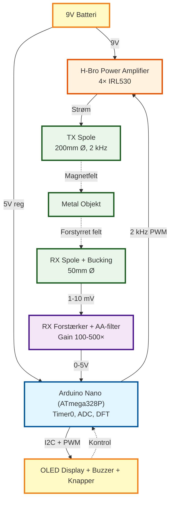

# System Architecture - VLF Metal Detector

## Vertical Block Diagram

```mermaid
flowchart TB
    Battery["9V Batteri"]
    MCU["Arduino Nano (ATmega328P)<br/>Timer0, ADC, DFT"]
    HBridge["H-Bro Power Amplifier<br/>4× IRL530"]
    TXCoil["TX Spole<br/>200mm Ø, 2 kHz"]
    Metal["Metal Objekt"]
    RXCoil["RX Spole + Bucking<br/>50mm Ø"]
    RXAmp["RX Forstærker + AA-filter<br/>Gain 100-500×"]
    Display["OLED Display + Buzzer + Knapper"]

    Battery -->|"9V"| HBridge
    Battery -->|"5V reg"| MCU
    MCU -->|"2 kHz PWM"| HBridge
    HBridge -->|"Strøm"| TXCoil
    TXCoil -.->|"Magnetfelt"| Metal
    Metal -.->|"Forstyrret felt"| RXCoil
    RXCoil -->|"1-10 mV"| RXAmp
    RXAmp -->|"0-5V"| MCU
    MCU -->|"I2C + PWM"| Display
    Display -.->|"Kontrol"| MCU

    classDef powerBox fill:#fff9c4,stroke:#f57f17,stroke-width:3px
    classDef mcuBox fill:#e1f5ff,stroke:#01579b,stroke-width:3px
    classDef txBox fill:#fff3e0,stroke:#e65100,stroke-width:3px
    classDef coilBox fill:#e8f5e9,stroke:#1b5e20,stroke-width:3px
    classDef rxBox fill:#f3e5f5,stroke:#4a148c,stroke-width:3px

    class Battery powerBox
    class MCU mcuBox
    class HBridge txBox
    class TXCoil,Metal,RXCoil coilBox
    class RXAmp rxBox
    class Display powerBox
```
