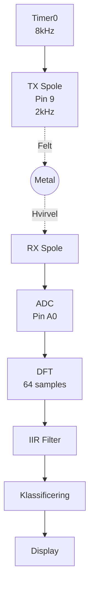
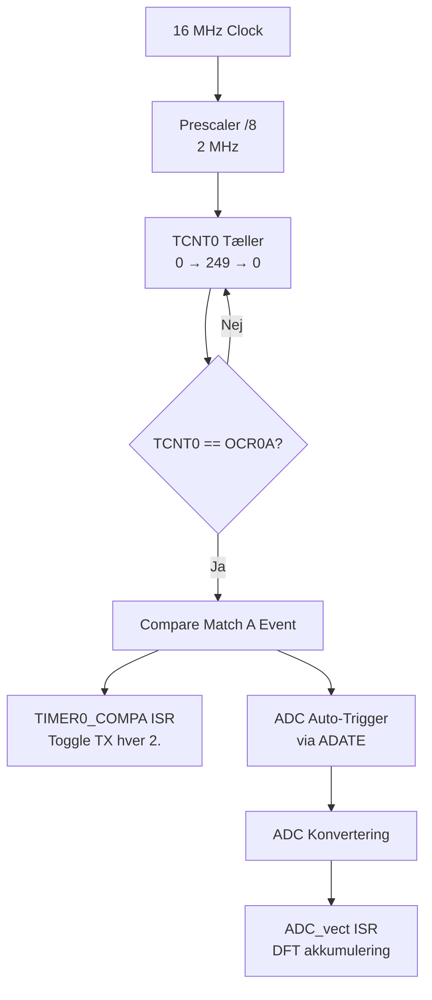
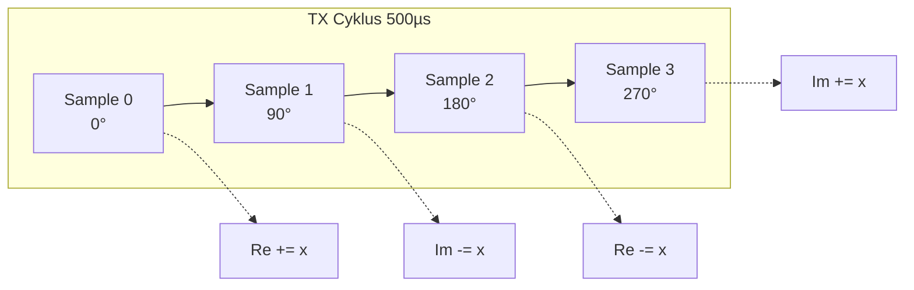
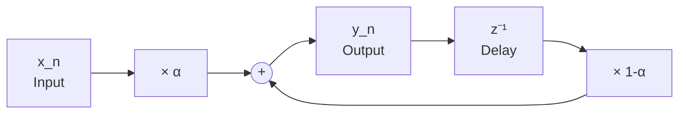
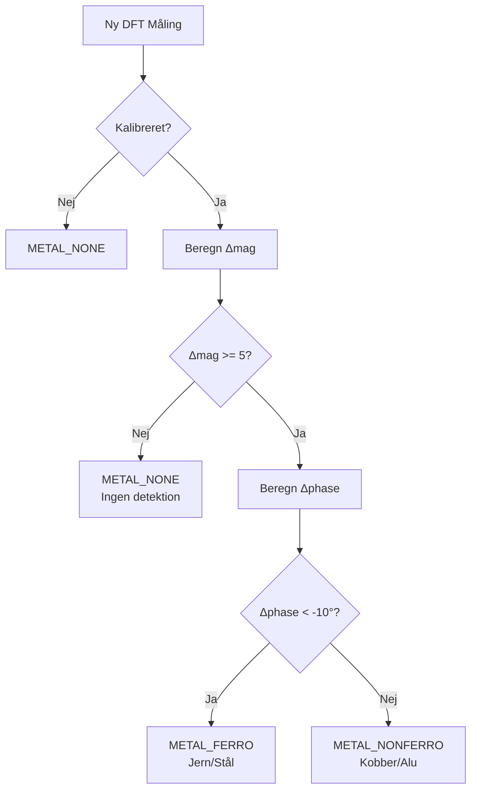
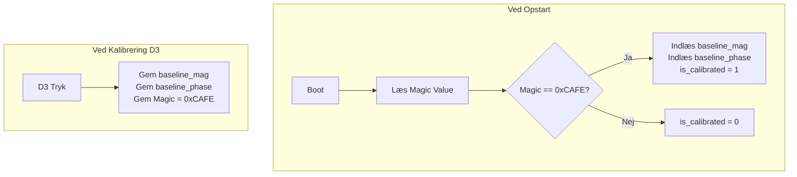
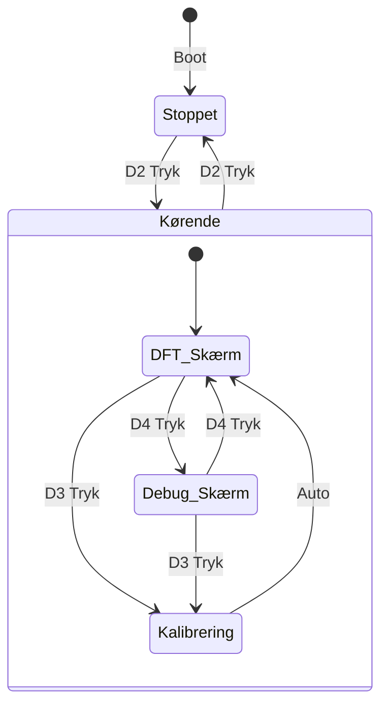

# Metaldetektor Firmware Kodegennemgang

> [!abstract] Dokumentformål
> Dette dokument giver en teknisk gennemgang af VLF metaldetektor firmwaren.
> **Nuværende Status:** Fuldt funktionel version med metaldetektion, klassificering og kalibrering.
>
> **Mål:** ATmega328P (Arduino Nano)
> **Kursus:** DTU 34621 - Indlejrede Systemer

---

## Indholdsfortegnelse

1. [[#1. Systemoversigt]]
2. [[#2. Kodestruktur]]
3. [[#3. Hardware Konfiguration]]
4. [[#4. Signalbehandling]]
5. [[#5. Metal Klassificering]]
6. [[#6. EEPROM Kalibrering]]
7. [[#7. Kompilering og Upload]]
8. [[#8. Brugergrænseflade]]
9. [[#9. Fejlfinding]]

---

## 1. Systemoversigt

### 1.1 Nuværende Arkitektur

Firmwaren er en fuldt funktionel metaldetektor med følgende funktioner:
- TX signalgenerering (2 kHz firkantbølge)
- RX signal sampling og DFT analyse
- IIR filtrering for stabil visning
- Metal klassificering (ferro/non-ferro baseret på fase)
- EEPROM kalibrering med persistens
- Start/Stop kontrol
- Debug display mode

```
Code/src/
├── main.c                 # Al applikationskode (~450 linjer)
│
└── drivers/               # Hardware drivere
    ├── I2C.c, I2C.h       # TWI master driver
    ├── ssd1306.c, .h      # OLED display driver
    └── data.h             # Font data (PROGMEM)
```

### 1.2 Signalflow



**Signalkæde:** Timer0 (8kHz) → TX Toggle (2kHz) → Metal → RX Spole → ADC → DFT → IIR Filter → Klassificering → Display

### 1.3 Nøglespecifikationer

| Parameter | Værdi | Noter |
|-----------|-------|-------|
| TX Frekvens | 2 kHz | VLF område |
| Samplerate | 8 kHz | 4 samples per TX cyklus |
| ADC Trigger | Auto (ADATE) | Timer0 Compare Match A |
| DFT Vindue | 64 samples | 8 ms data |
| TX Cykler per Vindue | 16 | 64 / 4 = 16 |
| IIR Alpha | 0.15 | Udglætningsfaktor |
| I2C Clock | ~400 kHz | Fast mode |
| ADC Opløsning | 10 bits | 0-1023 område |
| ADC Prescaler | 64 | 250 kHz ADC clock |

### 1.4 Pin Konfiguration

| Pin | AVR Port | Funktion | Noter |
|-----|----------|----------|-------|
| 9 | PB1 | TX signal | 2 kHz firkantbølge |
| A0 | PC0/ADC0 | RX signal indgang | 10-bit ADC |
| A4 | PC4 | I2C SDA | OLED display |
| A5 | PC5 | I2C SCL | OLED display |
| D2 | PD2 | Start/Stop knap | Toggle detektor on/off |
| D3 | PD3 | Kalibrering knap | Gem baseline i EEPROM |
| D4 | PD4 | Debug knap | Skift mellem DFT og debug skærm |

---

## 2. Kodestruktur

### 2.1 main.c Oversigt

**Placering:** `Code/src/main.c` (~450 linjer)

Filen indeholder al applikationslogik:
- Hardware initialisering (Timer, ADC, Knapper)
- Interrupt Service Routines (Timer0, ADC)
- DFT beregning og akkumulering
- IIR filtrering
- Metal klassificering
- EEPROM håndtering
- Display funktioner
- Hovedløkke med knaphåndtering

#### Includes og Konstanter

```c
#include <avr/io.h>
#include <avr/interrupt.h>
#include <avr/eeprom.h>
#include <util/delay.h>
#include <stdint.h>
#include <stdlib.h>
#include <stdio.h>
#include <math.h>

#include "drivers/I2C.h"
#include "drivers/ssd1306.h"

#define F_SAMPLE 8000
#define F_SIGNAL 2000
#define N 64
#define ADC_OFFSET 512

/* Metal Klassificering */
#define FERRO_THRESHOLD -10     /* Fase tærskel for ferro/non-ferro (grader) */
#define DETECT_THRESHOLD 5      /* Min. magnitude ændring for detektion */
#define METAL_NONE    0
#define METAL_FERRO   1
#define METAL_NONFERRO 2

/* IIR Filter */
#define IIR_ALPHA 0.15f

/* EEPROM Adresser og Magic Value */
#define EEPROM_MAGIC_ADDR     0
#define EEPROM_MAG_ADDR       2
#define EEPROM_PHASE_ADDR     4
#define EEPROM_MAGIC_VALUE    0xCAFE
```

#### Globale Variable

```c
/* TX og ADC */
static uint8_t tx_count = 0;
volatile int16_t adc_raw = 0;
volatile uint8_t sync_flag = 0;

/* DFT akkumulatorer */
volatile uint8_t dft_index = 0;
volatile int32_t Re = 0, Im = 0;
volatile int32_t Re_buf = 0, Im_buf = 0;
volatile uint8_t dft_done = 0;

/* Resultater */
volatile uint16_t mag = 0;
volatile int16_t phase = 0;

/* Detektor tilstand */
static uint8_t detector_running = 0;
static uint8_t show_debug = 0;

/* Metal Klassificering */
static int16_t baseline_phase = 0;
static uint16_t baseline_mag = 0;
static uint8_t is_calibrated = 0;
static uint8_t metal_type = METAL_NONE;
static uint8_t metal_detected = 0;

/* IIR Filtrerede værdier */
static float mag_filtered = 0.0f;
static float phase_filtered = 0.0f;
```

> [!WARNING] Signed Typer Påkrævet
> `Re` og `Im` SKAL være `int32_t` (signed), ikke `uint32_t`.
> DFT'en subtraherer værdier, så negative resultater er forventede.

#### Timer0 Initialisering

```c
void timer0_init(void) {
    DDRB |= (1 << PB1);           /* Pin 9 udgang */
    TCCR0A = (1 << WGM01);        /* CTC mode */
    TCCR0B = (1 << CS01);         /* Prescaler 8 */
    OCR0A = 249;                  /* 8 kHz interrupt */
    TIMSK0 = (1 << OCIE0A);
}
```

**Frekvensberegning:**
- f_interrupt = 16 MHz / (8 × 250) = 8 kHz
- TX toggles hver 2. interrupt = 4 kHz toggle rate = 2 kHz firkantbølge

#### ADC Initialisering

```c
void adc_init(void) {
    ADMUX = (1 << REFS0);         /* AVCC reference */
    ADCSRA = (1 << ADEN) | (1 << ADIE) | (1 << ADATE)
           | (1 << ADPS2) | (1 << ADPS1);  /* Prescaler 64 */
    ADCSRB = (1 << ADTS1) | (1 << ADTS0);  /* Timer0 trigger */
    ADCSRA |= (1 << ADSC);        /* Start */
}
```

> [!TIP] Auto-Trigger Mode
> Ved brug af `ADATE` med `ADTS1:0 = 011` starter ADC automatisk en ny
> konvertering ved hver Timer0 Compare Match A event. Ingen manuel triggering nødvendig.

#### Button Initialisering

```c
void button_init(void) {
    DDRD &= ~(1 << PD4);          /* D4 Debug - input */
    PORTD |= (1 << PD4);          /* Pull-up aktiveret */
    DDRD &= ~(1 << PD3);          /* D3 Calibrate - input */
    PORTD |= (1 << PD3);          /* Pull-up aktiveret */
    DDRD &= ~(1 << PD2);          /* D2 Start/Stop - input */
    PORTD |= (1 << PD2);          /* Pull-up aktiveret */
}
```

Alle tre knapper bruger interne pull-up modstande. Knapperne er active-low (forbundet til GND ved tryk).

#### Timer0 ISR (TX Generering)

```c
ISR(TIMER0_COMPA_vect) {
    if (!detector_running) {
        PORTB &= ~(1 << PB1);     /* TX lav når stoppet */
        tx_count = 0;
        return;
    }

    if (++tx_count >= 2) {
        PORTB ^= (1 << PB1);      /* Toggle TX */
        tx_count = 0;
        if (PORTB & (1 << PB1)) {
            sync_flag = 1;        /* Synkroniser DFT med TX rising edge */
        }
    }
}
```

ISR'en tjekker først om detektoren kører. Hvis ikke, holdes TX lav for at spare strøm og undgå støj.

#### ADC ISR (DFT Akkumulering)

```c
ISR(ADC_vect) {
    adc_raw = ADC;
    if (sync_flag && detector_running) {
        dft_sum(adc_raw);
    }
}
```

#### DFT Akkumulering

```c
void dft_sum(int16_t raw) {
    int16_t x = raw - ADC_OFFSET;

    switch (dft_index & 3) {
        case 0: Re += x;  break;
        case 1: Im -= x;  break;
        case 2: Re -= x;  break;
        case 3: Im += x;  break;
    }

    if (++dft_index >= N) {
        Re_buf = Re;
        Im_buf = Im;
        Re = Im = 0;
        dft_index = 0;
        dft_done = 1;
        sync_flag = 0;
    }
}
```

Optimeret single-bin DFT der udnytter at cos/sin koefficienter ved 4× oversampling kun er +1, -1 eller 0.

#### DFT Beregning

```c
void dft_calc(void) {
    double re = Re_buf, im = Im_buf;
    mag = sqrt(re*re + im*im) / N;
    phase = atan2(im, re) * 57.2957795;
}
```

> [!NOTE] Floating-Point Matematik
> Bruger standard bibliotek `sqrt()` og `atan2()` fra `<math.h>` for nøjagtig beregning.
> Kan optimeres med integer approksimationer senere hvis nødvendigt.

---

## 3. Hardware Konfiguration

### 3.1 Timer0 - TX Generering & ADC Auto-Trigger

Timer0 tjener dobbelt formål:
1. Generer 8 kHz Compare Match A event til ADC auto-triggering
2. ISR toggler TX pin hver 2. interrupt for 2 kHz signal



### 3.2 ADC Timing

| Parameter | Værdi | Beregning |
|-----------|-------|-----------|
| ADC clock | 250 kHz | 16 MHz / 64 |
| Konverteringstid | 52 µs | 13 cykler / 250 kHz |
| Sample interval | 125 µs | 8 kHz rate |
| Margin | 73 µs | 125 - 52 |

### 3.3 Timingdiagram

```
Tid (µs):      0    125   250   375   500
               │     │     │     │     │
Timer0 ISR:   [0]   [1]   [2]   [3]   [4]  (8 kHz)
TX Toggle:    Ja    Nej   Ja    Nej   Ja
TX Output:    ─────HIGH─────┐     ┌─────HIGH─────
                            └LOW─┘
ADC Sample:   S0    S1    S2    S3         (4 samples per TX cyklus)
DFT coeff:   Re+   Im-   Re-   Im+

             ◄───── 500µs (én TX cyklus, 2 kHz) ─────►
```

### 3.4 DFT Koefficient Mapping



---

## 4. Signalbehandling

> [!info] DFT Algoritme Dokumentation
> Se [[../Theory/DFT Algorithm|DFT Algoritme]] for fuld matematisk baggrund.

Firmwaren bruger en optimeret single-bin DFT der udnytter 4× oversampling:
- Sampler ved 8 kHz, signal ved 2 kHz
- Cos/sin koefficienter reduceres til +1, -1, 0
- Ingen trigonometriske beregninger i ISR

### 4.1 IIR Filter

Et single-pole IIR lavpasfilter udglatter magnitude og fase for stabil visning:

```c
#define IIR_ALPHA 0.15f

void filter_update(void) {
    mag_filtered = IIR_ALPHA * mag + (1.0f - IIR_ALPHA) * mag_filtered;
    phase_filtered = IIR_ALPHA * phase + (1.0f - IIR_ALPHA) * phase_filtered;
}
```

**Karakteristik:**
- Alpha = 0.15 giver god udglætning med rimelig responstid
- Højere alpha = hurtigere respons, mere støj
- Lavere alpha = langsommere respons, mere udglætning

**Matematisk formel:**
```
y[n] = α × x[n] + (1 - α) × y[n-1]
```

### 4.2 IIR Filter Blokdiagram



---

## 5. Metal Klassificering

### 5.1 Princip

Metal klassificeres baseret på faseændring fra kalibreret baseline:
- **Ferromagnetiske metaller** (jern, stål): Negativ faseændring (fase skifter mod negative værdier)
- **Ikke-ferromagnetiske metaller** (kobber, aluminium, messing): Positiv/neutral faseændring

Dette skyldes at ferromagnetiske materialer har høj permeabilitet som forstærker det magnetiske felt, mens ikke-ferromagnetiske materialer primært skaber hvirvelstrøms-tab.

### 5.2 Klassificeringsflowchart



### 5.3 Detektionstærskel

Før klassificering tjekkes om magnitude-ændringen overstiger en tærskel:

```c
#define DETECT_THRESHOLD 5      /* Min. magnitude ændring for detektion */
```

Dette forhindrer falske detektioner fra støj når intet metal er tilstede.

### 5.4 Klassificeringsalgoritme

```c
void classify_metal(void) {
    if (!is_calibrated) {
        metal_type = METAL_NONE;
        metal_detected = 0;
        return;
    }

    /* Beregn magnitude ændring (absolut værdi) */
    int16_t delta_mag = (int16_t)mag_filtered - (int16_t)baseline_mag;
    if (delta_mag < 0) delta_mag = -delta_mag;

    /* Check om magnitude ændring overstiger tærskel */
    if (delta_mag < DETECT_THRESHOLD) {
        metal_detected = 0;
        metal_type = METAL_NONE;
        return;
    }

    /* Metal detekteret - klassificer baseret på fase */
    metal_detected = 1;
    int16_t delta_phase = (int16_t)phase_filtered - baseline_phase;
    if (delta_phase < FERRO_THRESHOLD) {
        metal_type = METAL_FERRO;
    } else {
        metal_type = METAL_NONFERRO;
    }
}
```

### 5.5 Kalibrering

Tryk på D3 knappen for at gemme nuværende filtrerede værdier som baseline:

```c
void calibrate(void) {
    baseline_mag = (uint16_t)mag_filtered;
    baseline_phase = (int16_t)phase_filtered;
    is_calibrated = 1;
    eeprom_save_calibration();
}
```

Kalibrering bør udføres med detektoren i luften, væk fra metal.

### 5.6 Tærskelværdier

| Parameter | Værdi | Beskrivelse |
|-----------|-------|-------------|
| FERRO_THRESHOLD | -10 | Fase delta < -10 grader = ferromagnetisk |
| DETECT_THRESHOLD | 5 | Min. magnitude delta for at registrere metal |

---

## 6. EEPROM Kalibrering

Kalibrering gemmes i EEPROM så den bevares ved genstart og strømafbrydelse.

### 6.1 EEPROM Layout

| Adresse | Indhold | Størrelse |
|---------|---------|-----------|
| 0-1 | Magic value (0xCAFE) | 2 bytes |
| 2-3 | Baseline magnitude | 2 bytes |
| 4-5 | Baseline fase | 2 bytes |

Magic value bruges til at verificere at EEPROM indeholder gyldig kalibrering.

### 6.2 EEPROM Flowchart



### 6.3 Gem Kalibrering

```c
void eeprom_save_calibration(void) {
    eeprom_update_word((uint16_t*)EEPROM_MAGIC_ADDR, EEPROM_MAGIC_VALUE);
    eeprom_update_word((uint16_t*)EEPROM_MAG_ADDR, baseline_mag);
    eeprom_update_word((uint16_t*)EEPROM_PHASE_ADDR, (uint16_t)baseline_phase);
}
```

`eeprom_update_word()` skriver kun hvis værdien er ændret, hvilket minimerer EEPROM slitage.

### 6.4 Indlæs Kalibrering

```c
uint8_t eeprom_load_calibration(void) {
    uint16_t magic = eeprom_read_word((uint16_t*)EEPROM_MAGIC_ADDR);
    if (magic != EEPROM_MAGIC_VALUE) {
        return 0;  /* Ingen gyldig kalibrering fundet */
    }
    baseline_mag = eeprom_read_word((uint16_t*)EEPROM_MAG_ADDR);
    baseline_phase = (int16_t)eeprom_read_word((uint16_t*)EEPROM_PHASE_ADDR);
    is_calibrated = 1;
    return 1;
}
```

Kaldes automatisk ved opstart i `main()`.

---

## 7. Kompilering og Upload

### 7.1 PlatformIO Konfiguration

```ini
[env:nano]
platform = atmelavr
board = nanoatmega328
framework = arduino

board_build.f_cpu = 16000000L

build_flags =
    -std=c99
    -Wall
    -Os
```

### 7.2 Build Kommandoer

```bash
# Kompiler
pio run

# Upload til Arduino Nano
pio run -t upload

# Monitor seriel output
pio device monitor
```

### 7.3 Hukommelsesforbrug

| Hukommelse | Brugt | Tilgængelig | Procent |
|------------|-------|-------------|---------|
| RAM | 518 bytes | 2048 bytes | 25.3% |
| Flash | 7324 bytes | 30720 bytes | 23.8% |

---

## 8. Brugergrænseflade

### 8.1 Knapper

| Knap | Pin | Funktion | Noter |
|------|-----|----------|-------|
| D2 | PD2 | Start/Stop | Toggle detektor on/off |
| D3 | PD3 | Kalibrering | Gem baseline (kun når kørende) |
| D4 | PD4 | Debug | Skift mellem DFT og debug skærm |

Alle knapper har 50ms debounce delay og bruger falling-edge detection.

### 8.2 Tilstandsdiagram



### 8.3 Knaphåndtering i Main Loop

```c
/* Start/Stop knap (D2) */
uint8_t btn2 = (PIND >> PD2) & 1;
if (btn2_prev && !btn2) {           /* Falling edge */
    _delay_ms(50);                   /* Debounce */
    if (detector_running) {
        detector_stop();
        display_stopped();
    } else {
        detector_start();
    }
}
btn2_prev = btn2;

/* Kalibrering knap (D3) */
uint8_t btn3 = (PIND >> PD3) & 1;
if (btn3_prev && !btn3 && detector_running) {
    _delay_ms(50);
    calibrate();
    /* Vis bekræftelse */
}
btn3_prev = btn3;

/* Debug knap (D4) */
uint8_t btn = (PIND >> PD4) & 1;
if (btn_prev && !btn && detector_running) {
    _delay_ms(50);
    show_debug = !show_debug;
}
btn_prev = btn;
```

### 8.4 Display Skærme

**Stoppet Skærm:**
```
=== STOPPET ===

  Tryk D2 for
    at starte

 (Kal. indlæst)
```

**DFT Skærm (Normal drift):**
```
=== DFT ===
Re:  1234
Im:  -567
Mag: 89
Pha: -45
Søger...
```

**Metal Detekteret (Ferro):**
```
=== DFT ===
Re:  2345
Im:  -890
Mag: 120
Pha: -55
FERRO (Fe/Stl)
```

**Metal Detekteret (Non-ferro):**
```
=== DFT ===
Re:  1890
Im:  -234
Mag: 95
Pha: -5
NON-FERRO (Cu)
```

**Debug Skærm:**
```
=== DEBUG ===
ADC: 512
Raw: 95
Flt: 89
Dlt: 30
```

Debug skærmen viser:
- ADC: Rå ADC værdi (0-1023)
- Raw: Ufiltreret magnitude
- Flt: Filtreret magnitude
- Dlt: Delta fra baseline (kun hvis kalibreret)

---

## 9. Fejlfinding

### Intet TX Signal på Pin 9

1. Tjek at detektoren er startet (tryk D2)
2. Verificer at `DDRB |= (1 << PB1)` er udført i `timer0_init()`
3. Tjek at `sei()` kaldes i `main()` (aktiverer interrupts)
4. Mål med oscilloskop (bør være 2kHz firkantbølge)

### ADC Sampler Ikke

1. Verificer at `sei()` kaldes (aktiverer interrupts)
2. Tjek at detektoren kører (`detector_running = 1`)
3. Verificer at ADCSRA har ADEN, ADIE og ADATE bits sat
4. Verificer at ADCSRB har ADTS1:0 = 011 (Timer0 Compare Match A trigger)

### Display Virker Ikke

1. Tjek I2C forbindelser (A4=SDA, A5=SCL)
2. Verificer at `I2C_Init()` kaldes før `InitializeDisplay()`
3. Prøv anden I2C adresse (nogle moduler bruger 0x7A i stedet for 0x78)

### Kalibrering Indlæses Ikke Ved Opstart

1. Verificer at EEPROM ikke er blevet slettet
2. Tjek at magic value er korrekt (0xCAFE på adresse 0-1)
3. Kalibrer igen med D3 knappen for at gemme ny kalibrering

### Metal Detekteres Ikke

1. Sørg for at detektoren er kalibreret (display viser ikke "Tryk D3 for CAL")
2. Tjek at DETECT_THRESHOLD (5) ikke er for høj til dit setup
3. Verificer at RX spole er korrekt forbundet til A0
4. Tjek at TX spole sender signal (oscilloskop på pin 9)

### Forkert Metal Klassificering

1. Kalibrer igen i et område uden metal
2. Tjek at FERRO_THRESHOLD (-10) er passende
3. Verificer at fasen er stabil (brug debug skærm)

---

## 10. Fremtidige Forbedringer

Følgende funktioner kan tilføjes senere:

- [ ] Buzzer output med Timer2 PWM for audio feedback
- [ ] Seriel debug output for PC-baseret analyse
- [ ] Justerbare tærskelværdier via menu system
- [ ] Batteriniveau visning
- [ ] Automatisk gain kontrol
- [ ] Flere frekvenser for bedre diskriminering

---

## Dokumentrevisionshistorik

| Version | Dato | Ændringer |
|---------|------|-----------|
| 1.0 | 2025-01 | Første omfattende gennemgang (ATmega2560) |
| 2.0 | 2025-01 | Migreret til Arduino Nano (ATmega328P) |
| 2.1 | 2025-01 | Opdateret til at afspejle ADC auto-trigger mode (ADATE) |
| 2.2 | 2025-01 | Ændret til floating-point sqrt()/atan2() |
| 3.0 | 2025-01 | Forenklet til minimal testversion (enkelt main.c) |
| 4.0 | 2025-01 | Fuldt funktionel version med metal klassificering, IIR filter, EEPROM kalibrering, Start/Stop kontrol |

---

*Dokument genereret til DTU 34621 Metaldetektor Projekt*
*Hold: Mads Rudolph, Andreas Skaaning, Jonas Beck & Sigurd Hestbech*
