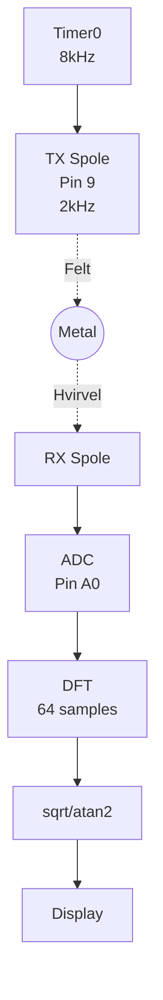
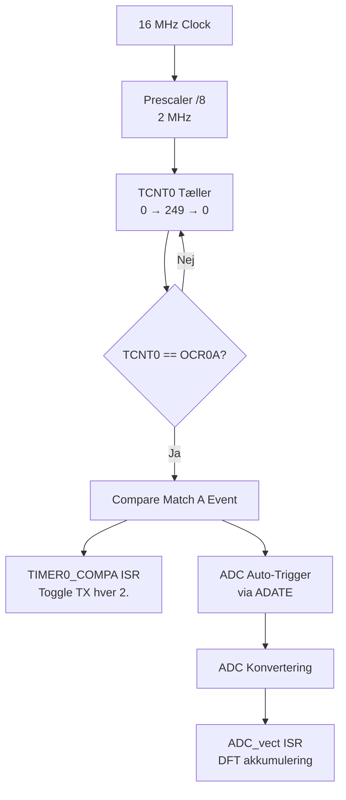

# Metaldetektor Firmware Kodegennemgang

> [!abstract] Dokumentformål
> Dette dokument giver en teknisk gennemgang af VLF metaldetektor firmwaren.
> **Nuværende Status:** Minimal testversion med fokus på kerne TX/RX/DSP funktionalitet.
>
> **Mål:** ATmega328P (Arduino Nano)
> **Kursus:** DTU 34621 - Indlejrede Systemer

---

## Indholdsfortegnelse

1. [[#1. Systemoversigt]]
2. [[#2. Kodestruktur]]
3. [[#3. Hardware Konfiguration]]
4. [[#4. Signalbehandling]]
5. [[#5. Kompilering og Upload]]

---

## 1. Systemoversigt

### 1.1 Nuværende Arkitektur (Minimal Testversion)

Firmwaren er i øjeblikket i en minimal testkonfiguration med al applikationskode samlet i en enkelt `main.c` fil. Dette forenkler udvikling og test af kerne signalbehandlingskæden.

```
Code/src/
├── main.c                 # Al applikationskode (TX, RX, DSP, display)
│
└── drivers/               # Hardware drivere (holdt separat)
    ├── I2C.c, I2C.h       # TWI master driver
    ├── ssd1306.c, .h      # OLED display driver
    └── data.h             # Font data (PROGMEM)
```

### 1.2 Signalflow



**Signalkæde:** Timer0 (8kHz) → TX Toggle (2kHz) → Metal → RX Spole → ADC (auto-trigger) → DFT → Display

### 1.3 Nøglespecifikationer

| Parameter | Værdi | Noter |
|-----------|-------|-------|
| TX Frekvens | 2 kHz | VLF område |
| Samplerate | 8 kHz | 4 samples per TX cyklus |
| ADC Trigger | Auto (ADATE) | Timer0 Compare Match A |
| DFT Vindue | 64 samples | 8 ms data |
| TX Cykler per Vindue | 16 | 64 / 4 = 16 |
| I2C Clock | ~400 kHz | Fast mode |
| ADC Opløsning | 10 bits | 0-1023 område |
| ADC Prescaler | 128 | 125 kHz ADC clock |

### 1.4 Pin Konfiguration

| Pin | AVR Port | Funktion | Noter |
|-----|----------|----------|-------|
| 9 | PB1 | TX signal | 2 kHz firkantbølge |
| A0 | PC0/ADC0 | RX signal indgang | 10-bit ADC |
| A4 | PC4 | I2C SDA | OLED display |
| A5 | PC5 | I2C SCL | OLED display |
| D4 | PD4 | Debug knap | Tryk for at skifte debug skærm |

---

## 2. Kodestruktur

### 2.1 main.c Oversigt

**Placering:** `Code/src/main.c` (~188 linjer)

Den minimale testversion indeholder:
- TX signalgenerering (Timer0)
- ADC sampling (auto-triggered)
- DFT akkumulering og beregning
- Basis OLED display output

#### Includes og Konstanter

```c
#include <avr/io.h>
#include <avr/interrupt.h>
#include <util/delay.h>
#include <stdint.h>
#include <math.h>

#include "drivers/I2C.h"
#include "drivers/ssd1306.h"

#define N 64                      /* DFT vinduesstørrelse */
#define ADC_OFFSET 512            /* DC offset (mid-skala) */
#define RAD_TO_DEG 57.2957795131  /* 180/PI */
```

#### Globale Variable

```c
/* TX tæller */
static volatile uint8_t tx_i = 0;

/* DFT akkumulatorer */
static volatile uint8_t dft_i = 0;
static volatile int32_t Re = 0;
static volatile int32_t Im = 0;
static volatile int32_t Re_buf = 0;
static volatile int32_t Im_buf = 0;
static volatile uint8_t DFT_done = 0;

/* Resultater */
static volatile uint16_t magnitude = 0;
static volatile int16_t phase = 0;
```

> [!WARNING] Signed Typer Påkrævet
> `Re` og `Im` SKAL være `int32_t` (signed), ikke `uint32_t`.
> DFT'en subtraherer værdier, så negative resultater er forventede.

#### Timer0 Initialisering

```c
void tx_init(void)
{
    DDRB |= (1 << PB1);           /* Pin 9 udgang */
    TCCR0A = (1 << WGM01);        /* CTC mode */
    TCCR0B = (1 << CS01);         /* Prescaler 8 */
    OCR0A = 249;                  /* 8 kHz interrupt */
    TIMSK0 = (1 << OCIE0A);
}
```

**Frekvensberegning:**
- f_interrupt = 16 MHz / (8 × 250) = 8 kHz
- TX toggles hver 2. interrupt = 4 kHz toggle rate = 2 kHz firkantbølge

#### ADC Initialisering

```c
void adc_init(void)
{
    ADMUX = (1 << REFS0);         /* AVCC reference */
    ADCSRA = (1 << ADEN) | (1 << ADIE) | (1 << ADATE)
           | (1 << ADPS2) | (1 << ADPS1) | (1 << ADPS0);
    ADCSRB = (1 << ADTS1) | (1 << ADTS0);  /* Timer0 trigger */
    ADCSRA |= (1 << ADSC);        /* Start */
}
```

> [!TIP] Auto-Trigger Mode
> Ved brug af `ADATE` med `ADTS1:0 = 011` starter ADC automatisk en ny
> konvertering ved hver Timer0 Compare Match A event. Ingen manuel triggering nødvendig.

#### Timer0 ISR (TX Generering)

```c
ISR(TIMER0_COMPA_vect)
{
    /* Toggle TX hver 2. interrupt = 2kHz */
    if (++tx_i >= 2) {
        PORTB ^= (1 << PB1);
        tx_i = 0;
    }
}
```

#### ADC ISR (DFT Akkumulering)

```c
ISR(ADC_vect)
{
    int16_t sample = ADC - ADC_OFFSET;

    /* 4x oversampling DFT ved 2kHz */
    switch (dft_i & 3) {
        case 0: Re += sample; break;
        case 1: Im -= sample; break;
        case 2: Re -= sample; break;
        case 3: Im += sample; break;
    }

    if (++dft_i >= N) {
        Re_buf = Re;
        Im_buf = Im;
        DFT_done = 1;
        Re = Im = 0;
        dft_i = 0;
    }
}
```

#### Magnitude og Fase Beregning

```c
void calc_mag_phase(void)
{
    double re = (double)Re_buf;
    double im = (double)Im_buf;

    magnitude = (uint16_t)(sqrt(re*re + im*im) / 16.0);
    phase = (int16_t)(atan2(im, re) * RAD_TO_DEG);
}
```

> [!NOTE] Floating-Point Matematik
> Bruger standard bibliotek `sqrt()` og `atan2()` fra `<math.h>` for nøjagtighed.
> Dette er langsommere på AVR men prioriterer korrekthed til test.
> Kan optimeres med integer approksimationer senere.

#### Main Funktion

```c
int main(void)
{
    /* Init */
    I2C_Init();
    InitializeDisplay();
    clear_display();
    tx_init();
    adc_init();
    sei();

    sendStrXY("Starter...", 3, 2);
    _delay_ms(1000);
    clear_display();

    /* Hovedløkke */
    while (1) {
        if (DFT_done) {
            DFT_done = 0;
            calc_mag_phase();
            display_results();
        }
        _delay_ms(50);
    }
}
```

> [!DANGER] Glem Ikke sei()
> Uden `sei()` vil ingen interrupts køre. TX signalet genereres ikke og ADC sampler ikke.

---

## 3. Hardware Konfiguration

### 3.1 Timer0 - TX Generering & ADC Auto-Trigger

Timer0 tjener dobbelt formål:
1. Generer 8 kHz Compare Match A event til ADC auto-triggering
2. ISR toggler TX pin hver 2. interrupt for 2 kHz signal



### 3.2 ADC Timing

| Parameter | Værdi | Beregning |
|-----------|-------|-----------|
| ADC clock | 125 kHz | 16 MHz / 128 |
| Konverteringstid | 104 µs | 13 cykler / 125 kHz |
| Sample interval | 125 µs | 8 kHz rate |
| Margin | 21 µs | 125 - 104 |

### 3.3 Timingdiagram

```
Tid (µs):      0    125   250   375   500
               │     │     │     │     │
Timer0 ISR:   [0]   [1]   [2]   [3]   [4]  (8 kHz)
TX Toggle:    Ja    Nej   Ja    Nej   Ja
TX Output:    ─────HIGH─────┐     ┌─────HIGH─────
                            └LOW─┘
ADC Sample:   S0    S1    S2    S3         (4 samples per TX cyklus)
DFT coeff:   Re+   Im-   Re-   Im+

             ◄───── 500µs (én TX cyklus, 2 kHz) ─────►
```

---

## 4. Signalbehandling

> [!info] Detaljeret DFT Dokumentation
> Se [[../Theory/DFT Algorithm|DFT Algoritme]] for fuld matematisk baggrund og implementation detaljer.

### 4.1 4× Oversampling DFT Tricket

Da vi sampler ved præcis 4× signalfrekvensen (8kHz sampling, 2kHz signal), bliver DFT koefficienterne trivielle:

| Sample Indeks | cos koefficient | sin koefficient | Operation |
|---------------|-----------------|-----------------|-----------|
| 0 | +1 | 0 | Re += sample |
| 1 | 0 | -1 | Im -= sample |
| 2 | -1 | 0 | Re -= sample |
| 3 | 0 | +1 | Im += sample |

**Ingen trigonometriske beregninger nødvendige i ISR!**

### 4.2 DFT Akkumuleringsmønster

```
TX Signal:     ┌────────────┐            ┌────────────┐
               │            │            │            │
          ─────┘            └────────────┘            └─────

Sample:        S0     S1     S2     S3     (4 samples per cyklus)
               │      │      │      │
Fase:          0°    90°   180°   270°
               │      │      │      │
               ▼      ▼      ▼      ▼
          Re += S0
                 Im -= S1
                        Re -= S2
                               Im += S3
```

### 4.3 Display Output

Tryk på **D4 knappen** for at skifte mellem to skærme:

**Skærm 1: DFT Resultater**
```
=== DFT ===

Re:   <værdi>
Im:   <værdi>

Mag:  <værdi>
Fase: <værdi> grader
```

**Skærm 2: Debug Info**
```
=== DEBUG ===

ADC:  <rå 0-1023>
```

| Værdi | Beskrivelse |
|-------|-------------|
| **Re/Im** | Rå DFT komponenter (kan være negative) |
| **Mag** | sqrt(Re² + Im²) / 16 |
| **Fase** | atan2(Im, Re) × 180/π grader |
| **ADC** | Nuværende rå ADC aflæsning (0-1023) |

---

## 5. Kompilering og Upload

### 5.1 PlatformIO Konfiguration

```ini
[env:nano]
platform = atmelavr
board = nanoatmega328
framework = arduino

board_build.f_cpu = 16000000L

build_flags =
    -std=c99
    -Wall
    -Os
```

### 5.2 Build Kommandoer

```bash
# Kompiler
pio run

# Upload
pio run -t upload

# Monitor seriel
pio device monitor
```

### 5.3 Hukommelsesforbrug (Minimal Version med Debug)

| Hukommelse | Brugt | Tilgængelig | Procent |
|------------|-------|-------------|---------|
| RAM | 261 bytes | 2048 bytes | 12.7% |
| Flash | 4874 bytes | 30720 bytes | 15.9% |

---

## Fejlfinding

### Intet TX Signal på Pin 9

1. Tjek at `tx_init()` kaldes
2. Verificer at `DDRB |= (1 << PB1)` er udført
3. Tjek at `sei()` kaldes (aktiverer interrupts)
4. Mål med oscilloskop (bør være 2kHz)

### ADC Sampler Ikke

1. Verificer at `sei()` kaldes (aktiverer interrupts)
2. Tjek at `adc_init()` kaldes (sætter auto-trigger op)
3. Verificer at ADCSRA har ADEN, ADIE og ADATE sat
4. Verificer at ADCSRB har ADTS1:0 = 011 (Timer0 Compare Match A trigger)

### Display Virker Ikke

1. Tjek I2C forbindelser (A4=SDA, A5=SCL)
2. Verificer at I2C_Init() kaldes før InitializeDisplay()
3. Prøv anden I2C adresse (nogle moduler bruger 0x7A i stedet for 0x78)

### Værdier Altid Nul

1. Sørg for at ADC er forbundet til RX spole signal
2. Tjek at ADC_OFFSET (512) er passende for dit signal
3. Verificer at DFT_done flag bliver sat (ISR kører)

---

## Fremtidige Forbedringer

Følgende funktioner blev fjernet til minimal test og kan tilføjes senere:

- [ ] IIR filtrering til udjævnet display
- [ ] Kalibreringsrutine
- [ ] Metalklassificering (ferro/ikke-ferro baseret på fase)
- [ ] Buzzer output med Timer2 PWM
- [ ] Knapinput til UI kontrol
- [ ] Debug skærme
- [ ] Tilstandsmaskine (IDLE/RUNNING/CALIBRATING)

---

## Dokumentrevisionshistorik

| Version | Dato | Ændringer |
|---------|------|-----------|
| 1.0 | 2025-01 | Første omfattende gennemgang (ATmega2560) |
| 2.0 | 2025-01 | Migreret til Arduino Nano (ATmega328P) |
| 2.1 | 2025-01 | Opdateret til at afspejle ADC auto-trigger mode (ADATE) |
| 2.2 | 2025-01 | Ændret til floating-point sqrt()/atan2() |
| 3.0 | 2025-01 | Forenklet til minimal testversion (enkelt main.c) |

---

*Dokument genereret til DTU 34621 Metaldetektor Projekt*
*Hold: Mads Rudolph, Andreas Skaaning, Jonas Beck & Sigurd Hestbech*
