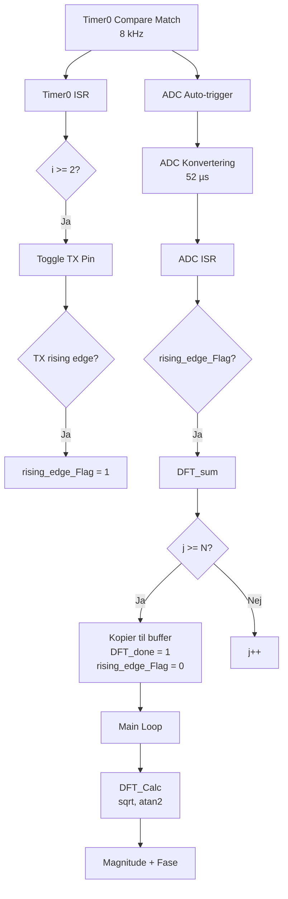

# ADC Capture System

> [!abstract] Dokumentformål
> Beskrivelse af ADC → DFT pipelinen, timing-kæden, og synkronisering med TX signalet.

## 1. Oversigt

Metal detektoren bruger en synkroniseret sampling-kæde til at analysere RX spolens signal:

```
Timer0 (8kHz) → ADC Auto-trigger → DFT Akkumulering → Magnitude/Fase
     ↓
TX Signal (2kHz) ← rising_edge_Flag → DFT Synkronisering
```

> [!important] Kritisk Timing
> ADC sampling SKAL være synkroniseret med TX signalet for korrekt faseberegning.
> Uden synkronisering vil fasen variere tilfældigt mellem DFT vinduer.

## 2. Timing-Kæde

### 2.1 Timer0 Konfiguration

Timer0 genererer 8 kHz interrupt som driver hele systemet. Se `timer.c:timer0_init()` (linje 22-37):

```c
// CTC mode (Clear Timer on Compare Match)
TCCR0A |= (1 << WGM01);

// Prescaler 8
TCCR0B |= (1 << CS01);

// Compare match: 16MHz / 8 / 250 = 8kHz
OCR0A = 249;
```

Beregning af interrupt frekvens:

$$f_{interrupt} = \frac{F_{CPU}}{prescaler \times (OCR0A + 1)} = \frac{16\text{MHz}}{8 \times 250} = 8000\text{ Hz}$$

### 2.2 TX Signal Generering

Timer0 ISR toggler TX pin hver 2. interrupt for at skabe 2 kHz firkantbølge. Se `timer.c:ISR(TIMER0_COMPA_vect)` (linje 76-87):

```c
ISR(TIMER0_COMPA_vect) {
    i++;
    if (i >= 2) {                   // Hver 2. interrupt
        PORTB ^= (1 << TX_PIN);     // Toggle TX pin
        i = 0;

        if (PORTB & (1 << TX_PIN)) {
            rising_edge_Flag = 1;   // Signal til DFT synkronisering
        }
    }
}
```

> [!tip] XOR Toggle Trick
> `PORTB ^= (1 << TX_PIN)` bruger XOR til at flippe bit uden at læse-modificere-skrive.
> Dette er hurtigere og atomisk.

### 2.3 Timing Parametre

| Parameter | Værdi | Beregning |
|-----------|-------|-----------|
| Timer0 interrupt | 8000 Hz | 16MHz / 8 / 250 |
| TX toggle rate | 4000 Hz | 8000 / 2 |
| TX frekvens | **2000 Hz** | 4000 / 2 (toggle = halv frekvens) |
| Sample periode | 125 µs | 1 / 8000 |
| TX periode | 500 µs | 1 / 2000 |

## 3. ADC Auto-Trigger

### 3.1 Konfiguration

ADC'en er sat op til automatisk at starte konvertering når Timer0 Compare Match A udløses. Se `adc.c:adc_init()` (linje 17-36):

```c
// Reference = AVCC (5V)
ADMUX = (1 << REFS0);

// ADC Kontrol: Enable, Interrupt, Auto-trigger, Prescaler 64
ADCSRA = (1 << ADEN) | (1 << ADIE) | (1 << ADATE)
       | (1 << ADPS2) | (1 << ADPS1);

// Auto-trigger kilde = Timer0 Compare Match A
ADCSRB |= (1 << ADTS1) | (1 << ADTS0);
```

> [!note] ADC Clock
> Med prescaler 64 og 16 MHz CPU clock får vi:
> $$f_{ADC} = \frac{16\text{MHz}}{64} = 250\text{ kHz}$$
> En konvertering tager 13 ADC cycles = 52 µs, hvilket er hurtigere end sample perioden (125 µs).

### 3.2 ADC Interrupt Handler

Når konvertering er færdig, kaldes `adc.c:ISR(ADC_vect)` (linje 53-59):

```c
ISR(ADC_vect) {
    ADC_Raw = ADC;              // Læs 10-bit værdi (0-1023)

    if (rising_edge_Flag == 1) {
        DFT_sum(ADC_Raw);       // Send til DFT kun når synkroniseret
    }
}
```

## 4. DFT Synkronisering

### 4.1 rising_edge_Flag Mekanisme

```
┌──────────────────────────────────────────────────────────────────┐
│                         TIMING DIAGRAM                           │
├──────────────────────────────────────────────────────────────────┤
│                                                                  │
│ Timer0 ISR:  ↓     ↓     ↓     ↓     ↓     ↓     ↓     ↓        │
│              |     |     |     |     |     |     |     |        │
│ TX Signal:   ┌─────┐     ┌─────┐     ┌─────┐     ┌─────┐        │
│              │     │     │     │     │     │     │     │        │
│          ────┘     └─────┘     └─────┘     └─────┘     └────    │
│              ↑           ↑           ↑           ↑              │
│              │           │           │           │              │
│ Flag=1:      ●           ●           ●           ●              │
│                                                                  │
│ ADC ISR:     ↓  ↓  ↓  ↓  ↓  ↓  ↓  ↓  ↓  ↓  ↓  ↓  ↓  ↓  ↓  ↓   │
│              |  |  |  |  |  |  |  |  |  |  |  |  |  |  |  |    │
│ DFT_sum:     ●  ●  ●  ●  ○  ○  ○  ○  ●  ●  ●  ●  ○  ○  ○  ○   │
│              │           │           │                          │
│              └─ N=64 ────┘           └─ næste vindue            │
│                samples                                           │
└──────────────────────────────────────────────────────────────────┘

● = DFT_sum kaldes (rising_edge_Flag == 1)
○ = DFT_sum springes over (venter på næste rising edge)
```

### 4.2 Synkroniseringsflow

1. **Timer0 ISR** toggler TX og sætter `rising_edge_Flag = 1` ved rising edge
2. **ADC ISR** kalder kun `DFT_sum()` når `rising_edge_Flag == 1`
3. **DFT_sum** akkumulerer N=64 samples, derefter nulstiller `rising_edge_Flag = 0`
4. DFT venter på næste TX rising edge før ny akkumulering starter

> [!success] Fasestabilitet
> Denne mekanisme sikrer at DFT altid starter ved TX fase 0°.
> Uden synkronisering ville fasen drifte med op til ±180° mellem vinduer.

## 5. DFT Akkumulering

### 5.1 4× Oversampling Optimering

Med $F_s = 8000$ Hz og $F_{signal} = 2000$ Hz sampler vi med præcis 4× oversampling.
Dette giver faseforskydning på $\frac{2\pi}{4} = \frac{\pi}{2}$ mellem samples.

DFT koefficienter for bin $k = \frac{N \times F_{signal}}{F_s} = \frac{64 \times 2000}{8000} = 16$:

| Sample n mod 4 | $\cos(2\pi n/4)$ | $-\sin(2\pi n/4)$ | Operation |
|----------------|------------------|-------------------|-----------|
| 0 | +1 | 0 | `Re += xn` |
| 1 | 0 | -1 | `Im -= xn` |
| 2 | -1 | 0 | `Re -= xn` |
| 3 | 0 | +1 | `Im += xn` |

Se `dft.c:DFT_sum()` (linje 51-107) for implementation.

### 5.2 DC Offset Fjernelse

Før akkumulering fjernes DC offset defineret i `config.h:25`:

```c
#define ADC_MIDDELVAERDI 512  // Midt i 10-bit range
```

I `dft.c:58`:
```c
xn = ADC_Raw - ADC_MIDDELVAERDI;
```

> [!warning] Vigtigt
> Uden DC offset fjernelse vil DFT'en se et stort DC komponent der forvrænger magnitude beregningen.

## 6. Signalflow Komplet



## 7. Timing Constraints

| Operation | Tid | Cykler @ 16MHz | Kilde |
|-----------|-----|----------------|-------|
| Timer0 ISR | ~2 µs | ~32 | `timer.c:76-87` |
| ADC konvertering | 52 µs | 832 (ADC clock) | Hardware |
| ADC ISR + DFT_sum | ~5 µs | ~80 | `adc.c:53-59`, `dft.c:51-107` |
| DFT_Calc (main loop) | ~500 µs | ~8000 | `dft.c:116-122` |

> [!note] Margin
> Sample periode er 125 µs. ISR overhead er ~7 µs, hvilket giver god margin.
> Float beregninger i `DFT_Calc()` kører i main loop og påvirker ikke sampling timing.

## Relaterede Dokumenter

- [[DFT Algorithm]] - Matematisk baggrund for 4× oversampling optimering
- [[Filter Design]] - IIR lavpasfilter efter DFT
- [[Metal Classification]] - Brug af fase til ferro/non-ferro skelnen

## Kode Referencer

| Fil | Funktion | Beskrivelse |
|-----|----------|-------------|
| `timer.c:22-37` | `timer0_init()` | Timer0 opsætning |
| `timer.c:76-87` | `ISR(TIMER0_COMPA_vect)` | TX generering + sync flag |
| `adc.c:17-36` | `adc_init()` | ADC auto-trigger opsætning |
| `adc.c:53-59` | `ISR(ADC_vect)` | Sample til DFT |
| `dft.c:51-107` | `DFT_sum()` | 4× oversampling akkumulering |
| `config.h:11-13` | — | Timing konstanter |
