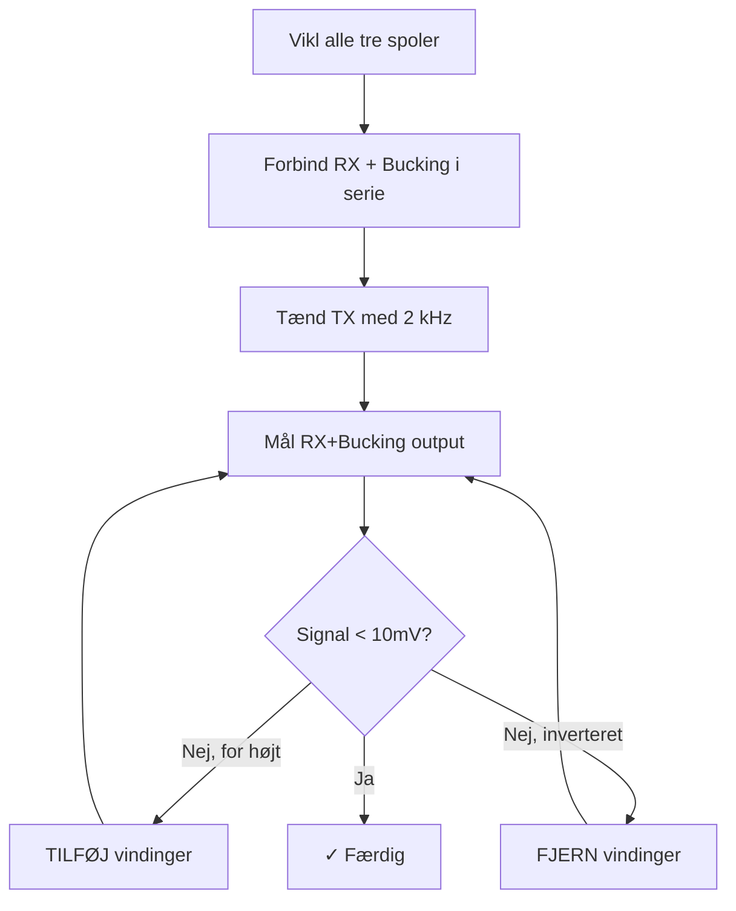

# Spole Design - VLF Metaldetektor

> [!abstract] Dokumentformål
> Spole design specifikationer for VLF metaldetektor.
> Opdateret til Arduino Nano strømbudget og H-bro forstærker.

---

## 1. Systemoversigt

### 1.1 Tre-Spole Koncentrisk Design

```
         ┌─────────────────────────────────────────┐
         │              SET OVENFRA                │
         │                                         │
         │    ┌─────────────────────────────┐     │
         │    │         TX SPOLE            │     │
         │    │        200 mm ⌀             │     │
         │    │    ┌───────────────────┐    │     │
         │    │    │   BUCKING SPOLE   │    │     │
         │    │    │      120 mm ⌀     │    │     │
         │    │    │   ┌───────────┐   │    │     │
         │    │    │   │  RX SPOLE │   │    │     │
         │    │    │   │   80 mm ⌀ │   │    │     │
         │    │    │   └───────────┘   │    │     │
         │    │    └───────────────────┘    │     │
         │    └─────────────────────────────┘     │
         │                                         │
         └─────────────────────────────────────────┘
```

### 1.2 Designkrav

| Parameter | Krav | Kilde |
|-----------|------|-------|
| TX Frekvens | 2 kHz | Firmware |
| TX Strøm | 80 mA | Strømbudget (Nano) |
| TX Induktans | ~6.3 mH | Forstærker design |
| RX Induktans | ≥ 10 mH | Kravspecifikation §16 |
| Forsyningsspænding | 7.5V (design) | Strømbudget |

---

## 2. Wheeler Formel - Flerlagssolenoid

$$L \text{ (µH)} = \frac{0.8 \times r^2 \times N^2}{6r + 9l + 10w}$$

Hvor (alle i cm):
- $r$ = middelradius af spole
- $l$ = aksial længde (viklingshøjde)
- $w$ = radial tykkelse (viklingsdybde)
- $N$ = totalt antal vindinger

---

## 3. TX Spole - Specifikationer

> [!info] Matcher Forstærker Design
> TX spolen er designet til at matche H-bro forstærkeren med L1 = 6.33 mH.
> Se [[TX Driver Design]] for forstærker detaljer.

### 3.1 Elektriske Specifikationer

| Parameter | Værdi | Noter |
|-----------|-------|-------|
| **Induktans** | **6.33 mH** | Matcher forstærker |
| **DC Modstand** | ~3.5 Ω | Med 0.52mm tråd |
| **Impedans @ 2kHz** | 80 Ω | $Z = \sqrt{R^2 + X_L^2}$ |
| **Strøm @ 7.5V** | ~80 mA | Med resonanskondensator |
| **Resonans C** | **1.0 µF** | For f_res = 2 kHz |

### 3.2 Fysiske Specifikationer

| Parameter | Værdi |
|-----------|-------|
| Form diameter | **200 mm** |
| Tråddiameter | **0.52 mm (AWG 24)** |
| Antal vindinger | **68 vindinger** |
| Vindinger per lag | **34 vindinger** |
| Antal lag | **2 lag** |
| Aksial længde | **18 mm** |
| Radial tykkelse | **1.0 mm** |
| Trådlængde | ~43 m |
| Vikleretning | **MED URET** |

### 3.3 Viklingsinstruktioner

```
         ←───────── 18 mm ──────────→
        ┌─────────────────────────────┐
Lag 2   │▓▓▓▓▓▓▓▓▓▓▓▓▓▓▓▓▓▓▓▓▓▓▓▓▓▓▓▓▓│ (vindinger 35-68)
Lag 1   │▓▓▓▓▓▓▓▓▓▓▓▓▓▓▓▓▓▓▓▓▓▓▓▓▓▓▓▓▓│ (vindinger 1-34)
        └─────────────────────────────┘
         ╔═══════════════════════════╗
         ║   200 mm diameter form    ║
         ╚═══════════════════════════╝
```

**Materialer:**
- Plastikform: 200 mm diameter
- Kobbertråd: 0.52 mm (AWG 24), ~50 m længde
- Elektrisk tape til sikring af lag

**Procedure:**
1. Marker startpunkt på 200 mm formen
2. Vikl **34 vindinger MED URET**, tætviklet (lag 1)
3. Påfør tynd tape til sikring
4. Vikl **34 vindinger** tilbage over lag 1 (lag 2)
5. **Total: 68 vindinger i 2 lag**

### 3.4 Vindinger vs Induktans Reference

| Vindinger | Induktans | Strøm @ 7.5V |
|-----------|-----------|--------------|
| 50 | 3.4 mH | ~120 mA |
| 58 | 4.6 mH | ~100 mA |
| **68** | **6.3 mH** | **~80 mA** ← Mål |
| 78 | 8.3 mH | ~65 mA |
| 88 | 10.6 mH | ~55 mA |
| 105 | 15.0 mH | ~40 mA |

![[tx_turns_vs_inductance.png]]
*Figur: TX vindinger vs induktans (genereret af MATLAB)*

### 3.5 Verifikationsmål

- [ ] Induktans: 6.3 mH ± 15% (5.4 - 7.3 mH)
- [ ] DC Modstand: < 5 Ω
- [ ] Strøm @ 7.5V med 1µF serie C: 70-90 mA

---

## 4. Resonanskredsløb

### 4.1 Hvorfor Resonans?

LC tankkredsen konverterer **firkantbølge** fra MCU til **sinusbølge**:

```
  MCU Firkantbølge              LC Tank Output
  ┌───┐   ┌───┐                  ╭───╮   ╭───╮
  │   │   │   │                 ╱     ╲ ╱     ╲
──┘   └───┘   └──      →    ──╱       ╳       ╲──
                               ╲     ╱ ╲     ╱
                                ╰───╯   ╰───╯
```

**Fordele ved sinusbølge:**
- Ren fasemåling for DFT
- Nøjagtig ferro/ikke-ferro diskriminering
- Bedre signal-støj forhold
- Lavere EMI emission

### 4.2 Resonanskondensator Beregning

For resonans ved 2 kHz med L = 6.33 mH:

$$C = \frac{1}{(2\pi f)^2 L} = \frac{1}{(2\pi \times 2000)^2 \times 0.00633} = 1.0\ \text{µF}$$

### 4.3 Resonanskondensator Specifikationer

| Parameter | Værdi |
|-----------|-------|
| **Kapacitans** | **1.0 µF** |
| Type | Film (MKP/MKT) |
| Spændingsrating | **≥ 50V** |
| Forbindelse | Serie med TX spole |
| Resonansfrekvens | 2000 Hz |

> [!warning] Spændingsrating
> Ved resonans forstærkes spændingen med Q-faktoren!
> Med Q ≈ 2.3 kan spændingen over C nå ~21V.
> Brug minimum 50V kondensator.

### 4.4 Q-Faktor

$$Q = \frac{X_L}{R} = \frac{2\pi f L}{R} = \frac{2\pi \times 2000 \times 0.00633}{3.5} = 22.7$$

> [!note] Høj Q-faktor
> Med lav DC modstand (0.52mm tråd) får vi høj Q.
> Dette giver skarpere resonans og renere sinusbølge.

![[tx_current_vs_inductance.png]]
*Figur: TX strøm vs induktans ved 7.5V, 2kHz*

---

## 5. Kredsløbsdiagram

### 5.1 TX Kredsløb (Serie LC)

```
                    H-BRO FORSTÆRKER
                         │
                         ▼
        ┌─────────────────────────────────────┐
        │                                     │
        │    ┌────────┐      ┌────────┐      │
        │    │   C1   │      │   L1   │      │
        ├────┤  1µF   ├──────┤ 6.3mH  ├──────┤
        │    │  50V+  │      │  TX    │      │
        │    └────────┘      └────────┘      │
        │                                     │
        └─────────────────────────────────────┘
                         │
                         ▼
                        GND
```

### 5.2 Komplet TX System

```
     Arduino Nano                H-Bro Driver              LC Tank
    ┌───────────┐             ┌─────────────┐         ┌──────────────┐
    │           │   D9/D10    │  IRF5305    │         │              │
    │  Timer0   ├────────────►│  IRL530     ├────────►│  C    L      │
    │  2kHz     │             │  H-bridge   │         │ 1µF  6.3mH   │
    │           │             │             │         │              │
    └───────────┘             └──────┬──────┘         └──────────────┘
                                     │
                                   9V Batteri
```

---

## 6. RX Spole - Specifikationer

### 6.1 Elektriske Krav

| Parameter | Krav | Noter |
|-----------|------|-------|
| Induktans | ≥ 10 mH | Kravspecifikation §16 |
| DC Modstand | < 20 Ω | For god signal kvalitet |
| Vikleretning | **MOD URET** | Modsat TX |

### 6.2 Fysiske Specifikationer

| Parameter | Værdi |
|-----------|-------|
| Form diameter | **80 mm** |
| Tråddiameter | 0.32 mm (AWG 28) |
| Antal vindinger | ~170 vindinger |
| Antal lag | 4 lag |
| Induktans | ~12 mH |
| DC Modstand | ~9 Ω |

### 6.3 Viklingsinstruktioner

```
         ←────── 14 mm ──────→
        ┌─────────────────────┐
Lag 4   │▒▒▒▒▒▒▒▒▒▒▒▒▒▒▒▒▒▒▒▒▒│ (vindinger 128-170)
Lag 3   │▒▒▒▒▒▒▒▒▒▒▒▒▒▒▒▒▒▒▒▒▒│ (vindinger 85-127)
Lag 2   │▒▒▒▒▒▒▒▒▒▒▒▒▒▒▒▒▒▒▒▒▒│ (vindinger 43-84)
Lag 1   │▒▒▒▒▒▒▒▒▒▒▒▒▒▒▒▒▒▒▒▒▒│ (vindinger 1-42)
        └─────────────────────┘
         ╔═══════════════════╗
         ║  80 mm diameter   ║
         ╚═══════════════════╝
```

**Vikl MOD URET** (modsat TX spolen)

### 6.4 RX Resonanskondensator (Valgfri)

For båndpasfilter ved 2 kHz med L = 12 mH:

$$C = \frac{1}{(2\pi \times 2000)^2 \times 0.012} = 528\ \text{nF} \approx 470\ \text{nF}$$

| Parameter | Værdi |
|-----------|-------|
| Kapacitans | ~470-560 nF |
| Forbindelse | Parallel med RX+Bucking |
| Formål | Båndpasfilter + spændingsforstærkning |

---

## 7. Bucking Spole - Specifikationer

### 7.1 Formål

Ophæver direkte TX felt ved RX position. Forbindes i serie med RX spole.

### 7.2 Specifikationer

| Parameter | Værdi |
|-----------|-------|
| Form diameter | **120 mm** |
| Tråddiameter | 0.52 mm |
| Start vindinger | ~30-40 |
| Antal lag | 1-2 |
| Vikleretning | **MOD URET** (samme som RX) |
| Justeringsområde | 25-50 vindinger |

### 7.3 Justering af Bucking Spole



**Procedure:**
1. Vikl alle tre spoler
2. Forbind RX og Bucking i serie (samme polaritet)
3. Tænd TX med 2 kHz signal (ingen metal i nærheden)
4. Mål RX+Bucking output på oscilloskop
5. Juster bucking vindinger:
   - Signal for HØJT → TILFØJ vindinger
   - Signal INVERTERET → FJERN vindinger
6. Iterer indtil signal < 10 mV

---

## 8. Oversigtstabel

```
┌─────────────────┬─────────────┬─────────────┬─────────────┐
│ Parameter       │   TX Spole  │   RX Spole  │   Bucking   │
├─────────────────┼─────────────┼─────────────┼─────────────┤
│ Form diameter   │   200 mm    │    80 mm    │   120 mm    │
│ Tråddiameter    │  0.52 mm    │   0.32 mm   │  0.52 mm    │
│ Antal vindinger │     68      │    ~170     │   ~35       │
│ Antal lag       │      2      │      4      │    1-2      │
│ Aksial længde   │    18 mm    │   ~14 mm    │   ~10 mm    │
│ Induktans       │   6.3 mH    │   ~12 mH    │   ~1 mH     │
│ DC Modstand     │   ~3.5 Ω    │    ~9 Ω     │   ~1 Ω      │
│ Resonans C      │   1.0 µF    │   ~470 nF   │    N/A      │
│ Vikleretning    │  MED URET   │  MOD URET   │  MOD URET   │
│ Strøm           │    80 mA    │     -       │     -       │
└─────────────────┴─────────────┴─────────────┴─────────────┘
```

---

## 9. Stykliste

### 9.1 TX Spole

| Komponent | Værdi | Antal | Noter |
|-----------|-------|-------|-------|
| Kobbertråd | 0.52 mm, ~50 m | 1 | AWG 24, emaljeret |
| Plastform | Ø200 mm | 1 | PVC rør eller 3D print |
| Film kondensator | 1.0 µF, 50V | 1 | MKP/MKT type |
| Elektrisk tape | - | 1 | Til sikring |

### 9.2 RX Spole

| Komponent | Værdi | Antal | Noter |
|-----------|-------|-------|-------|
| Kobbertråd | 0.32 mm, ~45 m | 1 | AWG 28, emaljeret |
| Plastform | Ø80 mm | 1 | PVC rør |
| Film kondensator | 470 nF | 1 | Valgfri, til båndpas |

### 9.3 Bucking Spole

| Komponent | Værdi | Antal | Noter |
|-----------|-------|-------|-------|
| Kobbertråd | 0.52 mm, ~15 m | 1 | AWG 24, emaljeret |
| Plastform | Ø120 mm | 1 | PVC rør |

---

## 10. Verifikation

### 10.1 Måleudstyr

- LCR meter (induktans og modstand)
- Oscilloskop (signalkvalitet)
- Multimeter (DC modstand)

### 10.2 Acceptkriterier

| Spole | Parameter | Mål | Tolerance |
|-------|-----------|-----|-----------|
| TX | Induktans | 6.3 mH | ±15% |
| TX | DC Modstand | 3.5 Ω | < 5 Ω |
| TX | Strøm @ 7.5V | 80 mA | ±15% |
| RX | Induktans | ≥10 mH | Min. krav |
| RX | DC Modstand | ~9 Ω | < 20 Ω |
| System | Null balance | <10 mV | Ved RX output |

### 10.3 Tjekliste

- [ ] TX spole viklet (68 vindinger, 2 lag)
- [ ] TX induktans målt: _____ mH
- [ ] TX DC modstand målt: _____ Ω
- [ ] RX spole viklet (~170 vindinger, 4 lag)
- [ ] RX induktans målt: _____ mH
- [ ] Bucking spole viklet (~35 vindinger)
- [ ] Null balance opnået: _____ mV
- [ ] Resonanskondensator monteret (1.0 µF)
- [ ] System test bestået

---

## 11. MATLAB Beregner

MATLAB filer til spoledesign findes i `Docs/Matlab/`:

### 11.1 Filer

| Fil | Formål |
|-----|--------|
| `Coil_Design_Multilayer.m` | Hovedscript - beregner og visualiserer spoledesign |
| `coil_functions.m` | Hjælpefunktioner til induktansberegning |

> [!tip] Generer Grafer
> Kør `Coil_Design_Multilayer.m` i MATLAB for at generere graferne i `Docs/Images/`.

### 11.2 Wheeler Formel (MATLAB)

```matlab
function L = wheeler_multilayer(N, r, l, w)
    % N = antal vindinger, r = middelradius [m]
    % l = aksial længde [m], w = radial tykkelse [m]
    r_cm = r * 100; l_cm = l * 100; w_cm = w * 100;
    L = (0.8 * r_cm^2 * N^2) / (6*r_cm + 9*l_cm + 10*w_cm) * 1e-6;
end
```

### 11.3 Hurtig Beregning

```matlab
% TX Spole verifikation
N = 68; r = 0.1005; l = 0.018; w = 0.001;  % 200mm form, 2 lag
L = (0.8 * (r*100)^2 * N^2) / (6*r*100 + 9*l*100 + 10*w*100) * 1e-6
% Resultat: ~6.3 mH

% Resonanskondensator
f = 2000; L = 6.33e-3;
C = 1 / ((2*pi*f)^2 * L)  % Resultat: ~1.0 µF
```

---

## 12. Relaterede Dokumenter

- [[TX Driver Design|TX Driver Design]] - H-bro forstærker
- [[Power Budget Analysis|Strømbudget Analyse]] - Arduino Nano strømbudget
- [[DFT Algorithm|DFT Algoritme]] - Signalbehandling
- [[Coil Configuration Comparison|Spole Konfiguration Sammenligning]] - Koncentrisk vs DD

---

## 13. Teori Referencer (DTU Vault)

| Emne | Link | Relevans |
|------|------|----------|
| Induktansberegning | [L23 - Magnetostatics II](obsidian://open?vault=Obsidian&file=Courses%2FElectromagnetics%2FFormulas%2FL23%20-%20Magnetostatics%20II) | Wheeler formel, selvinduktans |
| Magnetfelter | [Lecture 22 - Magnetostatics I](obsidian://open?vault=Obsidian&file=Courses%2FElectromagnetics%2FFormulas%2FLecture%2022%20-%20Magnetostatics%20I) | B-felt, Ampères lov, Biot-Savart |
| Permeabilitet | [Helpers (EM)](obsidian://open?vault=Obsidian&file=Courses%2FElectromagnetics%2FHelpers) | μr for ferromagnetiske materialer |
| Koordinatsystemer | [Electrostatics & Magnetostatics](obsidian://open?vault=Obsidian&file=Courses%2FElectromagnetics%2FFormulas%2FElectrostatics%20%26%20Magnetostatics) | Cylindriske koordinater |

---

*Spole design til DTU 34621 Metaldetektor Projekt*
*Opdateret til Arduino Nano og H-bro forstærker*

#spoler #design #TX #RX #bucking #flerlag
