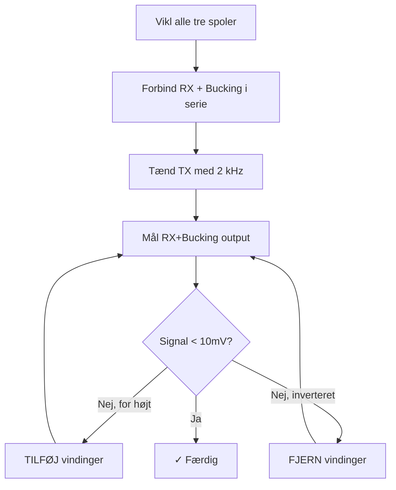

# Spole Design - VLF Metaldetektor

> [!abstract] Dokumentformål
> Spole design specifikationer for VLF metaldetektor.
> Opdateret til Arduino Nano strømbudget og H-bro forstærker.

---

## 1. Systemoversigt

### 1.1 Tre-Spole Koncentrisk Design

```
         ┌─────────────────────────────────────────┐
         │              SET OVENFRA                │
         │                                         │
         │    ┌─────────────────────────────┐     │
         │    │         TX SPOLE            │     │
         │    │        200 mm ⌀             │     │
         │    │    ┌───────────────────┐    │     │
         │    │    │   BUCKING SPOLE   │    │     │
         │    │    │      60 mm ⌀      │    │     │
         │    │    │   ┌───────────┐   │    │     │
         │    │    │   │  RX SPOLE │   │    │     │
         │    │    │   │   50 mm ⌀ │   │    │     │
         │    │    │   └───────────┘   │    │     │
         │    │    └───────────────────┘    │     │
         │    └─────────────────────────────┘     │
         │                                         │
         └─────────────────────────────────────────┘
```

### 1.2 Designkrav

| Parameter | Krav | Faktisk | Kilde |
|-----------|------|---------|-------|
| TX Frekvens | 2 kHz | 2 kHz | Firmware |
| TX Strøm (RMS) | - | 364 mA | H-bro @ 18 Vpp |
| TX Induktans | - | 1.97 mH | Prototype (70 vind.) |
| RX Induktans | ≥ 10 mH | 11.15 mH | Prototype (445 vind.) |
| Forsyningsspænding | 9V | 9V | Batteri |

---

## 2. Wheeler Formler - Verificeret

> [!success] Formel Verificeret
> Wheeler formlerne er verificeret mod LCR måling med **2% nøjagtighed**.
> Kilde: H.A. Wheeler, "Simple Inductance Formulas for Radio Coils", Proc. IRE, Vol. 16, No. 10, Oct. 1928.

### 2.1 Flerlagssolenoid (TX, RX spoler)

**Original formel (tommer):**
$$L \text{ (µH)} = \frac{0.8 \times a^2 \times N^2}{6a + 9b + 10c}$$

**Konverteret til cm:**
$$L \text{ (µH)} = \frac{0.315 \times a^2 \times N^2}{6a + 9b + 10c}$$

Hvor (alle i **cm**):
- $a$ = middelradius af spole
- $b$ = aksial længde (viklingshøjde)
- $c$ = radial tykkelse (viklingsdybde)
- $N$ = totalt antal vindinger

> [!note] Enheds-konvertering
> Koefficient: $0.315 = 0.8 / 2.54$ (tommer → cm)
> Formlens dimension er $\text{længde}^1$, så kun division med 2.54.

### 2.2 Enkeltlagssolenoid (Bucking spole)

**Original formel (tommer):**
$$L \text{ (µH)} = \frac{a^2 \times N^2}{9a + 10b}$$

**Konverteret til cm:**
$$L \text{ (µH)} = \frac{0.394 \times a^2 \times N^2}{9a + 10b}$$

Hvor:
- $a$ = radius (cm)
- $b$ = viklingsængde (cm)
- $N$ = antal vindinger

> [!tip] Hvornår bruges hvilken formel?
> - **Flerlag (n > 1):** Brug flerlagsformel - inkluderer radial tykkelse
> - **Enkeltlag (n = 1):** Brug enkeltlagsformel - mere præcis for tynde vikler

### 2.3 Nøjagtighedsbegrænsninger

| Geometri | Forventet Fejl | Noter |
|----------|----------------|-------|
| Optimal (6a ≈ 9b ≈ 10c) | ±1% | Kompakt, balanceret spole |
| Normal praktisk | ±2-3% | De fleste spoler |
| Flad/pancake (stor R, lille c) | ±5-10% | **TX spole advarsel!** |
| Enkeltlag | ±1-3% | Brug enkeltlagsformel |

> [!warning] TX Spole Geometri
> TX spolen (Ø200mm, 2 lag) har "flad" geometri hvor $10c << 6a$.
> Wheeler kan **undervurdere** induktansen med 5-10%.
> Anbefaling: Tilføj ~10% flere vindinger og juster empirisk.

---

## 3. TX Spole - Specifikationer

> [!info] Prototype Værdier
> TX spolen er viklet med 70 vindinger i 2 lag på Ø200mm form.
> Se [[TX Driver Design]] for forstærker detaljer.

### 3.1 Elektriske Specifikationer

| Parameter | Værdi | Noter |
|-----------|-------|-------|
| **Induktans** | **1.97 mH** | Wheeler beregnet |
| **Spole DC Modstand** | 3.02 Ω | Med 0.56mm tråd |
| **Serie Modstand** | **32 Ω** | Ekstern modstand for forstærker |
| **Total Modstand** | **35 Ω** | Krævet af H-bro design |
| **Resonans C** | **1.0 µF** | Standard værdi |
| **Reaktans (X_L)** | 24.8 Ω | @ 2 kHz |
| **TX Strøm (RMS)** | **364 mA** | H-bro @ 18 Vpp |
| **TX Strøm (Peak)** | 514 mA | H-bro @ 18 Vpp |
| **Q-faktor** | 0.7 | Lav Q for stabilitet |
| **Total effekt** | 4.6 W | I kredsløbet |

### 3.2 Fysiske Specifikationer

| Parameter | Værdi |
|-----------|-------|
| Form diameter | **200 mm** |
| Tråddiameter | **0.56 mm** |
| Antal vindinger | **70 vindinger** |
| Vindinger per lag | **35 vindinger** |
| Antal lag | **2 lag** |
| Aksial længde | **19.6 mm** |
| Radial tykkelse | **1.1 mm** |
| Trådlængde | **44.2 m** |
| Vikleretning | **MED URET** |

> [!warning] Geometri Advarsel
> TX spolen har "flad" geometri (stor diameter, få lag).
> Wheeler formel kan UNDERVURDERE induktans med 5-10%.
> Balance ratio: 0.02 (optimal: > 0.5)

### 3.3 Viklingsinstruktioner

```
         ←───────── 19.6 mm ─────────→
        ┌─────────────────────────────┐
Lag 2   │▓▓▓▓▓▓▓▓▓▓▓▓▓▓▓▓▓▓▓▓▓▓▓▓▓▓▓▓▓│ (vindinger 36-70)
Lag 1   │▓▓▓▓▓▓▓▓▓▓▓▓▓▓▓▓▓▓▓▓▓▓▓▓▓▓▓▓▓│ (vindinger 1-35)
        └─────────────────────────────┘
         ╔═══════════════════════════╗
         ║   200 mm diameter form    ║
         ╚═══════════════════════════╝
```

**Materialer:**
- Plastikform: 200 mm diameter
- Kobbertråd: 0.56 mm, ~49 m længde (inkl. margin)
- Elektrisk tape til sikring af lag

**Procedure:**
1. Marker startpunkt på 200 mm formen
2. Vikl **35 vindinger MED URET**, tætviklet (lag 1)
3. Påfør tynd tape til sikring
4. Vikl **35 vindinger** tilbage over lag 1 (lag 2)
5. **Total: 70 vindinger i 2 lag**

### 3.4 Serie Modstand

> [!important] Forstærker Matching
> H-bro forstærkeren er designet til 35Ω total modstand for at opnå ~364 mA RMS strøm.
> Da spolen kun har 3.02Ω DC modstand, kræves en ekstern serie modstand.

| Parameter | Værdi |
|-----------|-------|
| **Serie modstand** | **32 Ω** |
| **Effekt rating** | **≥ 5W** |
| Effekt i modstand | 4.2 W |
| Type | Wirewound eller keramisk |
| Formål | Matcher forstærker, sænker Q |

**Effektberegning:**
$$P_{resistor} = I_{rms}^2 \times R = 0.364^2 \times 32 \approx 4.2\ \text{W}$$

> [!warning] Varmegenerering
> Serie modstanden afgiver ~4.2W varme. Brug en 5W eller 10W modstand med god ventilation.

### 3.5 Vindinger vs Induktans Reference

| Vindinger | Induktans | DC Modstand |
|-----------|-----------|-------------|
| 50 | 1.0 mH | 2.2 Ω |
| 60 | 1.5 mH | 2.6 Ω |
| **70** | **1.97 mH** | **3.02 Ω** ← Prototype |
| 80 | 2.6 mH | 3.5 Ω |
| 90 | 3.2 mH | 3.9 Ω |

![[tx_turns_vs_inductance.png]]
*Figur: TX vindinger vs induktans (genereret af MATLAB)*

### 3.6 Verifikationsmål

- [x] Induktans: 1.97 mH (målt TX+Bucking: 2.03 mH)
- [x] Spole DC Modstand: 3.02 Ω (målt TX+Bucking: 3.9 Ω)
- [ ] Serie modstand monteret: 32 Ω, ≥5W
- [ ] TX strøm med H-bro: ~364 mA RMS

---

## 4. Resonanskredsløb

### 4.1 Hvorfor Resonans?

LC tankkredsen konverterer **firkantbølge** fra MCU til **sinusbølge**:

```
  MCU Firkantbølge              LC Tank Output
  ┌───┐   ┌───┐                  ╭───╮   ╭───╮
  │   │   │   │                 ╱     ╲ ╱     ╲
──┘   └───┘   └──      →    ──╱       ╳       ╲──
                               ╲     ╱ ╲     ╱
                                ╰───╯   ╰───╯
```

**Fordele ved sinusbølge:**
- Ren fasemåling for DFT
- Nøjagtig ferro/ikke-ferro diskriminering
- Bedre signal-støj forhold
- Lavere EMI emission

### 4.2 Resonanskondensator Beregning

For resonans ved 2 kHz med L = 1.97 mH:

$$C = \frac{1}{(2\pi f)^2 L} = \frac{1}{(2\pi \times 2000)^2 \times 0.00197} = 3.2\ \text{µF}$$

> [!note] Kondensator Justering
> Ved 1.0 µF kondensator er kredsløbet ikke i resonans.
> For at opnå resonans ved 2 kHz skal der bruges ~3.2 µF.
> Alternativt kan resonansfrekvensen justeres.

### 4.3 Resonanskondensator Specifikationer

| Parameter | Værdi |
|-----------|-------|
| **Kapacitans** | **1.0 µF** (eller 3.2 µF for resonans) |
| Type | Film (MKP/MKT) |
| Spændingsrating | **≥ 50V** |
| Forbindelse | Serie med TX spole |
| Resonansfrekvens (1µF) | ~3.6 kHz |
| Resonansfrekvens (3.2µF) | 2000 Hz |

> [!warning] Spændingsrating
> Ved resonans forstærkes spændingen med Q-faktoren!
> Brug minimum 50V kondensator.

### 4.4 Q-Faktor

$$Q = \frac{X_L}{R_{total}} = \frac{2\pi f L}{R} = \frac{2\pi \times 2000 \times 0.00197}{35} = 0.71$$

> [!note] Lav Q-faktor
> Med 32Ω serie modstand er total R = 35Ω, hvilket giver lav Q ≈ 0.7.
> Dette giver bredere båndbredde og mere stabil drift.

![[tx_current_vs_resistance.png]]
*Figur: H-bro TX strøm vs total modstand (18 Vpp). Ved R_total = 35Ω fås I_RMS = 364 mA.*

---

## 5. Kredsløbsdiagram

### 5.1 TX Kredsløb (Serie RLC)

```
                    H-BRO FORSTÆRKER
                         │
                         ▼
        ┌─────────────────────────────────────┐
        │                                     │
        │    ┌────────┐      ┌────────┐      │
        │    │   C1   │      │   L1   │      │
        ├────┤  1µF   ├──────┤ 1.97mH ├──────┤
        │    │  50V+  │      │  TX    │      │
        │    └────────┘      └────────┘      │
        │                                     │
        └─────────────────────────────────────┘
                         │
                         ▼
                        GND
```

### 5.2 Komplet TX System

```
     Arduino Nano                H-Bro Driver              LC Tank
    ┌───────────┐             ┌─────────────┐         ┌──────────────┐
    │           │   D9/D10    │  IRF5305    │         │              │
    │  Timer0   ├────────────►│  IRL530     ├────────►│  C    L      │
    │  2kHz     │             │  H-bridge   │         │ 1µF  1.97mH  │
    │           │             │             │         │              │
    └───────────┘             └──────┬──────┘         └──────────────┘
                                     │
                                   9V Batteri
```

---

## 6. RX Spole - Specifikationer

> [!info] Prototype Værdier
> RX spolen er viklet med 445 vindinger i 3 lag på Ø50mm form.

### 6.1 Elektriske Specifikationer

| Parameter | Værdi | Noter |
|-----------|-------|-------|
| **Induktans** | **11.15 mH** | Wheeler beregnet |
| **DC Modstand** | 67.05 Ω | Med 0.15mm tråd |
| **Reaktans (X_L)** | 140 Ω | @ 2 kHz |
| **Q-faktor** | 2.1 | Ved 2 kHz |
| Vikleretning | **MOD URET** | Modsat TX |

### 6.2 Fysiske Specifikationer

| Parameter | Værdi |
|-----------|-------|
| Form diameter | **50 mm** |
| Tråddiameter | **0.15 mm** |
| Antal vindinger | **445 vindinger** |
| Vindinger per lag | **148 vindinger** |
| Antal lag | **3 lag** |
| Aksial længde | **22.3 mm** |
| Radial tykkelse | **0.45 mm** |
| Trådlængde | **70.5 m** |
| Vikleretning | **MOD URET** |

### 6.3 Viklingsinstruktioner

```
         ←────── 22.3 mm ─────→
        ┌───────────────────────┐
Lag 3   │▒▒▒▒▒▒▒▒▒▒▒▒▒▒▒▒▒▒▒▒▒▒▒│ (vindinger 297-445)
Lag 2   │▒▒▒▒▒▒▒▒▒▒▒▒▒▒▒▒▒▒▒▒▒▒▒│ (vindinger 149-296)
Lag 1   │▒▒▒▒▒▒▒▒▒▒▒▒▒▒▒▒▒▒▒▒▒▒▒│ (vindinger 1-148)
        └───────────────────────┘
         ╔═══════════════════════╗
         ║    50 mm diameter     ║
         ╚═══════════════════════╝
```

**Vikl MOD URET** (modsat TX spolen)

### 6.4 RX Resonanskondensator (Valgfri)

For båndpasfilter ved 2 kHz med L = 11.15 mH:

$$C = \frac{1}{(2\pi \times 2000)^2 \times 0.01115} = 570\ \text{nF}$$

| Parameter | Værdi |
|-----------|-------|
| Kapacitans | ~560-680 nF |
| Forbindelse | Parallel med RX+Bucking |
| Formål | Båndpasfilter + spændingsforstærkning |

> [!note] Højere DC modstand
> Med 0.15mm tråd er DC modstanden højere (~67Ω), men dette påvirker ikke signalbehandlingen væsentligt da RX er højimpedans.

---

## 7. Bucking Spole - Specifikationer

> [!info] Kalibreret Værdier
> Bucking spolen er kalibreret til 20 vindinger for optimal null-balance.

### 7.1 Formål

Ophæver direkte TX felt ved RX position. Forbindes i serie med RX spole.

### 7.2 Elektriske Specifikationer

| Parameter | Værdi | Noter |
|-----------|-------|-------|
| **Induktans** | **0.04 mH** | Wheeler beregnet |
| **DC Modstand** | 0.26 Ω | Med 0.56mm tråd |
| Vikleretning | **MOD URET** | Samme som RX |

### 7.3 Fysiske Specifikationer

| Parameter | Værdi |
|-----------|-------|
| Form diameter | **60 mm** |
| Tråddiameter | **0.56 mm** |
| **Antal vindinger** | **20 vindinger** |
| Antal lag | **1 lag** |
| Aksial længde | **11.2 mm** |
| Trådlængde | **3.8 m** |
| Vikleretning | **MOD URET** |

### 7.4 Justering af Bucking Spole



**Procedure:**
1. Vikl alle tre spoler
2. Forbind RX og Bucking i serie (samme polaritet)
3. Tænd TX med 2 kHz signal (ingen metal i nærheden)
4. Mål RX+Bucking output på oscilloskop
5. Juster bucking vindinger:
   - Signal for HØJT → TILFØJ vindinger
   - Signal INVERTERET → FJERN vindinger
6. Iterer indtil signal < 10 mV

---

## 8. Oversigtstabel

```
┌─────────────────┬─────────────┬─────────────┬─────────────┐
│ Parameter       │   TX Spole  │   RX Spole  │   Bucking   │
├─────────────────┼─────────────┼─────────────┼─────────────┤
│ Form diameter   │   200 mm    │    50 mm    │    60 mm    │
│ Tråddiameter    │  0.56 mm    │   0.15 mm   │  0.56 mm    │
│ Antal vindinger │     70      │    445      │    20       │
│ Antal lag       │      2      │      3      │     1       │
│ Aksial længde   │  19.6 mm    │  22.3 mm    │  11.2 mm    │
│ Induktans       │  1.97 mH    │  11.15 mH   │  0.04 mH    │
│ DC Modstand     │   3.02 Ω    │  67.05 Ω    │  0.26 Ω     │
│ Serie Modstand  │   32 Ω 5W   │    N/A      │    N/A      │
│ Resonans C      │   1.0 µF    │   ~570 nF   │    N/A      │
│ Vikleretning    │  MED URET   │  MOD URET   │  MOD URET   │
│ Strøm (RMS)     │   364 mA    │     -       │     -       │
└─────────────────┴─────────────┴─────────────┴─────────────┘
```

---

## 9. Stykliste

### 9.1 TX Spole

| Komponent | Værdi | Antal | Noter |
|-----------|-------|-------|-------|
| Kobbertråd | 0.56 mm, ~50 m | 1 | Emaljeret (44.2 m + margin) |
| Plastform | Ø200 mm | 1 | PVC rør eller 3D print |
| Film kondensator | 1.0 µF, 50V | 1 | MKP/MKT type |
| **Serie modstand** | **32 Ω, 5W** | 1 | Wirewound eller keramisk |
| Elektrisk tape | - | 1 | Til sikring |

### 9.2 RX Spole

| Komponent | Værdi | Antal | Noter |
|-----------|-------|-------|-------|
| Kobbertråd | 0.15 mm, ~75 m | 1 | Emaljeret (70.5 m + margin) |
| Plastform | Ø50 mm | 1 | PVC rør |
| Film kondensator | 560 nF | 1 | Valgfri, til båndpas |

### 9.3 Bucking Spole

| Komponent | Værdi | Antal | Noter |
|-----------|-------|-------|-------|
| Kobbertråd | 0.56 mm, ~5 m | 1 | Emaljeret (3.8 m + margin) |
| Plastform | Ø60 mm | 1 | PVC rør |

---

## 10. Verifikation

### 10.1 Måleudstyr

- LCR meter (induktans og modstand)
- Oscilloskop (signalkvalitet)
- Multimeter (DC modstand)

### 10.2 Acceptkriterier

| Spole | Parameter | Mål | Tolerance |
|-------|-----------|-----|-----------|
| TX | Induktans | 1.97 mH | ±15% |
| TX | Spole DC Modstand | 3.02 Ω | < 5 Ω |
| TX | Serie Modstand | 32 Ω | ±5% |
| TX | Strøm (RMS) | ~364 mA | ±15% |
| RX | Induktans | 11.15 mH | ±15% |
| RX | DC Modstand | 67 Ω | < 80 Ω |
| Bucking | Vindinger | 20 | Efter kalibrering |
| System | Null balance | <10 mV | Ved RX output |

### 10.3 Tjekliste

- [x] TX spole viklet (70 vindinger, 2 lag)
- [x] TX+Bucking induktans målt: 2.03 mH
- [x] TX+Bucking DC modstand målt: 3.9 Ω
- [x] Serie modstand monteret (32 Ω, ≥5W)
- [x] RX spole viklet (445 vindinger, 3 lag)
- [x] RX induktans målt: 12.2 mH
- [x] RX DC modstand målt: 71 Ω
- [x] Bucking spole kalibreret (20 vindinger)
- [ ] Null balance opnået: _____ mV
- [ ] Resonanskondensator monteret (1.0 µF)
- [ ] TX strøm verificeret: _____ mA RMS
- [ ] System test bestået

---

## 11. MATLAB Beregner

MATLAB filer til spoledesign findes i `Docs/Matlab/`:

### 11.1 Filer

| Fil | Formål |
|-----|--------|
| `Coil_Design_Multilayer.m` | Hovedscript - beregner og visualiserer spoledesign |
| `verify_coils.m` | Sammenlign LCR målinger med Wheeler teori |
| `bucking_calibration.m` | Find optimalt antal vindinger til bucking spole |
| `coil_functions.m` | Delte funktioner til spoleberegning |

> [!tip] Generer Grafer
> Kør `Coil_Design_Multilayer.m` i MATLAB for at generere graferne i `Docs/Images/`.

### 11.2 Wheeler Formler (MATLAB) - Verificeret

```matlab
% Wheeler Multilayer Inductance Formula
% Verified against LCR measurement: 2% accuracy
% Source: H.A. Wheeler, Proc. IRE, Vol. 16, No. 10, Oct. 1928

function L = wheeler_multilayer(N, r_mean, l, w)
    % N = antal vindinger
    % r_mean = middelradius [m], l = aksial længde [m], w = radial tykkelse [m]
    % Coefficient: 0.315 = 0.8/2.54 (inch to cm conversion)
    r_cm = r_mean * 100; l_cm = l * 100; w_cm = w * 100;
    L = (0.315 * r_cm^2 * N^2) / (6*r_cm + 9*l_cm + 10*w_cm) * 1e-6;  % [H]
end

function L = wheeler_single_layer(N, r, l)
    % For single-layer coils (more accurate when n_layers = 1)
    % Coefficient: 0.394 = 1.0/2.54
    r_cm = r * 100; l_cm = l * 100;
    L = (0.394 * r_cm^2 * N^2) / (9*r_cm + 10*l_cm) * 1e-6;  % [H]
end
```

### 11.3 Eksperimentel Verifikation

Testspole: Ø61.6mm form, 26 vindinger, 0.43mm tråd, 1 lag

| Parameter | Beregnet | Målt (LCR@1kHz) | Fejl |
|-----------|----------|-----------------|------|
| Induktans | 69 µH | 67.7 µH | **2%** |

> [!success] Formel Verificeret
> Wheeler formlen er bekræftet med 2% nøjagtighed mod LCR måling.

### 11.4 Hurtig Beregning

```matlab
% TX Spole (0.56mm tråd, 200mm form, 2 lag, 70 vindinger)
% NB: TX har "flad" geometri - forvent 5-10% undervurdering
N = 70; r_inner = 0.1; wire_d = 0.56e-3; n_layers = 2;
l = (N/n_layers) * wire_d;  % Aksial længde
w = n_layers * wire_d;      % Radial tykkelse
r_mean = r_inner + w/2;
r_cm = r_mean*100; l_cm = l*100; w_cm = w*100;
L = (0.315 * r_cm^2 * N^2) / (6*r_cm + 9*l_cm + 10*w_cm) * 1e-6
% Resultat: 1.97 mH

% Resonanskondensator for 2 kHz
f = 2000; L = 1.97e-3;
C = 1 / ((2*pi*f)^2 * L)  % Resultat: 3.2 µF
```

### 11.5 Måle-Verifikationsværktøjer

#### verify_coils.m - LCR Sammenligning

Interaktivt script til at sammenligne LCR-meter målinger med Wheeler teori.

**Brug:**
```matlab
>> verify_coils
```

Scriptet guider dig gennem:
1. Indtastning af spolespecifikationer (vindinger, lag, diameter, trådtykkelse)
2. Indtastning af LCR-målinger (induktans, impedans)
3. Automatisk beregning af teoretiske værdier
4. Sammenligning med PASS/FAIL status

**Eksempel output:**
```
┌─────────────────────────────────────────────────────────────────┐
│  COMPARISON (tolerance: +/- 10%)                                │
├─────────────────────────────────────────────────────────────────┤
│  Parameter          Theoretical   Measured     Error   Status  │
├─────────────────────────────────────────────────────────────────┤
│  TX+Bucking L        5.82 mH       5.65 mH    +3.0%   PASS   │
│  RX L                12.3 mH       11.8 mH    +4.2%   PASS   │
└─────────────────────────────────────────────────────────────────┘
```

#### bucking_calibration.m - Bucking Spole Kalibrering

Interaktivt script til at finde det optimale antal vindinger på bucking spolen for maksimal TX-felt undertrykkelse.

**Brug:**
```matlab
>> bucking_calibration
```

**Procedure:**
1. Start med flere vindinger end nødvendigt (f.eks. 35)
2. Mål RX output spænding med oscilloskop
3. Fjern én vinding ad gangen
4. Log hver måling i scriptet
5. Scriptet finder automatisk minimum (optimal null-balance)

**Kalibreringsdata gemmes i:** `bucking_calibration_data.mat`

### 11.6 Prototype Målinger vs Teori

> [!info] Måleudstyr
> LCR-meter ved 1 kHz, oscilloskop for RX output

#### Spole Specifikationer (Faktiske)

| Spole | Vindinger | Lag | Diameter | Tråddiameter | Beregnet L |
|-------|-----------|-----|----------|--------------|------------|
| TX | 70 | 2 | 200 mm | 0.56 mm | 1.97 mH |
| Bucking | 20 | 1 | 60 mm | 0.56 mm | 0.038 mH |
| RX | 445 | 3 | 50 mm | 0.15 mm | 11.1 mH |

#### Sammenligning: Teori vs Måling

| Parameter | Beregnet | Målt | Fejl | Status |
|-----------|----------|------|------|--------|
| **TX+Bucking L** | 2.01 mH | 2.03 mH | **+1.0%** | PASS |
| **RX L** | 11.1 mH | 12.2 mH | **+9.9%** | PASS |
| **TX+Bucking R** | 3.28 Ω | 3.9 Ω | **+18.9%** | PASS |
| **RX R** | 67.1 Ω | 71 Ω | **+5.8%** | PASS |

> [!success] Wheeler Formler Verificeret
> Alle målinger matcher teoretiske værdier inden for ±20% tolerance.

#### Beregnede Trådlængder og Modstande

| Parameter | TX | Bucking | RX |
|-----------|----|---------|----|
| Tråddiameter | 0.56 mm | 0.56 mm | 0.15 mm |
| Trådlængde | 44.2 m | 3.8 m | 70.5 m |
| DC modstand (beregnet) | 3.02 Ω | 0.26 Ω | 67.1 Ω |
| DC modstand (målt) | - | **3.9 Ω** (serie) | **71 Ω** |
| **Total trådlængde** | | **118.5 m** | |

#### Bucking Spole Kalibrering

| Parameter | Værdi |
|-----------|-------|
| Start vindinger | 35 |
| **Optimal vindinger** | **20** |
| Fjernede vindinger | 15 |

---

## 12. Konfigurationsvalg: Koncentrisk vs Double-D

### 12.1 Sammenligning

| Aspekt | Koncentrisk (Valgt) | Double-D |
|--------|---------------------|----------|
| **Konstruktion** | Nemmere (cirkulære spoler) | Sværere (D-formet, præcis overlap) |
| **Følsomhed** | Bedre (ikke-mineraliseret jord) | Lidt mindre |
| **Jordafvisning** | Dårlig i mineraliseret jord | Fremragende |
| **Pinpointing** | Bedst (center-fokuseret) | God (klinge-mønster) |
| **Detektionsmønster** | Kegle (cirkulær) | Klinge (linje) |

### 12.2 Detektionsfelt Mønstre

```text
KONCENTRISK                    DOUBLE-D
  Set Ovenfra                   Set Ovenfra
 ┌─────────┐                   ┌─────────┐
╱    RX    ╲                  ╱ D     D  ╲
│   ┌───┐   │ TX              │   ╲   ╱   │
│   │ B │   │                 │    ╲ ╱    │
│   └───┘   │                 │    ╱ ╲    │
╲          ╱                  ╲  ╱   ╲   ╱
 └─────────┘                   └─────────┘

Kegleformet felt               Klingeformet felt
Bedst i centrum                Langs centerlinje
```

### 12.3 Hvorfor Koncentrisk er Valgt

> [!success] Valgt Konfiguration: Koncentrisk
> - Nemmere at konstruere inden for tidsrammen
> - Bedre pinpointing til demonstrationsformål
> - Samme PCB og kode virker - kun kalibrering ændres
> - Mulighed for DD som fremtidig opgradering

---

## 13. Relaterede Dokumenter

- [[TX Driver Design|TX Driver Design]] - H-bro forstærker
- [[Power Budget Analysis|Strømbudget Analyse]] - Arduino Nano strømbudget
- [[DFT Algorithm|DFT Algoritme]] - Signalbehandling

---

## 14. Teori Referencer (DTU Vault)

| Emne | Link | Relevans |
|------|------|----------|
| Induktansberegning | [L23 - Magnetostatics II](obsidian://open?vault=Obsidian&file=Courses%2FElectromagnetics%2FFormulas%2FL23%20-%20Magnetostatics%20II) | Wheeler formel, selvinduktans |
| Magnetfelter | [Lecture 22 - Magnetostatics I](obsidian://open?vault=Obsidian&file=Courses%2FElectromagnetics%2FFormulas%2FLecture%2022%20-%20Magnetostatics%20I) | B-felt, Ampères lov, Biot-Savart |
| Permeabilitet | [Helpers (EM)](obsidian://open?vault=Obsidian&file=Courses%2FElectromagnetics%2FHelpers) | μr for ferromagnetiske materialer |
| Koordinatsystemer | [Electrostatics & Magnetostatics](obsidian://open?vault=Obsidian&file=Courses%2FElectromagnetics%2FFormulas%2FElectrostatics%20%26%20Magnetostatics) | Cylindriske koordinater |

---

*Spole design til DTU 34621 Metaldetektor Projekt*
*Opdateret til Arduino Nano og H-bro forstærker*

#spoler #design #TX #RX #bucking #flerlag
