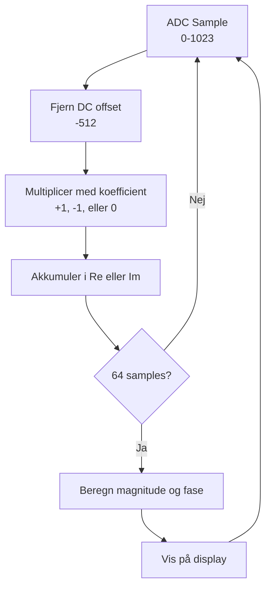

# DFT Algoritme

> [!abstract] Dokumentformål
> Beskrivelse af den optimerede single-bin DFT algoritme brugt i metaldetektoren.
> Se [[../Guides/Code_Review|Kodegennemgang]] for fuld firmware dokumentation.

---

## Optimeringsprincippet

> [!tip] 4× Oversampling
> Da vi sampler ved **præcis 4× signalfrekvensen** (8 kHz sampling, 2 kHz signal), bliver sinus og cosinus værdierne trivielle - **ingen trigonometriske beregninger nødvendige i ISR!**

### Koefficienter ved 4× Oversampling

| Sample n | cos(2πn/4) | -sin(2πn/4) | Operation |
|----------|------------|-------------|-----------|
| 0 | +1 | 0 | Re += sample |
| 1 | 0 | -1 | Im -= sample |
| 2 | -1 | 0 | Re -= sample |
| 3 | 0 | +1 | Im += sample |

> [!note] Negativ Sinus
> Vi bruger `-sin()` i den imaginære del fordi DFT formlen er:
> $$X[k] = \sum_{n=0}^{N-1} x[n] \cdot e^{-j2\pi kn/N} = \sum_{n=0}^{N-1} x[n] \cdot (\cos - j\sin)$$

---

## Algoritme Implementation

### Definitioner

```c
#define F_SAMPLE 8000       // Sample frekvens (Hz)
#define F_SIGNAL 2000       // TX/RX signal frekvens (Hz)
#define N 64                // Antal samples per DFT vindue

#define RePhase1  1         // cos(0)
#define ImPhase2  1         // sin(π/2)
#define RePhase3 -1         // cos(π)
#define ImPhase4 -1         // sin(3π/2)
#define ADC_middelvaerdi 512 // DC offset (mid-skala for 10-bit ADC)
```

### DFT Akkumulering (i ADC ISR)

```c
void DFT_sum(int16_t ADC_Raw) {
    xn = ADC_Raw - ADC_middelvaerdi;  // Fjern DC offset

    switch(j & 3) {  // j mod 4 - cykler 0,1,2,3,0,1,2,3...
        case 0: Re += RePhase1 * xn;  break;  // cos(0) = +1
        case 1: Im += -ImPhase2 * xn; break;  // -sin(π/2) = -1
        case 2: Re += RePhase3 * xn;  break;  // cos(π) = -1
        case 3: Im += -ImPhase4 * xn; break;  // -sin(3π/2) = +1
    }
    j++;

    if (j >= N) {
        Re_buff = Re;  Im_buff = Im;  // Gem resultat
        DFT_done = 1;
        Re = Im = 0;  j = 0;          // Nulstil til næste vindue
    }
}
```

### Magnitude og Fase Beregning (i hovedløkke)

```c
void DFT_Calc() {
    // Konverter til double før kvadrering for at undgå int32_t overflow
    mag = sqrt((double)Re_buff*Re_buff + (double)Im_buff*Im_buff) / N;
    ang = atan2(Im_buff, Re_buff) * 57.2957795131;  // Radianer til grader
}
```

---

## Matematisk Baggrund

### Standard DFT Formel

For bin $k$ ved frekvens $f_k = k \cdot f_s / N$:

$$X[k] = \sum_{n=0}^{N-1} x[n] \cdot e^{-j2\pi kn/N}$$

### Vores Single-Bin DFT

Vi beregner kun bin $k = N/4 = 16$ (svarende til 2 kHz):

$$X[16] = \sum_{n=0}^{63} x[n] \cdot (\cos(2\pi \cdot 16 \cdot n/64) - j\sin(2\pi \cdot 16 \cdot n/64))$$

Da $2\pi \cdot 16/64 = \pi/2$, gentager koefficienterne sig med periode 4.

---

## Integer Overflow Forebyggelse

> [!warning] 32-bit Signed Integers Påkrævet
>
> **Akkumulering (Re, Im):**
> - 64 samples × max værdi 512 (efter DC fjernelse) = 32.768
> - Passer i int16_t, men vi bruger int32_t for sikkerhed
>
> **Kvadrering i magnitude:**
> - Værst: 32768² = 1.073.741.824
> - Overstiger int32_t range (2.147.483.647 for signed)
> - **Løsning:** Cast til `double` før kvadrering

```c
// FORKERT - kan overflow:
mag = sqrt(Re_buff*Re_buff + Im_buff*Im_buff);

// KORREKT - cast til double først:
mag = sqrt((double)Re_buff*Re_buff + (double)Im_buff*Im_buff);
```

---

## Signalflow



---

## Timing

| Parameter | Værdi | Beregning |
|-----------|-------|-----------|
| Sample interval | 125 µs | 1/8000 Hz |
| Samples per TX cyklus | 4 | 8000/2000 |
| TX cykler per vindue | 16 | 64/4 |
| DFT vindue varighed | 8 ms | 64 × 125 µs |
| Opdateringsrate | 125 Hz | 1/8 ms |

---

## Basisfase ved Firkantbølge

> [!important] -45° Basisfase
> Når TX firkantbølgen samples direkte (uden RC filter), måles en basisfase på **-45°**.
>
> Dette skyldes at en firkantbølge der er HØJ for samples 0,1 og LAV for samples 2,3 producerer:
> ```
> Re = x[0] - x[2] = (+A) - (-A) = +2A
> Im = -x[1] + x[3] = (-A) + (-A) = -2A
> Fase = atan2(-2A, +2A) = -45°
> ```

Se [[../Guides/Testing Guide|Testguide]] for verifikation af faseberegning.

---

## Fasefortolkning for Metaldetektion

| Faseændring | Metaltype | Fysisk Årsag |
|-------------|-----------|--------------|
| Mere negativ | **Ferromagnetisk** | Høj magnetisk permeabilitet (μr >> 1) |
| Mindre negativ | **Ikke-ferromagnetisk** | Hvirvelstrømme dominerer |

> [!note] Relativ Fase
> For metaldetektion er kun **ændringer** i fase vigtige, ikke absolutte værdier.
> Basisfasen (-45°) udlignes ved kalibrering.

---

## Relaterede Dokumenter

- [[../Guides/Testing Guide|Testguide]] - AD3, RC Loopback, MATLAB verifikation
- [[../Guides/Code_Review|Firmware Kodegennemgang]]

---

## Teori Referencer (DTU Vault)

| Emne | Link | Relevans |
|------|------|----------|
| DFT/FFT Teori | [DSP-Bible](obsidian://open?vault=Obsidian&file=Courses%2FDSP%2FFormulas%2FDSP-Bible) | Komplet DFT formelsamling |
| Sampling & Frekvens | [Week 1-4](obsidian://open?vault=Obsidian&file=Courses%2FDSP%2FFormulas%2FWeek%201-4) | Nyquist, DTFT, frekvensrepræsentationer |
| 4× Oversampling | [Multirate DSP](obsidian://open?vault=Obsidian&file=Courses%2FDSP%2FFormulas%2FMultirate%20Digital%20Signal%20Processing) | Oversampling teori |
| Komplekse Tal | [Manual_Math_Complete_Guide](obsidian://open?vault=Obsidian&file=Courses%2FDSP%2FFormulas%2FManual_Math_Complete_Guide) | Fasevinkel, polær/rektangulær |

---

*Dokument opdateret til at matche nuværende firmware implementation*
