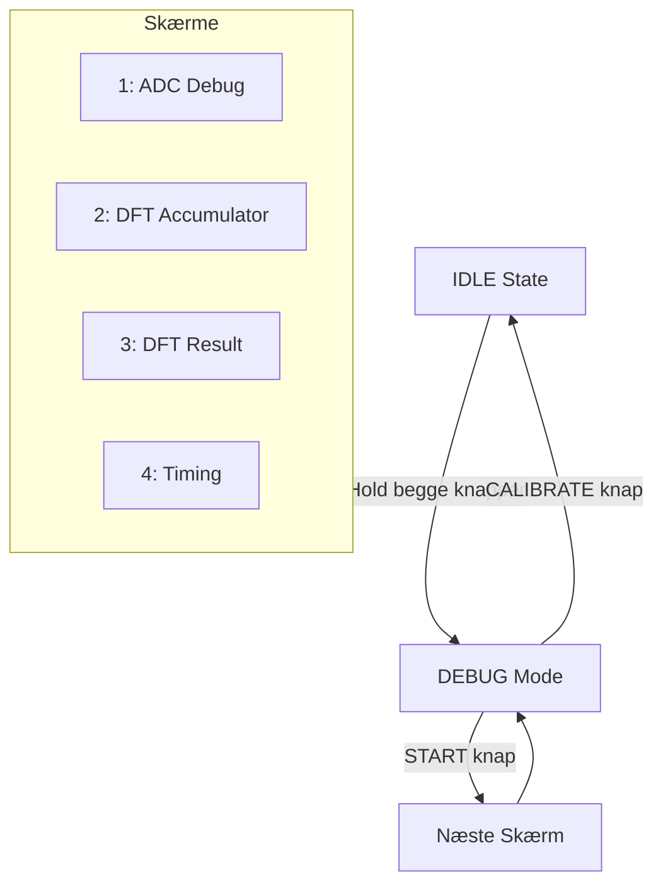

# Debug System Guide

Komplet guide til brug af debug systemet i metal detektoren.

## Overview



## Aktivering af Debug Mode

> [!IMPORTANT]
> Debug mode kan KUN aktiveres fra **IDLE state** (efter splash screen og kalibrering).

### Sådan gør du

| Trin | Handling | Feedback |
|------|----------|----------|
| 1 | Hold **BEGGE** knapper nede samtidigt | - |
| 2 | Vent ~100ms | - |
| 3 | Hør 2x beep | Du er nu i debug mode |
| 4 | Slip knapperne | Første debug skærm vises |

### Knapper i Debug Mode

| Knap | Pin | Funktion |
|------|-----|----------|
| **START** | PE4 (Pin 2) | Skift til næste debug skærm |
| **CALIBRATE** | PE5 (Pin 3) | Afslut debug mode → IDLE |

> [!TIP]
> Tryk START gentagne gange for at cycle gennem alle 4 skærme: ADC → DFT Accum → DFT Result → Timing → ADC...

---

## Equipment Required

| Udstyr | Formål |
|--------|--------|
| Oscilloskop | Verificer timing signaler (2 kanaler) |
| Signal Generator | Simuler RX signal (2kHz sinus, DC offset) |
| Multimeter | Mål DC offset og amplitude |
| Arduino Mega | Target platform |
| OLED Display | Debug output (SSD1306 I2C) |

> [!NOTE]
> Signal generator skal kunne levere 2kHz sinus med justerbar DC offset (0-5V range).

---

## Debug Screens Overview

| # | Skærm | Enum | Viser |
|---|-------|------|-------|
| 1 | ADC Debug | `DEBUG_SCREEN_ADC` | Rå ADC værdier, min/max, sample count |
| 2 | DFT Accumulator | `DEBUG_SCREEN_DFT_ACCUM` | Re/Im akkumulatorer, DFT count, index |
| 3 | DFT Result | `DEBUG_SCREEN_DFT_RESULT` | Magnitude, fase, metal klassifikation |
| 4 | Timing | `DEBUG_SCREEN_TIMING` | ISR count, sync status, frekvenser |

---

## Stage 1: ADC Verification

**Mål:** Verificer at ADC samples korrekt ved 8kHz.

### Setup

1. Forbind signal generator til **ADC0 (Pin A0)**
2. Indstil: **DC mode, 2.5V** (midtpunkt af 0-5V range)
3. Gå i debug mode (hold begge knapper)

> [!WARNING]
> Overskrid ALDRIG 5V på ADC input! Dette kan beskadige mikrocontrolleren permanent.

### Test Procedure

| Test | Input | Forventet Output |
|------|-------|------------------|
| DC Midpoint | 2.5V DC | Raw: ~512, Min≈Max≈512 |
| DC Low | 0.5V DC | Raw: ~102 |
| DC High | 4.5V DC | Raw: ~921 |
| Sample Count | Vent 1 sek | Count stiger med ~8000 |

### ADC Værdi Beregning

```
ADC_værdi = (V_input / V_ref) × 1023
V_ref = 5.0V (AVCC)

Eksempel: 2.5V → (2.5/5.0) × 1023 = 511.5 ≈ 512
```

### Verification Checklist

- [ ] ADC værdi følger input spænding lineært
- [ ] Min/Max opdateres korrekt ved ændret input
- [ ] Count stiger kontinuerligt (~8000/sek)
- [ ] Range (max-min) er ~0-5 for stabilt DC signal

> [!TIP]
> Brug "Range" værdien til at vurdere støjniveau. En range > 20 på DC signal indikerer problemer med jordforbindelse eller EMI.

### Forventet Display Output

```
== ADC DEBUG ==
Raw:    512
Min:    510
Max:    514
Range:    4
Count: 008000
10-bit: 0-1023
```

---

## Stage 2: DFT Accumulator Test

**Mål:** Verificer at DFT akkumulerer samples korrekt.

### Setup

1. Skift signal generator til **2kHz sinus**
2. Amplitude: **2Vpp** (1V til 3V swing)
3. DC offset: **2.5V** (holder signal i 0-5V range)

> [!IMPORTANT]
> Frekvensen SKAL være præcis 2000 Hz for at matche TX frekvensen. Selv små afvigelser (±10 Hz) vil reducere akkumulator værdier markant.

### Signal Generator Indstillinger

| Parameter | Værdi |
|-----------|-------|
| Waveform | Sinus |
| Frequency | 2000.0 Hz |
| Amplitude | 2 Vpp |
| DC Offset | 2.5 V |
| Output Load | High-Z |

### Test Procedure

| Test | Signal | Forventet |
|------|--------|-----------|
| 2kHz Sinus | f=2kHz, 2Vpp | Re og Im > 500 |
| Index Cycling | Observér | Index tæller 0→63 kontinuerligt |
| DFT Count | Vent 1 sek | DFT# stiger med ~125 |

> [!NOTE]
> DFT rate = Sample rate / Window size = 8000 Hz / 64 samples = 125 DFT/sek

### Verification Checklist

- [ ] Re akkumulator viser værdi > 500 (typisk 5000-15000)
- [ ] Im akkumulator viser værdi (kan være positiv eller negativ)
- [ ] Index cykler 0-63 kontinuerligt
- [ ] DFT count stiger (~125/sek)

> [!WARNING]
> Hvis Re og Im begge er tæt på 0 med et 2kHz signal, tjek at frekvensen er PRÆCIS 2000 Hz og at signalet har tilstrækkelig amplitude.

### Forventet Display Output

```
= DFT ACCUM =
Re:   12500
Im:    8700
DFT#:  00125
Index:  32/64
Window: 64 samp
4x oversample
```

---

## Stage 3: DFT Result Verification

**Mål:** Verificer magnitude og fase beregning.

### Setup

Fortsæt med 2kHz sinus signal fra Stage 2.

### Test Procedure

| Test | Ændring | Forventet |
|------|---------|-----------|
| Amplitude op | Øg til 3Vpp | Magnitude stiger |
| Amplitude ned | Reducer til 1Vpp | Magnitude falder |
| Fase ændring | Juster fase på sig gen | Phase ændres |
| Off-frequency | Skift til 1kHz eller 3kHz | Magnitude falder drastisk |

> [!TIP]
> Brug fase-justering på signal generator til at simulere forskellige metal typer. Ferrous metaller giver typisk lav fase (<65°), non-ferrous giver høj fase (>65°).

### Phase Threshold Test

| Signal Fase | Forventet Type | Display |
|-------------|----------------|---------|
| < 65° | Jernholdigt metal | `FERROUS` |
| ≥ 65° | Ikke-jernholdigt | `NON-FERRO` |
| Lav amplitude | Intet signal | `NO SIGNAL` |

### Magnitude Threshold

> [!IMPORTANT]
> Magnitude threshold er sat til **20**. Signaler med magnitude < 20 klassificeres som "NO SIGNAL" uanset fase.

### Verification Checklist

- [ ] Magnitude følger amplitude proportionalt
- [ ] Phase er stabil (±2°) for konstant signal
- [ ] Klassifikation skifter korrekt ved 65° threshold
- [ ] Off-frequency signaler giver lav magnitude (<50)

### Forventet Display Output

```
= DFT RESULT =
Mag:   1250
Phase:   72 deg
Type: NON-FERRO
Thresh: 65 deg
MinMag: 20
```

---

## Stage 4: Timing Verification

**Mål:** Verificer alle timing parametre med oscilloskop.

### Oscilloskop Setup

| Kanal | Probe Point | Pin | Forventet Signal |
|-------|-------------|-----|------------------|
| CH1 | TX Output | Pin 11 (PB5/OC1A) | 2kHz firkant, 50\% duty |
| CH2 | Debug Toggle | Pin 13 (PB7) | 4kHz firkant |

> [!NOTE]
> Debug pin toggles i hver ADC ISR, så frekvensen er halvdelen af sample rate: 8kHz / 2 = 4kHz.

### Timing Parametre

| Parameter | Forventet Værdi | Tolerance |
|-----------|-----------------|-----------|
| TX frekvens | 2000 Hz | ±1\% (1980-2020 Hz) |
| Sample rate | 8000 Hz | ±1\% |
| Debug pin | 4000 Hz | ±1\% |
| Samples per TX cycle | 4 | Eksakt |

### Faseverifikation

> [!IMPORTANT]
> CH1 (TX) og CH2 (Debug) skal have et **stabilt faseforhold**. Hvis fasen "driver", er der et synkroniseringsproblem mellem Timer1 og ADC triggering.

### ISR Timing Beregning

```
Timer1 TOP = 3999 (CTC mode)
f_TX = 16 MHz / (2 × (3999 + 1)) = 2000 Hz

ADC triggers på Timer1 Compare Match B
OCR1B alternerer mellem 999 og 2999
→ 2 samples per Timer1 cycle = 4000 Hz × 2 = 8000 Hz
```

### Verification Checklist

- [ ] TX frekvens = 2000 Hz ±1\%
- [ ] Debug pin = 4000 Hz (toggle rate)
- [ ] ISR count stiger med ~8000/sek
- [ ] Sync status viser "OK"
- [ ] Stabil fase mellem TX og sample timing

### Forventet Display Output

```
== TIMING ==
TX: 2000 Hz
Fs: 8000 Hz
Samp/cyc: 4
ISR#: 008000
Sync: OK
Pin13: Toggle
Scope: 4kHz
```

---

## Troubleshooting

> [!WARNING]
> Læs denne sektion hvis noget ikke virker som forventet.

| Problem | Mulig Årsag | Løsning |
|---------|-------------|---------|
| Kan ikke gå i debug mode | Ikke i IDLE state | Vent på kalibrering færdig |
| ADC viser 0 | ADC ikke initialiseret | Tjek at `adc_init()` kaldes |
| ADC viser 1023 konstant | Input over 5V | Reducer signal amplitude |
| ADC viser 0 konstant | Input under 0V eller løs forbindelse | Tjek kabler og DC offset |
| Count stiger ikke | ISR kører ikke | Tjek Timer1 COMPB og `sei()` |
| DFT# er 0 | `DFT_sum()` kaldes ikke | Verificer ISR kalder `DFT_sum()` |
| Re/Im altid ~0 | Forkert frekvens | Brug PRÆCIS 2000 Hz |
| Magnitude altid 0 | Signal for svagt | Øg amplitude til >1Vpp |
| Phase ustabil | Lav amplitude eller støj | Øg signal, tjek jordforbindelse |
| "NO SIGNAL" vises | Magnitude < 20 | Øg signal amplitude |
| Sync: CHECK | System ikke kørende | Verificer interrupts er enabled |
| Display tomt | I2C fejl | Tjek SDA/SCL forbindelser |

> [!TIP]
> Start altid fejlfinding fra Stage 1 (ADC). Hvis ADC ikke virker, vil alle efterfølgende stages også fejle.

---

## Integer Math Implementation

Debug systemet bruger kun integer matematik for at spare Flash og RAM.

### isqrt() - Integer Square Root

```c
uint16_t isqrt(uint32_t n)
// Newton-Raphson iteration
// Returnerer floor(sqrt(n))
```

> [!NOTE]
> `isqrt()` returnerer altid floor-værdien, ikke den afrundede. For n=99 returneres 9, ikke 10.

### fast_atan2_deg() - Integer Arctangent

```c
int16_t fast_atan2_deg(int32_t y, int32_t x)
// Returnerer vinkel i grader (-180 til +180)
// Præcision: ±3° typisk, ±5° worst case ved 45°
```

> [!WARNING]
> `fast_atan2_deg()` har reduceret præcision sammenlignet med floating-point `atan2()`. Dette er acceptabelt for metal detektion hvor vi kun skelner >65° vs <65°.

---

## Known Limitations

> [!NOTE]
> Disse begrænsninger er by design og påvirker ikke normal funktion.

### 1. Integer Math Precision

- `isqrt()` giver `floor(sqrt(n))`, ikke afrundet
- `fast_atan2_deg()` har ~2-3° fejl, op til ~5° ved 45° vinkler
- Tilstrækkeligt til 65° threshold klassifikation

### 2. Display Update Rate

- Debug display opdateres kun når `debug_update()` kaldes
- Main loop kører ved ~20 Hz (50ms delay)
- Hurtigere opdatering mulig ved at reducere delay

### 3. ISR Overhead

- `debug_log_adc_sample()` tilføjer ~20 CPU cycles til ISR
- `debug_pin_toggle()` tilføjer ~2 cycles
- Total overhead: <1\% af ISR tid
- Kan fjernes i produktion ved at udelade debug.h include

### 4. Memory Usage

| Resource | Debug Enabled | Debug Disabled |
|----------|---------------|----------------|
| RAM | ~30 bytes ekstra | 0 |
| Flash | ~2KB | 0 |

---

## Quick Reference Card

### Aktivering

```
IDLE state → Hold BEGGE knapper → 2x beep → DEBUG mode
```

### Navigation

| Knap | I Debug Mode |
|------|--------------|
| START | Næste skærm |
| CALIBRATE | Exit → IDLE |

### Skærm Rækkefølge

```
ADC → DFT Accum → DFT Result → Timing → (gentag)
```

### Forventede Værdier (2kHz, 2Vpp signal)

| Skærm | Parameter | Typisk Værdi |
|-------|-----------|--------------|
| ADC | Raw | 300-700 (svinger) |
| ADC | Range | 400-500 |
| DFT Accum | Re | 5000-15000 |
| DFT Accum | Im | ±5000-15000 |
| DFT Result | Magnitude | 500-2000 |
| DFT Result | Phase | 0-90° |
| Timing | ISR# | +8000/sek |

---

## See Also

- [[DFT Algorithm]] - DFT implementation details
- [[Power Budget Analysis]] - Current consumption
- [[Development Roadmap]] - Project phases
- [[Code_Review]] - Komplet kode gennemgang
