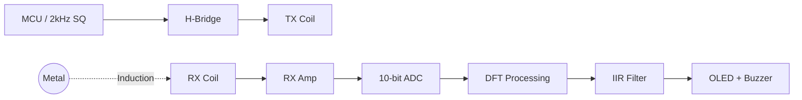

<div align="center">

# VLF Metal Detector

**Electromagnetic Sensors & Digital Signal Processing**

[](Docs/Metaldetektor_Projekt.pdf)
[](https://skab101.github.io/34621-Metal-Detector/timeline.html)
[](https://github.com)

_A technical implementation of a VLF induction balance metal detector using real-time DFT-based phase detection._

---

</div>

## Overview

This project targets the development of a functional VLF metal detector built on the ATmega328P. It features modular firmware, IIR signal smoothing, and phase-based classification to distinguish between ferromagnetic and non-ferromagnetic metals.

### Features

- **DSP Core:** Single-bin DFT optimized for 4x oversampling (8 kHz) with real-time phase observation.
- **Power Stage:** High-efficiency H-bridge MOSFET driver for the transmitter coil.
- **Coil System:** Concentric coil design with an integrated bucking coil for balance.
- **Feedback:** Real-time OLED HUD and variable-tone buzzer for proximity detection.

## Architecture



## Specifications

| Component        | Specification                     |
| :--------------- | :-------------------------------- |
| **TX Frequency** | 2 kHz (Square Wave)               |
| **Sample Rate**  | 8 kHz (4x Oversampling)           |
| **MCU**          | ATmega328P (Arduino Nano @ 16MHz) |
| **Driver**       | H-Bridge (IRF5305 + IRL530)       |
| **Sensors**      | Concentric Coils (Bucking config) |
| **UI**           | SSD1306 OLED (I2C)                |

## Repository

- `Code/` — Core firmware (PlatformIO, C)
- `Docs/` — Technical reports and [Final PDF](Docs/Metaldetektor_Projekt.pdf)
- `KiCad/` — Hardware schematics and PCB designs
- `Simulation/` — LTspice and QSPICE validation files
- `Scripts/` — MATLAB and Python analysis tools

## Getting Started

Build and upload using [PlatformIO](https://platformio.org/):

```bash
cd Code
pio run -t upload
pio device monitor
```

---

<div align="center">
<b>Mads Rudolph · Andreas Skaaning · Jonas Beck · Sigurd Hestbech</b>
<br>
<sub>DTU Course 34621 · January 2026</sub>
</div>
